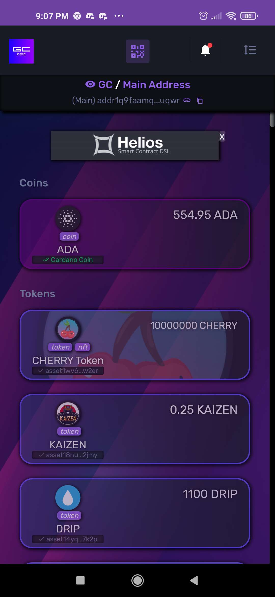
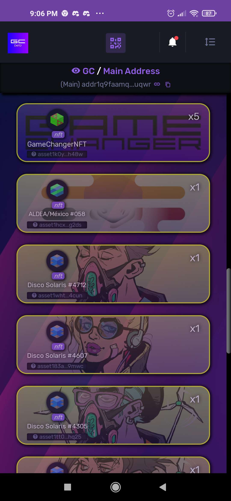
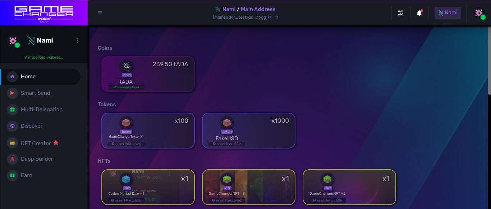
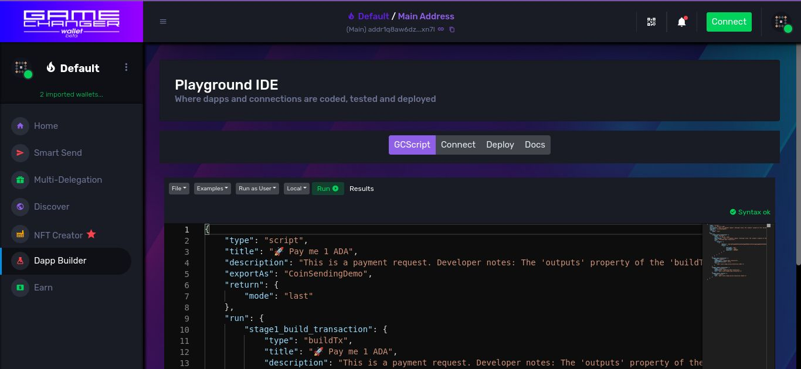

# GameChanger Wallet v2 Beta Documentation

## The Cardano Meta Wallet

GameChanger is a very powerful, customizable, yet friendly, non custodial web light wallet. 

Since 2021 unleashes Cardano's and eUTXO potential while democratizing users, developers and students access.

The smart design principles of the wallet allows you to import or connect these wallet types to it:
 - seed phrase
 - QR encrypted (personal and gift wallets) 
 - Ledger and Trezor hardware wallets 
 - Nami, Eternl, Flint, any browser extension wallets
 - Shared Treasuries
 
 And dapps, devices, users and other agents can use links and QR codes to seamlessly communicate with the wallet.

 **One wallet to have them all, on Desktop and Mobile, with the same dapp connector.**
 
## Examples and special use cases:

### Dapps:

- **[66+ full open source example dapps](examples/README.md)**
    - The famous examples included on [Playground, the built-in IDE of GameChanger Wallet](https://beta-wallet.gamechanger.finance/playground)
    - GCScript code
    - Full HTML5 frontend code with zero external dependencies, and zero backends!
    - QR code dapp connectors included    
- [Helios Timelock](https://github.com/GameChangerFinance/cardano-gc-helios-dapp)
    - First dapp on Cardano working from hosted source code stored on-chain. 
    - **The PAB for the web:** Helios smart contract code compiled on-the-fly on GameChanger dapp connections
    - **The big picture behind GameChanger Dapps** explained on-dapp for the Cardano Community
- M2Tec - Hardware and Software Dapps (first hardware dapps on Cardano powered by GameChanger universal dapp connector)
    - [M2Tec Payments](https://payments.m2tec.nl/)
    - [M2Tec Gift Wallet Printing Tool](https://gift.m2tec.nl)
    - M2Tec Paypads: Payment devices for stores, with Odoo integration for ADA and native asset payments, loyalty tokens and more.
    - M2Tec Cardano Totem: The first Cardano ATM-like public terminals with built-in stake pool
- GCFS examples (GameChanger On-Chain File System): 
    - [Voting Dapp for Catalyst Proposals](https://gcvoting.netlify.app/catalyst/fund10/102594)
- DJack - Decentralized Email Inbox on Cardano
    - powered by SSI
    - no minting required
- [DCorps - Digital Companies Registry on Cardano](https://www.lidonation.com/zh/proposals/dcorps-digital-companies-registry-registering-your-catalyst-project-on-chain-f10) (GameChanger V1)
- [Dandelion Contributor Portal](https://contrib.dandelion.link) (GameChanger V1)

### Some videos and articles:

- [NFTPass RareEvo - onboarding on Cardano at scale ](https://www.youtube.com/watch?v=C96IK0qztbo)
- [GCFS - Permapinning files on Cardano forever](https://www.youtube.com/watch?v=tq3Sxuh_XGE)
- [GCFS - Fiat Payroll using Oracles](https://www.youtube.com/watch?v=AMKhjJQH6cI&t=773s) (not focused on solving scheduling!)
- [QR code payment requests - The magic behind M2Tec hardware dapps](https://www.youtube.com/watch?v=cq2YDDuao2o)
- [Is Cardano ecosystem decentralized?](https://forum.cardano.org/t/is-cardano-ecosystem-decentralized/121882)
 

## Resources
- [Beta Release Notes](RELEASE.md)
- [66+ open source example dapps](examples/README.md)
- [GCScript documentation](https://beta-wallet.gamechanger.finance/doc/api/v2/api.html)
- [Playground IDE in GameChanger Wallet ](https://beta-wallet.gamechanger.finance/playground)
- [Youtube Tutorials](https://www.youtube.com/@gamechanger.finance)
- [Discord Support](https://discord.gg/vpbfyRaDKG)
- [Twitter News](https://twitter.com/GameChangerOk)
- [Website](https://gamechanger.finance)

## Screenshots

## License
MIT 

## Thanks

*Roberto, Maarten, Quasar, Javi and Mati* for all your support

And to the **147.414.000++ votes** who tried to support our job on **Catalyst Fund10** despite coordinated whales will, don't give up on Governance, your votes mean a lot for builders in Cardano!

    
*--- Founder and Dev Adriano Fiorenza*
