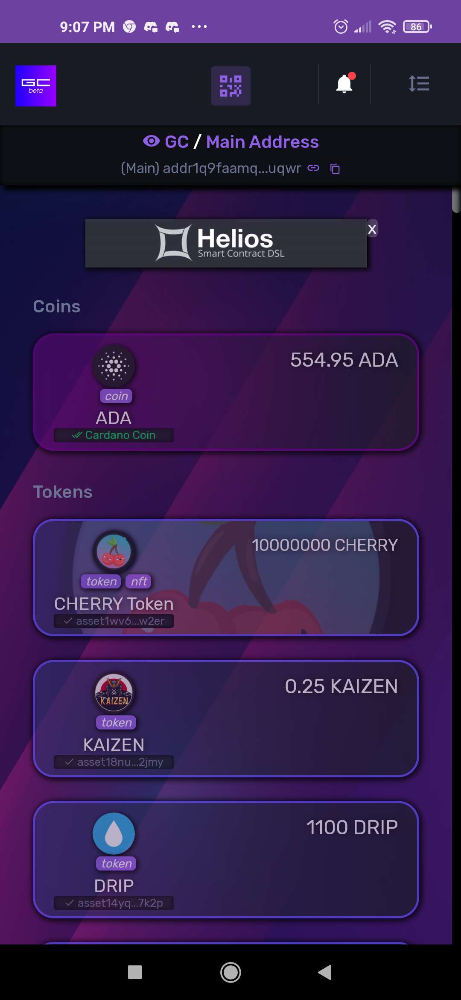
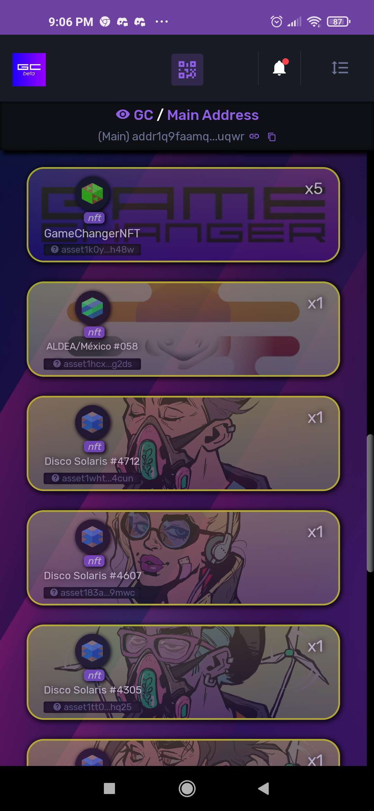
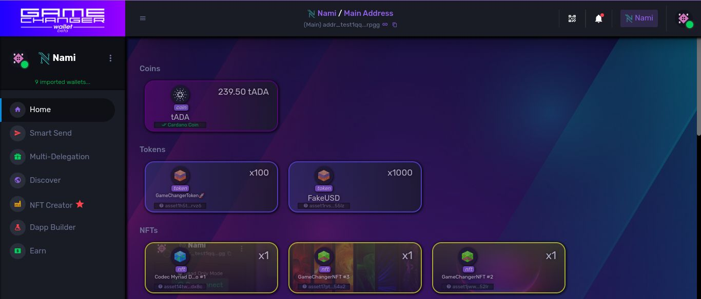
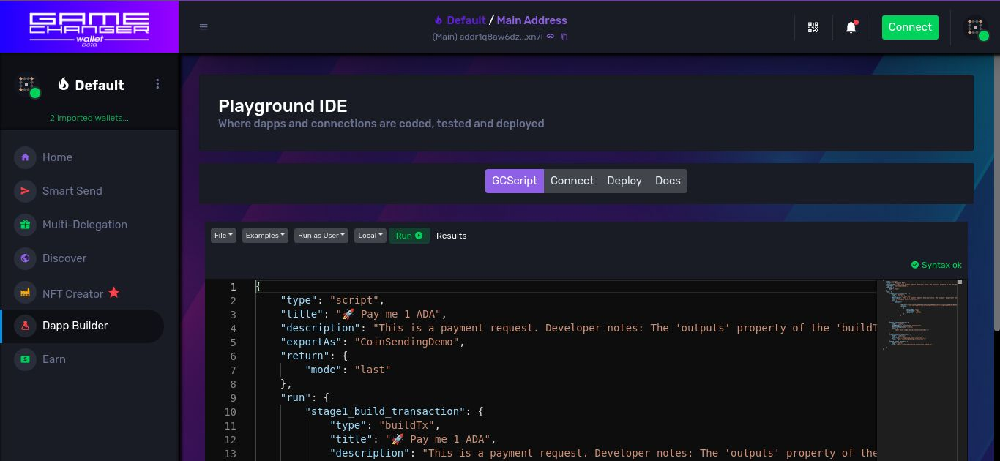

# GameChanger Wallet v2 Documentation

## The Cardano Meta Wallet

GameChanger is a very powerful, customizable, yet friendly, non custodial web light wallet. 

Since 2021 unleashes Cardano and eUTXO potential while democratizing users, developers and students access.

The smart design principles of the wallet allows you to import or connect these wallet types:
 - seed phrase
 - burner wallets
 - QR encrypted (personal and gift wallets) 
 - Ledger and Trezor hardware wallets 
 - Nami, Eternl, Flint, Vespr, any CIP-30 or browser extension wallet
 - Shared Treasuries (script addresses)
 
 And dapps, devices, users and other agents can use links and QR codes to seamlessly communicate with the wallet.

 **One wallet to have them all, on Desktop and Mobile, with the same dapp connector.**

## Link

This is the official link to access **GameChanger Wallet v2 (Production)**:

[**🚀 GameChanger Wallet v2**](https://wallet.gamechanger.finance/)

These networks are supported: 
- Cardano Mainnet
- Cardano Pre-Production Testnet 

*See bottom of the page for information about the now concluded Beta phase*

## Documentation

- [Transactions / Quick Start](docs/transactions/quick-start.md): A single page covering from making a Cardano transaction to code snippets to help integrate the wallet
- [General Documentation](docs/README.md): Universal Dapp Connector, GCScript DSL, ISL, Transactions, Workspaces and more.
- [GCScript Language Reference (API docs)](https://wallet.gamechanger.finance/doc/api/v2): GCScript and ISL reference documentation. Functions, types, and other definitions.
- [JSON Schema](/release/README.md)

## Ecosystem:

### Dapps:

- [ARP Radio](https://arpradio.media/): Discover the plethora of music in the Cardano ecosystem, then purchase, play, trade, and more! Created by SudoScientist
- [Moments](https://www.adamoments.io/): Moments is a decentralized social media platform where creators capture their ideas, share freely, and lock in ownership by minting posts on Cardano. Created by our friend and cherished community member Max Van Rossem.
- [M2Tec Payments](https://payments.m2tec.nl/): POS payment request generator dapp leveraging on an GCFS on-chain open protocol ( [Code on Github](https://github.com/M2tec/gcfs-payments.m2tec.nl) )
- [Dandelion Contributor Portal](https://contrib.dandelion.link) (GameChanger V1)

### Examples and Boilerplates:
- [🔥 gc-connect](https://github.com/arpradio/gc-connect): great open-dapp boilerplate to integrate UDC/GameChanger Wallet, is the software that powers ARP Radio and Moments integrations. Developed by SudoScientist
- Examples using **Official Library [@gamechanger-finance/gc](https://www.npmjs.com/package/@gamechanger-finance/gc)**:
    - [✨ Kitchen Sink ✨](https://gclib-kitchen-sink.netlify.app/): URL, QR, HTML, React, ExpressJs, all output format in one example
    - [URL](https://github.com/GameChangerFinance/gamechanger/blob/master/examples/URL.txt)
    - [QR (png)](https://github.com/GameChangerFinance/gamechanger/blob/master/examples/QR.png)
    - [QR (svg)](https://github.com/GameChangerFinance/gamechanger/blob/master/examples/QR.svg)
    - [Button](https://github.com/GameChangerFinance/gamechanger/blob/master/examples/button.html)
    - [HTML5 Dapp](https://github.com/GameChangerFinance/gamechanger/blob/master/examples/htmlDapp.html)
    - [ReactJs Dapp](https://github.com/GameChangerFinance/gamechanger/blob/master/examples/reactDapp.html)
    - [ExpressJs Backend](https://github.com/GameChangerFinance/gamechanger/blob/master/examples/expressBackend.js)
- **[70+ full open source example dapps](examples/README.md)**
    - The famous examples included on [Playground, the built-in IDE of GameChanger Wallet](https://wallet.gamechanger.finance/playground)
    - GCScript code
    - HTML5 frontend code using new **Official Library [@gamechanger-finance/gc](https://www.npmjs.com/package/@gamechanger-finance/gc)**, and zero backends!
    - HTML5 frontend code with zero external dependencies, and zero backends!
    - QR code dapp connectors included    
- [Unimatrix Live Demo](https://unimatrix-live-demo.netlify.app/): Signing Bot and Pasive listener for multisig transactions on private obfuscated channels using [Unimatrix Sync](https://github.com/GameChangerFinance/unimatrix/). With **Universal Dapp Connector** it builds and signs multi-signature transactions fully on users wallets, on client-side. With 4 built-in use cases :
    - 3 transactions in 1 dapp connection call: Be sure to have more than 3 UTXOs available as you will be using GameChanger Wallet's well known multi-transaction multisig features, otherwise you will face a missing balance screen.
    - Token sale: a decentralized, backend-less, token sale with instant, in-user-wallet multisig minting
    - NFT sale: a decentralized, backend-less, NTF sale with instant, in-user-wallet multisig minting
    - Passive mode: monitor announced transactions live, letting users manually sign and share their transactions by connecting their wallets. Handy for DAOs and user groups, or single users with semi-cold wallet setups.
     
- [Builder Fest 2026 Challenge](https://github.com/GameChangerFinance/builderfest-2026-ticket): How to solve the Builder Fest on-chain registration challenge in GCScript DSL. (auxiliary scripts are available, and Docs pending. WIP). Full project uses
    - Plutus script parametrization on user's wallets
    - Query beacon tokens
    - Plutus transactions
    - more.. 
- [gc-contract-app](https://github.com/M2tec/gc-contract-app)
    - educational dapp by **Maarten Menheere** for **Gimbalabs** that shows how **GameChanger Wallet** is like a *PAB for the web*
    - It builds a smart contract on-the-fly using *Helios Language*, 
    - like many GC dapps it does not use backends
- [Helios Timelock](https://github.com/GameChangerFinance/cardano-gc-helios-dapp)
    - First dapp on Cardano working from hosted source code stored on-chain. 
    - **The PAB for the web:** Helios smart contract code compiled on-the-fly on GameChanger dapp connections
    - **The big picture behind GameChanger Dapps** explained on-dapp for the Cardano Community
### Tools:
- [Inception IDE Beta](https://inception.m2tec.nl/)
    - First stand-alone IDE for building **Cardano** dapps fully online (client side PAB)
    - in browser, no cardano-node deployment required. 
    - on-chain and off-chain code, **Helios Language**, **GCScript** and externaly-built **Plutus Scripts**
    - dapp <--> wallet connections you code here can be used on your own backends and frontends
    - By **Maarten Menheere**. [Github](https://github.com/M2tec/inception)
- [M2Tec Gift Wallet Printing Tool](https://gift.m2tec.nl)
- [Kitchen Sink](https://gclib-kitchen-sink.netlify.app/): URL, QR, HTML, React, ExpressJs, all output format in one example
- **Official CLI Tool [@gamechanger-finance/gc](https://www.npmjs.com/package/@gamechanger-finance/gc)**:URL, QR, HTML, React, ExpressJs, all output format in one CLI tool 
### Use Cases
- M2Tec - Hardware and Software Dapps (first hardware dapps on Cardano powered by GameChanger universal dapp connector)
    - M2Tec Paypads: Payment devices for stores, with Odoo integration for ADA and native asset payments, loyalty tokens and more.
    - M2Tec Cardano Totem: The first Cardano ATM-like public terminals with built-in stake pool
- GCFS examples (GameChanger On-Chain File System): 
    - [Voting Dapp for Catalyst Proposals](https://gcvoting.netlify.app/catalyst/fund10/102594)
- DJack - Decentralized Email Inbox on Cardano: By our friend Javi Ribo 
    - powered by SSI
    - no minting required
- [DCorps - Digital Companies Registry on Cardano](https://www.lidonation.com/zh/proposals/dcorps-digital-companies-registry-registering-your-catalyst-project-on-chain-f10) (GameChanger V1)

### Some videos and articles:

- [Do you build Web2.9 or Web3?](https://www.youtube.com/watch?v=cJjI8YBzEs4) - Workshop at UTN Buenos Aires - 30/07/2024 (spanish)
- [NFTPass RareEvo - onboarding on Cardano at scale ](https://www.youtube.com/watch?v=C96IK0qztbo)
- [GCFS - Permapinning files on Cardano forever](https://www.youtube.com/watch?v=tq3Sxuh_XGE)
- [GCFS - Fiat Payroll using Oracles](https://www.youtube.com/watch?v=AMKhjJQH6cI&t=773s) (not focused on solving scheduling!)
- [QR code payment requests - The magic behind M2Tec hardware dapps](https://www.youtube.com/watch?v=cq2YDDuao2o)
- [Is Cardano ecosystem decentralized?](https://forum.cardano.org/t/is-cardano-ecosystem-decentralized/121882)
 

## Resources
- [General Documentation](docs/README.md)
- [How to connect?](https://www.npmjs.com/package/@gamechanger-finance/gc)
- [Beta Release Notes](RELEASE.md)
- [70+ open source example dapps](examples/README.md)
- [Universal Dapp Connector documentation](DAPP_CONNECTOR.md)
- [GCScript documentation](https://wallet.gamechanger.finance/doc/api/v2)
- [Playground IDE in GameChanger Wallet ](https://wallet.gamechanger.finance/playground)
- [Catalyst](catalyst/CATALYST.md)
- [Youtube Tutorials](https://www.youtube.com/@gamechanger.finance)
- [Discord Support](https://discord.gg/vpbfyRaDKG)
- [Twitter News](https://twitter.com/GameChangerOk)
- [Website](https://gamechanger.finance)

## Screenshots

## GameChanger Wallet V2 Beta status

GameChanger Wallet V2 Beta phase has officially ended. 

*Thank you for participating all these years of heavy development and testing!*

Migrate to the Production V2 now as this release is now deprecated and may not receive updates anymore!  

In order to migrate [read this](docs/universal-dapp-connector/url-patterns.md)

These are the old URLs to access:  

- [Mainnet wallet](https://beta-wallet.gamechanger.finance/)
- [Pre-Production Testnet wallet](https://beta-preprod-wallet.gamechanger.finance/)

## License

MIT

## Thanks

*Special thanks to Roberto, Maarten, Quasar, Javi, Juan, Max, Sudo and Ratio* for all your support. *You are Cardano!*.

And to voters and **Project Catalyst** for supporting part of this development across the years. 

Let's keep building alternative tooling and standards to decentralize deeper our great **Cardano Ecosystem**

    
*--- Founder and Dev Adriano Fiorenza*
