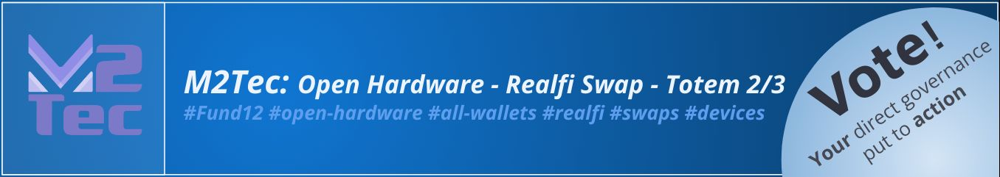
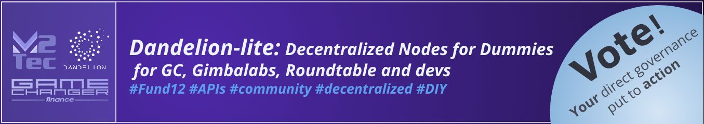
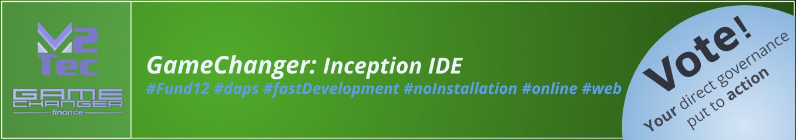
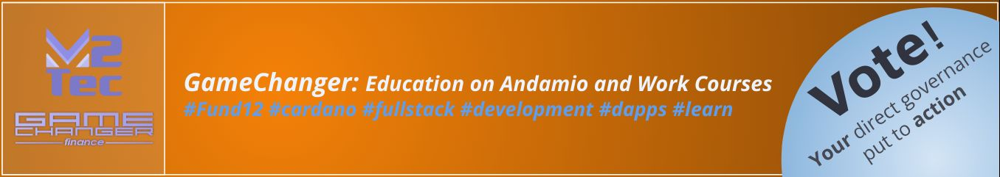

# Welcome to Catalyst Fund 12 #GameChangerVerse

Consider voting these open source projects:

## [M2tec: Open hardware - Realfi swap - Totem](https://cardano.ideascale.com/c/idea/120113)

**Problem:** Swapping and signing Cardano transactions in real world situations.

**Solution:** Totem: Empowering Mass Adoption of Cardano - Your All-in-One Real-World Exchange and Validation Device!

---

## [Dandelion-lite: Decentralized nodes for dummies for GC, Gimbalabs, Roundtable and devs](https://cardano.ideascale.com/c/idea/120108)

**Problem:** To deliver professional applications Cardano requires a dApp to run back-end services. We intend to make these services easy to deploy and add several tools to make the back-end more powerful.

**Solution:** A distributed companion to Dandelion backend services. Allowing people with basic server management skills to instantiate a Dandelion-lite node. Add a new API using direct SQL

---

## [Gamechanger: Inception IDE](https://cardano.ideascale.com/c/idea/120115)

**Problem:** GameChanger Wallet universal dApp connector does not have a specialized, third party, Integrated development environment. Developing dApps are already fast with Gamechanger but could be even faster

**Solution:** Create an online code editor using the VS code JS libraries. A first prototype can be found [here](https://inception.m2tec.nl/) (Inception). This tool can make launching dApps as simple as editing a JSON file and clicking deploy

---

## [Gamechanger: Education on Andamio and Work Courses](https://cardano.ideascale.com/c/idea/120445)

**Problem:** Currently Gamechanger has a large amount of examples and a language reference. There is minimal in-depth educational content.

**Solution:** Create a project-based learning experience that helps people develop dApp's efficiently with minimal setup and publish on Andamio and Work.Courses

---

## Resources
- [General Documentation](/docs/README.md)
- [How to connect?](https://www.npmjs.com/package/@gamechanger-finance/gc)
- [Universal Dapp Connector documentation](/DAPP_CONNECTOR.md)
- [70+ open source example dapps](/examples/README.md)
- [Beta Release Notes](/RELEASE.md)
- [GCScript documentation](https://beta-wallet.gamechanger.finance/doc/api/v2)
- [Playground IDE in GameChanger Wallet ](https://beta-wallet.gamechanger.finance/playground)
- [Catalyst](/catalyst/CATALYST.md)
- [Youtube (Tutorials)](https://www.youtube.com/@gamechanger.finance)
- [Discord (Support)](https://discord.gg/vpbfyRaDKG)
- [Twitter (News)](https://twitter.com/GameChangerOk)
- [Website](https://gamechanger.finance)