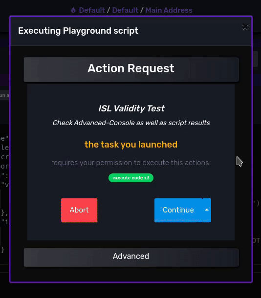
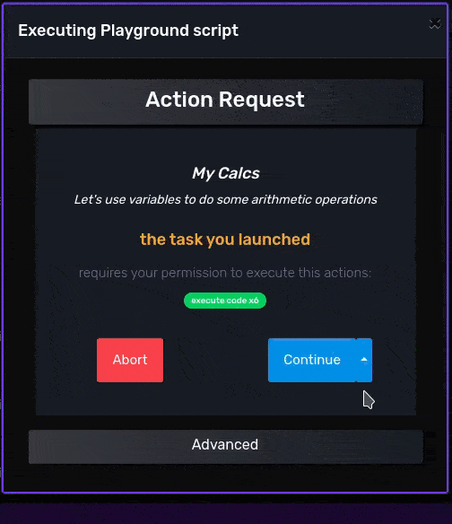

# [GCScript DSL](README.md) / GCScript on Steroids: with Inline Scripting Language (ISL)


## Overview

On this chapter you have learned how every element on GCScript is a function call, which involves a permissioned wallet operation that may have input arguments and may return some results after it's execution, but...

- how would you pass the result of a function as argument of another function? 
- how would you do simple arithmetic, cryptographic, and string operations?
- how would you reshape or design the resulting data structure of a block of code?
- how would you delegate simple operations into wallet-side context for simplicity and/or enhanced privacy?
- how would you log into dapp connector console for debugging or notifying events?

If I ask you to code a simple dapp connection to calculate and return only the SHA512 hash of user's address and nothing more for privacy reasons, how would you solve it?

So far you can ask for and return back the user address which is a not private enough solution for this exercise:

```json
{
    "type": "script",
    "exportAs":"myWalletData",
    "return":{
        "mode":"last"
    },
    "run":{
        "address":  {"type":"getCurrentAddress"}
    }
}
```

🔍 *See also:*
[getCurrentAddress](https://beta-wallet.gamechanger.finance/doc/api/v2/getCurrentAddress.html),
[script](https://beta-wallet.gamechanger.finance/doc/api/v2/api.html)


*My results:*

```json
{
  "exports": {
    "myWalletData": "addr1q8aw6dzpw3cld828cqywp0sql4sxfw6syhzyh2kfcfccakddqwj2u3djrag0mene2cm9elu5mdqmcz9zc2rzgq7c5g6qshxn7l"
  }
}
```

**Inline Scripting Language (ISL)**: is the scripting language you can use to execute minor and permission-less operations to give flexibility, privacy and general purpose features to the permissioned and static GCScript. It is the available addon language to enhance GCScript and it is only callable in-lined on most GCScript function arguments. ISL syntax is a non-turing complete subset of **Javascript**. You can also provide non-ISL or invalid-ISL strings to GCScript function arguments and will be treated as string constants instead.  

<br/>

>**[Macro](https://beta-wallet.gamechanger.finance/doc/api/v2/macro.html):** Is a special GCScript function that acts like a pipe, it returns the isomorphic JSON results of the JSON with (or without) ISL strings passed on the `run` argument. In other terms, it is very handy because you can use it to run ISL code while also for declaring constants like in the `data` function. It's only difference with `data` is that `macro` supports ISL. 

<br/>
<details>
  <summary>How to know if a specific function argument accepts ISL?</summary>

ISL is supported on most arguments, still you can check in [GCScript API Documentation](https://beta-wallet.gamechanger.finance/doc/api/v2/index.html) if it accepts **ISL** as some may not for diverse reasons. 

</details>

<br/>

Now let's use the `macro` function with a single line of ISL for 

- getting the address value: `get('cache.address')`
- applying the SHA512 hash: `sha512(...)`
- generating the new result of the dapp connection: `{sha512(get('cache.address'))}`

```json
{
    "type": "script",
    "exportAs":"myPrivateWalletData",
    "return":{
        "mode":"last"
    },
    "run":{
        "address":  {"type":"getCurrentAddress"},
        "hash":     {
            "type":"macro",
            "run" :"{sha512(get('cache.address'))}"
        },
    }
}
```

🔍 *See also:*
[getCurrentAddress](https://beta-wallet.gamechanger.finance/doc/api/v2/getCurrentAddress.html),
[macro](https://beta-wallet.gamechanger.finance/doc/api/v2/macro.html),
[get](https://beta-wallet.gamechanger.finance/doc/api/v2/macro.html#run_anyOf_i0_anyOf_i1_anyOf_i1),
[sha512](https://beta-wallet.gamechanger.finance/doc/api/v2/macro.html#run_anyOf_i0_anyOf_i5_anyOf_i1),
[script](https://beta-wallet.gamechanger.finance/doc/api/v2/api.html)


*My -private- results:*

```json
{
  "exports": {
    "myPrivateWalletData": "776887253df0b91d752b997c5cc08dcbcdf19e7f01f9475c3e14e8899e2979b097d3c5cca3251bdbbf83493560d84e946f82f4d021bf0fd0a4faf124725048ea"
  }
}
```

<br/>

In summary, ISL is to GCScript as:

- Javascript is to HTML
- Environment variables and Bash scripting is to Docker Compose yaml files
- wires are to hardware devices 
<br/>


## Syntax and behavior

ISL syntax is a simple subset of Javascript syntax. It is meant mainly for calling a pre-defined set of functions. The ISL interpreter understands other basic types such as strings and numbers but once again, it is mainly meant for calling functions.

Rules:

- a string that begins with `{` and ends with `}` is a block of code.
    - otherwise, providing a wrong formatted block of code results in an ISL critical syntax error
    - GCScript interpreter on ISL critical syntax errors returns the string value instead of the execution result of the code in the string  
    - elements contained on a block of code can either be a
        - string literal wrapped between quotes (`'`) or JSON-scaped double quotes (`"`) 
        - number literal without decimal support
        - *undefined* literal (for example `{}`)
        - function call
        - block of code
        - element separator (`;`)
    - blocks of code are resolved by returning 
        - the computed value on single-item lists, on a success state.
        - *undefined* on lists of more than one element, on a success state.
        - the value of the computed argument of the `return()` function. This function halts the execution cursor at position on success state
        - *undefined* throwing the value of the computed argument of the `fail()` function on dapp connector console. This function halts the execution cursor at position on error state
- a function call begin with the function name followed by the list of arguments passed between `(` and `)` and separated with `,`
    - elements contained on the argument list of a function can either be a
        - string literal wrapped between quotes (`'`) or JSON-scaped double quotes (`"`) 
        - number literal without decimal support
        - *undefined* literal (for example `uuid()`)
        - function call
        - argument separator (`,`)
- *undefined* values resolved from ISL execution will get filtered out by the GCScript interpreter as this value type is not a valid JSON type. This will be done gracefully, without halting overall execution nor throwing errors.

Currently, like in GCScript, execution flow lacks conditional branching and iteration support to keep the execution outcome as deterministic as possible without introducing wallet-side unknown behaviors. Simplicity as a security feature. If you need conditionals, iteration support and other turing complete language features, try solving that part of your code at dapp-side, outside the wallet, or redesign your system to only delegate wallet-side tasks that are well defined and are not prone to scale randomly nor take unknown actions. 

>"The wallet is your smart and auditable employee, only you must take the critical decisions". 

## Valid ISL or ~~Invalid ISL~~ String Constants?

Valid ISL or ~~Invalid ISL~~ String Constants? That is the question. Sometimes you need to pass ISL code, sometimes you only want to pass a string constant, and sometimes well.. you forget to wrap your ISL code between `{` and `}`...


Let's explore interpreter behavior around this language feature using 2 ISL functions,`console()` for logging values on the **Dapp Connector Console** and the `return()` function to return values into cache object in script context:

```json
{
    "type": "script",
    "title":"ISL Validity Test",
    "description":"Check Advanced-Console as well as script results",
    "exportAs":"ISLValidityTest",
    "run":{
        "valid":{
            "type":"macro",
            "run" :"{console('log','✓ This is valid ISL'); return('OK')}"
        },
        "invalid":{
            "type":"macro",
            "run" :"console('log','✗ This is invalid ISL'); return('NOT OK')"
        }
    }
}
```

🔍 *See also:*
[macro](https://beta-wallet.gamechanger.finance/doc/api/v2/macro.html),
[console](https://beta-wallet.gamechanger.finance/doc/api/v2/macro.html#tab-pane_run_anyOf_i0_anyOf_i1_anyOf_i2),
[return](https://beta-wallet.gamechanger.finance/doc/api/v2/macro.html#tab-pane_run_anyOf_i0_anyOf_i0_anyOf_i0),
[script](https://beta-wallet.gamechanger.finance/doc/api/v2/api.html)


*Export results:*

```json
{
  "exports": {
    "ISLValidityTest": {
      "valid": "OK",
      "invalid": "console('log','✗ This is invalid ISL'); return('NOT OK')"
    }
  }
}
```

*and if we check logs and warnings on **Advanced** -> **Console**, we get:*

```json
[
  {
    "path": "/valid",
    "type": "log",
    "message": "✓ This is valid ISL",
    "time": 1717100675363
  },
  {
    "path": "/invalid",
    "type": "warn",
    "message": "{\n  \"code\": \"inline-macro-maybe-text\",\n  \"message\": \"just letting you know that this text will be used as value because differs too much from inline macro syntax. Maybe this is what you wanted and is ok.\",\n  \"more\": {\n    \"error\": \"Syntax error. Block of code between '{' and '}' not found in 'console('log','✗ This is invalid ISL'); return('NOT OK')'\",\n    \"text\": \"console('log','✗ This is invalid ISL'); return('NOT OK')\"\n  }\n}",
    "time": 1717100675534
  }
]
```

*This is how running this script looks like on the **Dapp Connector Live Debugger**:*

<div style="text-align:center">
    
</div>


In summary: Review your ISL code! Invalid syntax make code lines behave as string constants. Also with the `console(<'log'|'info'|'warn'|'error'>,<value>)` ISL function and the **Dapp Connector Console** you can debug any constant or variable of your code.

## ISL on GCScript function arguments

Remember that almost all GCScript function arguments support ISL?, let's explore ISL on other functions than `macro`. 

Let's pass the result of the `address` function into the `signDataWithAddress` function to sign an hexadecimal encoded message. To do so we will use the `get()` function, that is a getter function for accessing script context variables like the *cache global object*, the memory space where all function results are stored. The `get()` function accepts the JSON path of the memory space we want to read as argument, in this case `get('cache.myAddress')`.
 
Also let's use the ISL `strToHex()` function to encode on-the-fly a text message as an hexadecimal string. Message will be provided through script arguments and once again accessed by calling `get('args.myMessage')` function. Get ready to use `get()` a lot.

```json
{
    "type": "script",
    "title":"Message Signing",
    "description":"Let's use your wallet private key to sign an arbitrary message",
    "args":{
        "myMessage":"✉ this is the input message ✉"
    },
    "return":{
        "mode":"last"
    },
    "exportAs":"messageSignature",
    "run":{
        "myAddress":  {"type":"getCurrentAddress"},
        "mySignature": {
            "type": "signDataWithAddress",
            "address": "{get('cache.myAddress')}",
            "dataHex": "{strToHex(get('args.myMessage'))}"
        }
    }
}
```
🔍 *See also:*
[getCurrentAddress](https://beta-wallet.gamechanger.finance/doc/api/v2/getCurrentAddress.html),
[signDataWithAddress](https://beta-wallet.gamechanger.finance/doc/api/v2/signDataWithAddress.html),
[get](https://beta-wallet.gamechanger.finance/doc/api/v2/macro.html#run_anyOf_i0_anyOf_i1_anyOf_i1),
[strToHex](https://beta-wallet.gamechanger.finance/doc/api/v2/macro.html#tab-pane_run_anyOf_i0_anyOf_i4_anyOf_i2),
[script](https://beta-wallet.gamechanger.finance/doc/api/v2/api.html)


*My export results:*

```json
{
  "exports": {
    "messageSignature": {
      "signature": "845846a201276761646472657373583901faed34417471f69d47c008e0be00fd6064bb5025c44baac9c2718ed9ad03a4ae45b21f50fde67956365cff94db41bc08a2c2862403d8a234a166686173686564f45821e29c8920746869732069732074686520696e707574206d65737361676520e29c895840681d92bec9b500d1999acd60499bd9e6e4f7c2ea22052ee38e56fde0b9d96e188a45c9a9a18cb6375c5e65558809ea3b0c9d1e8a61a913f3a0d2cc0f7c676c05",
      "key": "a401010327200621582048362707efe478336740139127d8468aca10bf1358d2ab903d2d58876c99733b"
    }
  }
}
```
## Variables and ISL: the *global* object

So far you have learned how the `get()` ISL function can be used to access the *cache* global object, which is a read-only space where GCScript function results are stored as constants. 

"What if I need to create my own variables?"

Welcome the *global* object, the memory space you can read and write through ISL.

For reading any memory space, like *cache*, *args*, and *global* objects we use the already known `get(<path>)` function providing the JSON path we want to access for reading, and for writing into *global* object we use the `set(<name>,<value>)` function providing the name of the variable we want to create or update and the value we want to set on that memory space.

Let's do some arithmetic operations involving user-defined variables.

The `addBigNum()` and `subBigNum()` ISL functions are math helpers that allow you to add and subtract from small to very large numbers, this numeric type is called *BigNum* and is a safer type to deal with blockchain values. These numbers are handled as numeric strings.

What number do you think we will get as result?

```json
{
    "type": "script",
    "title":"My Calcs",
    "description":"Let's use variables to do some arithmetic operations",
    "exportAs":"myCalc",
    "return":{
        "mode":"last"
    },
    "run":{
        "create": {
            "type": "macro",
            "run":"{set('myVariable','1')}"
        },
        "operation1": {
            "type": "macro",
            "run":"{set('myVariable',addBigNum(get('global.myVariable'),'10'))}"
        },
        "operation2": {
            "type": "macro",
            "run":"{set('myVariable',subBigNum(get('global.myVariable'),'10'))}"
        },
        "operation3": {
            "type": "macro",
            "run":"{set('myVariable',addBigNum(get('global.myVariable'),'10'))}"
        },                        
        "finally":{
            "type": "macro",
            "run":"{get('global.myVariable')}"
        }
    }
}
```

🔍 *See also:*
[macro](https://beta-wallet.gamechanger.finance/doc/api/v2/macro.html),
[set](https://beta-wallet.gamechanger.finance/doc/api/v2/macro.html#tab-pane_run_anyOf_i0_anyOf_i1_anyOf_i0),
[get](https://beta-wallet.gamechanger.finance/doc/api/v2/macro.html#tab-pane_run_anyOf_i0_anyOf_i1_anyOf_i1),
[addBigNum](https://beta-wallet.gamechanger.finance/doc/api/v2/macro.html#tab-pane_run_anyOf_i0_anyOf_i6_anyOf_i0),
[subBigNum](https://beta-wallet.gamechanger.finance/doc/api/v2/macro.html#tab-pane_run_anyOf_i0_anyOf_i6_anyOf_i1),
[script](https://beta-wallet.gamechanger.finance/doc/api/v2/api.html)


*Export results:*

```json
{
  "exports": {
    "myCalc": "11"
  }
}
```
*This is how it looks like on the *Dapp Connector Live Debugger*, running the dapp connection in **Step By Step Mode** for pausing the execution and analyzing the script context memory on each line of the code.*

<div style="text-align:center">
    
</div>


The **Dapp Connector Live Debugger** allows you to audit in real time every line of code and the execution impact of every single instruction a dapp is asking your wallet to do. No matter what dapp brand it is, where the code came from, *never trust, always verify*, you as a Web3 user or developer can review, fork, edit and re-deploy any dapp connection code, any GCScript. Welcome to the wallet where you are in control.

On the **Dapp Connector User Interface** you can choose in which mode to run your dapp connection by clicking/tapping on the **Continue Dropdown Button** and selecting the mode, for example **Step By Step**, **Slowed Down** or **Normal** mode among other options like **Edit On Playground IDE** which allows you to edit and fork any dapp connection.

Go to **Advanced** -> **Status** for watching live a snapshot of the script memory context on any moment of the script execution. 


## Execution flow

The [macro](https://beta-wallet.gamechanger.finance/doc/api/v2/macro.html) GCScript function accepts as argument any JSON type with/without ISL strings embedded at any level of it. This means that with `macro` we have a high degree of freedom on how to design and distribute the in-lined code.

Let's solve the exact same math operation sequence from last example but in different ways:

### One-liner

By separating function calls with `;` and by using the `return(<value>)` ISL function at the end of the sequence we can run more than one instruction on the same ISL line, on the same block of code:

*One ISL code block (with line breaks for cleaner readability)*

```js
{
    set('myVariable','1');    
    set('myVariable',addBigNum(get('global.myVariable'),'10'));
    set('myVariable',subBigNum(get('global.myVariable'),'10'));
    set('myVariable',addBigNum(get('global.myVariable'),'10'));
    return(get('global.myVariable'));
}
```

*Now same ISL code block but now embedded on GCScript (with scaped line breaks as JSON specification requires)*

```json
{
    "type": "script",
    "title":"My Calcs",
    "description":"Let's use variables to do some arithmetic operations",
    "exportAs":"myCalc",
    "return":{
        "mode":"last"
    },
    "run":{
        "finally":{
            "type": "macro",
            "run":"{\nset('myVariable','1');\n set('myVariable',addBigNum(get('global.myVariable'),'10'));\n set('myVariable',subBigNum(get('global.myVariable'),'10'));\n set('myVariable',addBigNum(get('global.myVariable'),'10'));\n return(get('global.myVariable'));\n }"
        }
    }
}
```
🔍 *See also:*
[macro](https://beta-wallet.gamechanger.finance/doc/api/v2/macro.html),
[set](https://beta-wallet.gamechanger.finance/doc/api/v2/macro.html#tab-pane_run_anyOf_i0_anyOf_i1_anyOf_i0),
[get](https://beta-wallet.gamechanger.finance/doc/api/v2/macro.html#tab-pane_run_anyOf_i0_anyOf_i1_anyOf_i1),
[addBigNum](https://beta-wallet.gamechanger.finance/doc/api/v2/macro.html#tab-pane_run_anyOf_i0_anyOf_i6_anyOf_i0),
[subBigNum](https://beta-wallet.gamechanger.finance/doc/api/v2/macro.html#tab-pane_run_anyOf_i0_anyOf_i6_anyOf_i1),
[return](https://beta-wallet.gamechanger.finance/doc/api/v2/macro.html#tab-pane_run_anyOf_i0_anyOf_i0_anyOf_i0),
[script](https://beta-wallet.gamechanger.finance/doc/api/v2/api.html)

### Array of ISL strings

As `macro` allow us for passing JSON lists or arrays of strings, we can split the code in ISL code blocks items for cleaner readability:

```json
{
    "type": "script",
    "title":"My Calcs",
    "description":"Let's use variables to do some arithmetic operations",
    "exportAs":"myCalc",
    "return":{
        "mode":"last"
    },
    "run":{
        "myCalcs": {
            "type": "macro",
            "run": [
                "{set('myVariable','1')}",
                "{set('myVariable',addBigNum(get('global.myVariable'),'10'))}",
                "{set('myVariable',subBigNum(get('global.myVariable'),'10'))}",
                "{set('myVariable',addBigNum(get('global.myVariable'),'10'))}"                
            ]
        },
        "finally":{
            "type": "macro",
            "run":"{get('global.myVariable')}"
        }
    }
}
```
🔍 *See also:*
[macro](https://beta-wallet.gamechanger.finance/doc/api/v2/macro.html),
[set](https://beta-wallet.gamechanger.finance/doc/api/v2/macro.html#tab-pane_run_anyOf_i0_anyOf_i1_anyOf_i0),
[get](https://beta-wallet.gamechanger.finance/doc/api/v2/macro.html#tab-pane_run_anyOf_i0_anyOf_i1_anyOf_i1),
[addBigNum](https://beta-wallet.gamechanger.finance/doc/api/v2/macro.html#tab-pane_run_anyOf_i0_anyOf_i6_anyOf_i0),
[subBigNum](https://beta-wallet.gamechanger.finance/doc/api/v2/macro.html#tab-pane_run_anyOf_i0_anyOf_i6_anyOf_i1),
[script](https://beta-wallet.gamechanger.finance/doc/api/v2/api.html)

### Key-Value Map of ISL strings

As `macro` allow us for passing JSON key-value maps of strings, we can split the code in ISL code blocks values for cleaner readability and also for a self-documented code using map keys for this matter:

```json
{
    "type": "script",
    "title":"My Calcs",
    "description":"Let's use variables to do some arithmetic operations",
    "exportAs":"myCalc",
    "return":{
        "mode":"last"
    },
    "run":{
        "myCalcs": {
            "type": "macro",
            "run": {
                "create":"{set('myVariable','1')}",
                "operation1":"{set('myVariable',addBigNum(get('global.myVariable'),'10'))}",
                "operation2":"{set('myVariable',subBigNum(get('global.myVariable'),'10'))}",
                "operation3":"{set('myVariable',addBigNum(get('global.myVariable'),'10'))}"                
            }
        },
        "finally":{
            "type": "macro",
            "run":"{get('global.myVariable')}"
        }
    }
}
```
🔍 *See also:*
[macro](https://beta-wallet.gamechanger.finance/doc/api/v2/macro.html),
[set](https://beta-wallet.gamechanger.finance/doc/api/v2/macro.html#tab-pane_run_anyOf_i0_anyOf_i1_anyOf_i0),
[get](https://beta-wallet.gamechanger.finance/doc/api/v2/macro.html#tab-pane_run_anyOf_i0_anyOf_i1_anyOf_i1),
[addBigNum](https://beta-wallet.gamechanger.finance/doc/api/v2/macro.html#tab-pane_run_anyOf_i0_anyOf_i6_anyOf_i0),
[subBigNum](https://beta-wallet.gamechanger.finance/doc/api/v2/macro.html#tab-pane_run_anyOf_i0_anyOf_i6_anyOf_i1),
[script](https://beta-wallet.gamechanger.finance/doc/api/v2/api.html)


## Isomorphism

Some GCScript function arguments only accepts a string, a number or a boolean value.

Some GCScript function arguments accepts more complex JSON structures like key-value maps or arrays.

The [macro](https://beta-wallet.gamechanger.finance/doc/api/v2/macro.html) GCScript function accepts as argument any JSON type with/without ISL strings embedded at any level of it. It is an isomorphic function. It can handle these types:

- string
- number
- boolean
- list
- map
- ISL string

In this example we can explore isomorphism with ISL nested at deep levels of a JSON structure:

```json
{
    "type": "script",
    "exportAs":"isomorphicResult",
    "return":{
        "mode":"last"
    },
    "run":{
        "name":     {"type":"getName"},
        "address":  {"type":"getCurrentAddress"},
        "slotNo":   {"type":"getCurrentSlot"},
        "isomorphicTest":{
            "type":"macro",
            "run" :{
                "myList":[
                    "{get('cache.name')}",
                    "{get('cache.address')}",
                    "{get('cache.slotNo')}",
                    false,
                    14,
                    "this is not ISL, so is a string constant"
                ],
                "my":{
                    "nested":{
                        "map":{
                            "myName":"{get('cache.name')}",
                            "myAddress":"{get('cache.address')}",
                            "mySlotNo":"{get('cache.slotNo')}",
                            "foo":true,
                            "bar":15,
                            "baz":"this is also a non-ISL string, so is a string constant"
                        }
                    }
                },
                "even this is possible":{
                    "{get('cache.name')}":{
                        "{get('cache.address')}":{
                            "{get('cache.slotNo')}":"voilà (another string constant)"
                        }
                    }
                }
            }
        }
    }
}
```
🔍 *See also:*
[getName](https://beta-wallet.gamechanger.finance/doc/api/v2/getName.html),
[getCurrentAddress](https://beta-wallet.gamechanger.finance/doc/api/v2/getCurrentAddress.html),
[getCurrentSlot](https://beta-wallet.gamechanger.finance/doc/api/v2/getCurrentSlot.html),
[macro](https://beta-wallet.gamechanger.finance/doc/api/v2/macro.html),
[get](https://beta-wallet.gamechanger.finance/doc/api/v2/macro.html#run_anyOf_i0_anyOf_i1_anyOf_i1),
[script](https://beta-wallet.gamechanger.finance/doc/api/v2/api.html)


*My isomorphic results:*

```json
{
  "exports": {
    "isomorphicResult": {
      "myList": [
        "Default",
        "addr1q8aw6dzpw3cld828cqywp0sql4sxfw6syhzyh2kfcfccakddqwj2u3djrag0mene2cm9elu5mdqmcz9zc2rzgq7c5g6qshxn7l",
        "125512966",
        false,
        14,
        "this is not ISL, so is a string constant"
      ],
      "my": {
        "nested": {
          "map": {
            "myName": "Default",
            "myAddress": "addr1q8aw6dzpw3cld828cqywp0sql4sxfw6syhzyh2kfcfccakddqwj2u3djrag0mene2cm9elu5mdqmcz9zc2rzgq7c5g6qshxn7l",
            "mySlotNo": "125512966",
            "foo": true,
            "bar": 15,
            "baz": "this is also a non-ISL string, so is a string constant"
          }
        }
      },
      "even this is possible": {
        "Default": {
          "addr1q8aw6dzpw3cld828cqywp0sql4sxfw6syhzyh2kfcfccakddqwj2u3djrag0mene2cm9elu5mdqmcz9zc2rzgq7c5g6qshxn7l": {
            "125512966": "voilà (another string constant)"
          }
        }
      }
    }
  }
}
```

The isomorphic [macro](https://beta-wallet.gamechanger.finance/doc/api/v2/macro.html) function with it's ISL support is very handy for creating complex JSON templates, for example you may find it useful for dealing with 

- dapp connection results, 
- NFT metadata, 
- plutus data (for smart contracts)
- JSON message signing with CIP-8
- and much more..

---

Congratulations! You have learned all the basic knowledge on how to combine GCScript with ISL to solve all kind of wallet-related operations on client side in a way users can audit and developers can fork and contribute back, fostering an entire Web3 open source ecosystem for Cardano.

Now it's a matter of learning the specific GCScript and ISL functions that will allow you to build, sign and submit transactions, derive keys, sign and encrypt messages and even create and deploy code on *GCFS, the Cardano on-chain Filesystem Protocol*

Previous: [Syntax](syntax.md) | Home: [General Documentation](../README.md)