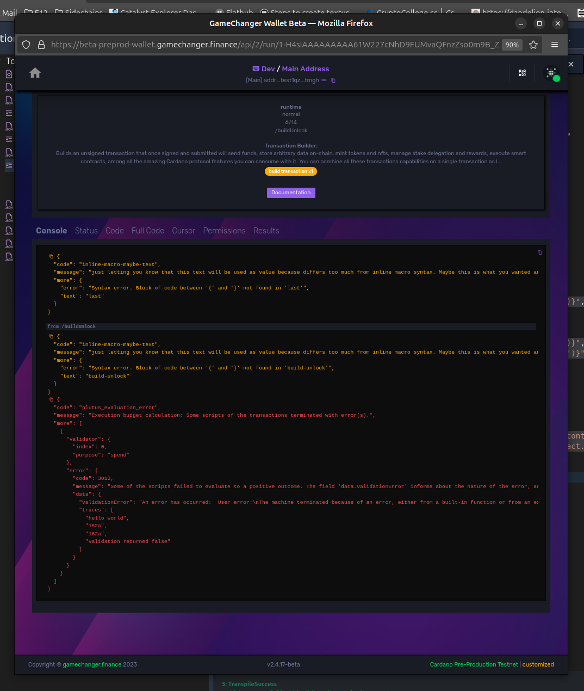

# [Transactions](README.md) / Smart Contracts

## Introduction

In previous section we made some comments and comparisons about Plutus Validators.

Plutus is a domain specific language created with Haskell, inheriting Haskell's functional nature which gives developers the benefit of being able to formally verify the code. On smart contracts, to have high degrees of assurances that the code performs as it should when dealing with millions of dollars in value is something you really want to have in your favor.

I like to think of Plutus like low level assembly code of this giant financial distributed computer called Cardano, where you still have other more abstract language alternatives like C, Typescript and Python can be. 

In Cardano you can also program smart contracts on:
- [Helios](https://www.hyperion-bt.org/helios-book/) 
- Aiken
- Plu.ts
- Marlowe
- and others!

...and all of them compile into Plutus Scripts at the end some way or another. 

## Locking and unlocking 5 coins on a smart-contract address

As you know already from last section, Native and Plutus scripts are used to rule over transaction features, to allow us to consume, to redeem these features based on code logic.

Basically these transaction features or blockchain resources are:
- spend: spending eUTXOs as transaction inputs from script-based addresses
- mint: minting/burning native assets using script as minting policy
- cert: creating stake delegation and other certificates controlled by script validation
- reward: withdrawing staking rewards controlled by script validation

So we can say the basic anatomy of transactions with Plutus Validators consist on
- a transaction feature or blockchain resource that we are trying to consume, controlled by the plutus script
    - it can carry some arbitrary data (datum or datum hashes)
- a plutus script as transaction witness
- a redeemer as transaction witness: a basic setup that tells the script 
    - which is the feature to consume
    - what extra data to provide to this relationship (redeemer data)  
    - some other advanced details such as memory and CPU script execution unit count

Each use case differs from others. Sometimes you don't need datums but instead datum hashes, sometimes you don't need redeemer data, etc..

Not getting into deep technical Plutus terminology, syntax and other details, our approach here will be from a transaction-building point of view. We will work first with a pre-compiled Plutus Script represented as hexadecimal text. 

We will use this compiled Plutus Script (language version 2) :

```json
    "56550100002225333573466e1cdd68011bad0031498581"
```

and the script address generated using that script is 

```json
    "addr_test1zrpqx9g6d299twh09c7nqf5ssk9y9327hkmazs82mct62v9dqwj2u3djrag0mene2cm9elu5mdqmcz9zc2rzgq7c5g6q5xcn4r"
```

In this example we will be controlling the spend permission of 1 eUTXO being part of the balance of an external address, an address created using a Plutus Script instead of user keys... an address not controlled by humans, but rather ruled by code. 

And the rule will be to provide the right password, the number we decide to store next to the coins sent to the smart contract: the magic number `1234`

### Sending the coins to the smart contract plus the password

```js
{
    "type": "script",
    "title": "Locking coins on a smart contract",
    "description": "This contract will lock some coins on a smart contract address behind a secret password number",
    "run": {
        "dependencies": {
            "type": "script",
            "run": {
                // datums and redeemer data (and their data-hashes) can be generated using this function
                "datum": {
                    "type": "plutusData",
                    "data": {
                        "fromJSON": {
                            "schema": 1,
                            "obj": {
                                // this is the secret password number we choose   
                                "int": 1234
                            }
                        }
                    }
                },
                "assets": {
                    "type": "data",
                    "value": [
                        {
                            "policyId": "ada",
                            "assetName": "ada",
                            "quantity": "5000000"
                        }
                    ]
                },
                // we embed the plutus script, the script hash, the script address and other data here for later reuse
                "contract": {
                    "type": "data",
                    "value": {
                        "lang": "plutus_v2",
                        "hex": "56550100002225333573466e1cdd68011bad0031498581",
                        "hash": "c203151a6a8a55baef2e3d302690858a42c55ebdb7d140eade17a530",
                        "address": "addr_test1zrpqx9g6d299twh09c7nqf5ssk9y9327hkmazs82mct62v9dqwj2u3djrag0mene2cm9elu5mdqmcz9zc2rzgq7c5g6q5xcn4r"
                    }
                }
            }
        },
        "buildLock": {
            "type": "buildTx",
            "name": "built-lock",
            "tx": {
                "outputs": [
                    {
                        // this output will send assets to the smart contract address
                        "address": "{get('cache.dependencies.contract.address')}",
                        "assets": "{get('cache.dependencies.assets')}",
                        // we attach the hash of the datum to this output
                        // this will create an eUTXO, an extended UTXO with smart-contract data or "datum"
                        // actually the hash of the secret password that will allow it's later withdrawal  
                        "datum": {
                            "datumHashHex": "{get('cache.dependencies.datum.dataHashHex')}"
                        },
                        // transaction resources are actually linked by index numbers
                        // because that is way too low level for us, we use ID tags to keep track of these resources
                        // refer to the API documentation to learn more about `idPattern` argument
                        "idPattern": "locked"
                    }
                ]
            }
        },
        "signLock": {
            "type": "signTxs",
            "namePattern": "signed-lock",
            "detailedPermissions": false,
            "txs": [
                "{get('cache.buildLock.txHex')}"
            ]
        },
        "submitLock": {
            "type": "submitTxs",
            "namePattern": "submitted-lock",
            "txs": "{get('cache.signLock')}"
        },
        // finally we export a bundle of data that is useful to craft a second transaction
        "finally": {
            "type": "script",
            "exportAs": "LockingCoins",
            "run": {
                "lockedAssets": {
                    "type": "macro",
                    "run": "{get('cache.dependencies.assets')}"
                },
                "contract": {
                    "type": "macro",
                    "run": "{get('cache.dependencies.contract')}"
                },
                "lockTxHash": {
                    "type": "macro",
                    "run": "{get('cache.buildLock.txHash')}"
                },
                // here is where we export the output index that we were tracking using the 'locked' tag or id.
                "lockedUTXOIndex": {
                    "type": "macro",
                    "run": "{get('cache.buildLock.indexMap.output.locked')}"
                },
                "datumHex": {
                    "type": "macro",
                    "run": "{get('cache.dependencies.datum.dataHex')}"
                }
            }
        }
    }
}

```
<a href="https://beta-preprod-wallet.gamechanger.finance/api/2/run/1-H4sIAAAAAAAAA5VU227bMAz9FcMv3YAusOXIifdWbA_tsLUFlgEDhqGQJcZRa8mOJLdOgv77RNu5NGiATA-JxcsheUhqE7pVDeHn0HIjaxdehk66EgXfK_4kdRHwSmobVDpggVXMOC_QzjCOtgJ6N1lp7zFbSLvTBi-yLIPSgwS2UnAaJmBCGLA2yGEhtUA9cAMuqJm1L5URgW5UDsaHM40Ps_FRa9ACNJdg8X5cwdaMuUYd6OuycY39yhzDzPHP6-amUt9-3t3it-ULUF4aX4ZV_ogSqZ2_kmT86s9l6BMCdxhS9GDPrGz89c8mrKtS8tWN8DomUNW53DIFO8myYdpzvPICGnUnfP3rwXe0noLfhCXTxa6Qh2fidQtoESilNIoRixBCkyShk2ScphBzIdJpFMc5E1GUxONsSqcxujG78H6ceCGNWcqmjNKcwZxAIpKIpFnkLdmYcEohF_lExOMImIB4wmgSYWF917qyhHlwYF28NvWyzYpUkCxzL4so4xO9nFNrn7JVlpDJ4kmxtZ0SxV1KnjOxfHkkTSIeDSsiBRoIVxmUDVViqfg6W3Ni1sVywmmRLmnL9diEfSPyRpYCB_SArE42a31quqcbBe4TTiBOdYumVePqBjvoW7UvYFOA-3DBmW__6HC2RtuWjAbbi4-v4X4KTvv1Fr31bgq7j2vP-3XXspPOnR3-ssEYcXzNUtwz58DgpmFRIHBuvMLKQh9xgaJZawcu9n4oB7HlRIBjsgRxD0ZJa_0S-6rmrLSAfCFLb7LckT5y7ZAWzq1tciXdcQKd8N0UOo3bZ9FFehNoW9BQ-FxqVpar9zYd2roy7srun6sv-Mzs34CeqKvjvVWMm2prdU4f39_PM2G2ngMQ5jRrr7sNPAPqDe3e6QAFxK_Z77sbH6j9TyiJPj9YPeo3YtSjDdD9pJ6JeWp2h7nF8w8P8O73ZAYAAA" target="_blank" onclick="window.open(this.href, 'dapp connection', 'width=400,height=600'); return false;" style="text-decoration:none; outline:none;">
 
</a>


🔍 *See also:*
[plutusData](https://beta-wallet.gamechanger.finance/doc/api/v2/plutusData.html),
[data](https://beta-wallet.gamechanger.finance/doc/api/v2/data.html),
[buildTx](https://beta-wallet.gamechanger.finance/doc/api/v2/buildTx.html),
[signTxs](https://beta-wallet.gamechanger.finance/doc/api/v2/signTxs.html),
[submitTxs](https://beta-wallet.gamechanger.finance/doc/api/v2/submitTxs.html),
[macro](https://beta-wallet.gamechanger.finance/doc/api/v2/macro.html),
[script(nested)](https://beta-wallet.gamechanger.finance/doc/api/v2/script.html),
[script](https://beta-wallet.gamechanger.finance/doc/api/v2/api.html)

And these were my results
```json
{
  "exports": {
    "LockingCoins": {
      "lockedUTXOIndex": 0,
      "lockedAssets": [
        {
          "policyId": "ada",
          "assetName": "ada",
          "quantity": "5000000"
        }
      ],
      "contract": {
        "lang": "plutus_v2",
        "hex": "56550100002225333573466e1cdd68011bad0031498581",
        "hash": "c203151a6a8a55baef2e3d302690858a42c55ebdb7d140eade17a530",
        "address": "addr_test1zrpqx9g6d299twh09c7nqf5ssk9y9327hkmazs82mct62v9dqwj2u3djrag0mene2cm9elu5mdqmcz9zc2rzgq7c5g6q5xcn4r"
      },
      "lockTxHash": "8ee99a1fa8d3a6632da00a9bfe787456ee97172353c7b050a98a566aed9c03f1",
      "datumHex": "1904d2"
    }
  }
}
```

### Withdrawing the coins from the smart contract using the right password

Now that we have locked a 5 tADA eUTXO on the smart contract address, lets create a transaction using the plutus script and a redeemer as transaction witnesses to consume those external coins. 

Because GameChanger Wallet auto-manages the change outputs for us, as we will not be spending all those 5 tADA coins, some will return back to our wallet (around 4,82 tADA, the missing value gets spent on transaction fee). We can say then that we are going to withdraw those locked coins from the smart contract.

For this second part is very important to cherry-pick the right eUTXO sitting at the smart contract address. In my case I need to use the eUTXO at index`lockedUTXOIndex`, and originated on the transaction `lockTxHash`, of exactly `lockedAssets` coins.

So my eUTXO data is this one:
```json
    {
        "txHash":"8ee99a1fa8d3a6632da00a9bfe787456ee97172353c7b050a98a566aed9c03f1",
        "index":0,
    }
```

With all the exported data from previous results embedded on the new gcscript, I can now design my coin-redeeming transaction:

```js
{
  "type": "script",
  "title": "Unlocking coins from a smart contract",
  "description": "This contract will unlock some coins from a smart contract address providing a secret password number",
  "run": {
    "dependencies": {
      "type": "script",
      "run": {
        "redeemer": {
            // datums and redeemer data (and their data-hashes) can be generated using this function
            "type": "plutusData",
            "data": {
                "fromJSON": {
                    "schema": 1,
                    "obj": {
                        "int": 1234
                    }
                }
            }
        },
        // we embed all relevant data based on the locking transaction here
        // yes: this transaction is dependant of a first locking one.
        "txData": {
            "type": "data",
            "value": {
                // the index of the eUTXO, meaning the position of the output on the list of outputs of the former transaction 
                "lockedUTXOIndex": 0,
                // the hash or unique ID of the former transaction
                "lockTxHash": "8ee99a1fa8d3a6632da00a9bfe787456ee97172353c7b050a98a566aed9c03f1",
                "lockedAssets": [
                    {
                    "policyId": "ada",
                    "assetName": "ada",
                    "quantity": "5000000"
                    }
                ],
                "contract": {
                    "lang": "plutus_v2",
                    "hex": "56550100002225333573466e1cdd68011bad0031498581",
                    "hash": "c203151a6a8a55baef2e3d302690858a42c55ebdb7d140eade17a530",
                    "address": "addr_test1zrpqx9g6d299twh09c7nqf5ssk9y9327hkmazs82mct62v9dqwj2u3djrag0mene2cm9elu5mdqmcz9zc2rzgq7c5g6q5xcn4r"
                },
                "datumHex": "1904d2"
            }
        }
      }
    },
    "buildUnlock": {
      "type": "buildTx",
      "name": "built-unlock",
      //this is another GCWallet feature to reference a parent transaction, not mandatory, but will help users to track transaction sequences through wallet user interface
      "parentTxHash": "{get('cache.dependencies.txData.lockTxHash')}",
      "tx": {
        // in this case we need to do some manual coin-selection
        // we will try to consume the eUTXO assets sitting on the smart contract address
        // in other terms: we will try to withdraw funds from the smart contract, from a wallet that is not the user's wallet. 
        "inputs": [
          {
            "txHash": "{get('cache.dependencies.txData.lockTxHash')}",
            "index": "{get('cache.dependencies.txData.lockedUTXOIndex')}",
            // transaction resources and their redeemers are actually linked by index numbers
            // because that is way too low level for us, we use ID tags to name these resources
            // refer to the API documentation to learn more about `idPattern` argument
            "idPattern": "locked_input"
          }
        ],
        // Here we provide all the "special" witnesses
        // in this case validators that will behave as script-based signatures (Cardano smart contracts)
        "witnesses": {
            // we use plutus scripts
            "plutus": {
                //here we provide a list of all the plutus scripts used on the transaction, and their language versions
                "scripts": [
                    {
                        "scriptHex": "{get('cache.dependencies.txData.contract.hex')}",
                        "lang": "{get('cache.dependencies.txData.contract.lang')}"
                    }
                ],
                // here we define the "consumers"
                // a GCWallet concept that links a transaction resource with a redeemer definition
                // in other terms "which transaction feature will be rule by which smart contract and redeemer data"
                "consumers": [
                {
                    //we provide the hash of the plutus script as reference
                    "scriptHashHex": "{get('cache.dependencies.txData.contract.hash')}",
                    //we provide the built datum, the secret password
                    "datum": {
                        "dataHex": "{get('cache.dependencies.txData.datumHex')}"
                    },
                    //we define the redeemer
                    "redeemer": {
                        // we pass the same datum as redeemer data, the secret password
                        "dataHex": "{get('cache.dependencies.redeemer.dataHex')}",
                        // we specify what kind of transaction resource we are trying to rule by the smart contract
                        "type": "spend",
                        // we specify the index of the transaction resource we are trying to rule, by providing it's named reference 
                        "itemIdPattern": "locked_input"
                    }
                }
                ]
            }
        },
        "options": {
            // Plutus scripts are very unlikely to fail, but when they do so a small collateral is consumed by the network 
            // here we specify the coin selection algorithm to be used. Check the API documentation for more details
            "collateralCoinSelection": "LASLAD"
        }
      }
    },
    "signUnlock": {
      "type": "signTxs",
      "namePattern": "signed-unlock",
      "detailedPermissions": false,
      "txs": [
        "{get('cache.buildUnlock.txHex')}"
      ]
    },
    "submitUnlock": {
      "type": "submitTxs",
      "namePattern": "submitted-unlock",
      "txs": "{get('cache.signUnlock')}"
    },
    "finally": {
      "type": "script",
      "exportAs": "UnlockingCoins",
      "run": {
        "unlockTxHash": {
          "type": "macro",
          "run": "{get('cache.buildUnlock.txHash')}"
        }
      }
    }
  }
}

```
<a href="https://beta-preprod-wallet.gamechanger.finance/api/2/run/1-H4sIAAAAAAAAA51V227jNhD9FUEv2wKuIVGmZO1b0DwkxWJ3gXiBAkUQjMixzUSkZJKKZQf-95KifEl3u3CrF1uHcznDOTN6i-2uxfhjbJgWrY0nsRW29sA3VTfsRahVxBqhTLTUjYwgMhK0dZCyGpi35xhcRaOc12ItzOk02oq6jrohUGQaiT8LFQHnGo2JWt28Cu4TOxNkGm3UgjHbRvNIdbJC7bLqzmV7c8lbVBwVE2j8-z-LGc00ckTpHM8mbd3ZztyCBV-D_3FnntgfD18--_-GrVE6NJ3ETfXsEaGseyXZ7OAed1H97eg2huQh2CvUHXrYl4382-LPL_eOYx9_TCYDtujvwKydwxyxLCFdwpxnkOcZ4ZAkUFZLLObFjObuuEgLktGMFVVC3dEcaJ4D8pIl2TKNJ2OOG2PQugv46y1um1qw3T134YF7OuDPPoPEE7LpQLku7xxAk-GJD4-T-NRTTx3U6nRJT6_Eea19BTHNKU1S70MIoVmW0SKb5TmmjPN8nqRpBTxJsnRWzuncE1yHUhlxIE0hB1cCrQCXBDOeJSQvE2cJM8IoxYpXBU9nCQLHtACaJb6AoIuBPtdPFo1N97rd9OUq56Qs7XadlKxQmyU15qXclRkp1i8S9mZOJLM5eS35ZvtMuow_a1glEhUSJkusOyr5RrJ9uWdE71ebgtFVvqE9UzMdHwZZdPJuqDstkxknceh81Ymah_m4aP-ALnrHWIXb9oD9LcjfoS1oVPbU_LcV2l8-MHAym17KeBp0NT0r5cOvBz-XfdBg242dtv83kghqvMrvQr-jM_8K1qL2wx4MngZOg4S2wirXqjCLQTxhlPw4Btbh_91VBI6KnK6P2UddXu3o7b3nqG_TuSXwjoe7lP_K5XSPgzyGLeQMrotyVNTAafJuL10R5Gg-HW1HYYw7zxv6BlmU9__apMOjF3AzrOuhN6ypa3CmUP_udvMD1sjGVf7p5uHTzW08KN6IlfpO8B5c9GYU_Dmjx5Gfhc_RgqiRf0UthTEh8xJqg17Vvh3vSr6YLndtY5mPnkRXSWG_pzHAPyQynNhLLkO-d-nOpY1NWQoFdb370ecE-7bR9sZcfh79tZnzpyZkOk75KYQEppuj1c_KHdXlF83hb0EOHRadBwAA" target="_blank" onclick="window.open(this.href, 'dapp connection', 'width=400,height=600'); return false;" style="text-decoration:none; outline:none;">
 
</a>


🔍 *See also:*
[plutusData](https://beta-wallet.gamechanger.finance/doc/api/v2/plutusData.html),
[data](https://beta-wallet.gamechanger.finance/doc/api/v2/data.html),
[buildTx](https://beta-wallet.gamechanger.finance/doc/api/v2/buildTx.html),
[signTxs](https://beta-wallet.gamechanger.finance/doc/api/v2/signTxs.html),
[submitTxs](https://beta-wallet.gamechanger.finance/doc/api/v2/submitTxs.html),
[macro](https://beta-wallet.gamechanger.finance/doc/api/v2/macro.html),
[script(nested)](https://beta-wallet.gamechanger.finance/doc/api/v2/script.html),
[script](https://beta-wallet.gamechanger.finance/doc/api/v2/api.html)


finally 5 tADA were spent or withdrawn from smart contract and these were my results:

```json
{
  "exports": {
    "UnlockingCoins": {
        "unlockTxHash": "c128c550062949195ece48e14e36f2a62071e44fd75b0cf61ccee2e99faaf856"
    }
  }
}
```


### Should I trust on pre-built Plutus Scripts?

We think the clever Cardano design where only nodes process a tiny portion of transactions on-chain while most CPU and resource consumption occurs off-chain on transaction crafting is great for scalability and performance, but is creating a generation of dapps relying too much on opaque backend services and un-interoperable protocols due to language-specific SDKs and close source code.

This is why on GameChanger wallet we encourage developers to deal with all the wallet-related and transaction-related code on client side, more specifically on wallet-side, allowing users and experts to always be able to review and audit the source code, not only the compiled code. (Also this has great open source collaboration benefits).

That's why we added an [Helios](https://www.hyperion-bt.org/helios-book/) Smart Contract Language compiler into the wallet, to offer developers the possibility of stop dealing with pre-compiled and opaque Plutus Scripts and start relying directly on it's source code on user's wallets.

Remember the plutus script we used on previous examples? How can you be sure about what's doing inside? Does it have bugs? Backdoors maybe? Don't trust, always ensure you have means to verify.

This is the [Helios](https://www.hyperion-bt.org/helios-book/) code that once compiled produced the former plutus script used before

```js
// MagicNumber.hl

spending MagicNumber

struct Datum {
    magicNumber: Int
}

struct Redeemer {
    magicNumber: Int 
}

func main( datum: Datum, redeemer: Redeemer, _ ) -> Bool {   
    redeemer.magicNumber==datum.magicNumber
}

```

And to stop worrying about trusting opaque pre-baked or pre-built Cardano structures, our suggestion is to build them in a transparent way on user's wallets, like this:

```js
{
    "type": "script",
    "title": "About to compile MagicNumber.hl ",
    "description": "This script will build a Plutus Script on-the-fly on users wallets for transparency purposes",
    "exportAs": "Lock_Contract",
    "return": {
        "mode": "last"
    },
    "run": {
 "helios": {
        "type": "data",
        "value": {
            // this is the helios source code text embedded on GCScript in hexadecimal encoding
            "contract": "0a7370656e64696e67204d616769634e756d6265720a0a73747275637420446174756d207b0a202020206d616769634e756d6265723a20496e740a7d0a0a7374727563742052656465656d6572207b0a202020206d616769634e756d6265723a20496e74200a7d0a0a66756e63206d61696e28646174756d3a20446174756d2c2072656465656d65723a2052656465656d65722c205f29202d3e20426f6f6c207b2020200a2020202072656465656d65722e6d616769634e756d6265723d3d646174756d2e6d616769634e756d6265720a7d"
            }
        },
        "stakeCredential": {
            "type": "data",
            // this is a staking public key hash 
            "value": "ad03a4ae45b21f50fde67956365cff94db41bc08a2c2862403d8a234"
        },
        "contract": {
            //This function can import pre-compiled or compile on-the-fly Plutus Scripts
            "type": "plutusScript",
            "script": {
                // here we provide the Helios source code encoded in utf8 encoding for on-the-fly compilation
                "heliosCode": "{hexToStr(get('cache.helios.contract'))}",
                // also it's important to specify a compiler version to avoid changes to the compiled script
                // Remember: if a single bit changes, script hash and generated addresses, policyIds, and certificates changes 
                "version": "0.15.2"
            }
        },                
        "address": {
            // this function builds Cardano addresses
            "type": "buildAddress",
            "name": "ContractAddress",
            "addr": {
                // as spend credential we use the plutus script hash to rule spending
                "spendScriptHashHex": "{get('cache.contract.scriptHashHex')}",
                // as staking credential we use a key hash to keep locked funds delegated to a stake pool to contribute with the network
                "stakePubKeyHashHex": "{get('cache.stakeCredential')}"
            }
        },
        "finally": {
            "type": "script",
            "run": {
                "lang": {
                    "type": "macro",
                    "run": "{get('cache.contract.lang')}"
                },
                "hex": {
                    "type": "macro",
                    "run": "{get('cache.contract.scriptHex')}"
                },
                "hash": {
                    "type": "macro",
                    "run": "{get('cache.contract.scriptHashHex')}"
                },
                "address": {
                    "type": "macro",
                    "run": "{get('cache.address')}"
                }
            }
        }
    }
}

```
<a href="https://beta-preprod-wallet.gamechanger.finance/api/2/run/1-H4sIAAAAAAAAA51UTW_iMBD9K1YubSWKguM40BviUmk_VIneV449IVFNHNnOFoT47zvOByAKhy6RwJl57_mNPcMh8vsGopfISVs1PppEvvI6BJa5aT3xhkizbSoN5JfYVPJ3u83BTktNEKqgZ1WmRsJ7WTnSB8hnpTXJ20orIsibbn3ryLpPmfrZl_Bc6D0uSevAOvIptAbvSGEs8VbUrhEWarknTWsb48DhZrBrjPVLhzv9NPLjz8rUCJXBsgXfWrRwiLZGBe9aOB8dMdF20RJ0ZVxYDcUq4QXy_grdQgjLUeslikWWZDFPOXDGF_id0ZgpPuMZviUMspQrTnmKYdFhWUYxhr-IY3yG74igcZbHgsb9w2_yE8wz3CFjqKO-qqWIQg8pDwzEf0-TxqMq51moJhk4mKVzfnLaMc6-Je5ytW9AfPGCuLSgC3SiEkAFygt8Ajvv_Z2dXutRuONdJers6x4qVBUd8W6dFx-wsqCg9pXQd283EipOBBPA0pzOijQuFF7qAg-Zp7IoFkzlbJbLeC6wqDmnLE4UrhMWGujcGCf1puvm9Tguw9ycumzVd-ChhN27WXv7uAH_-CCFLGHaI6aj6MPT0zH4xAnoJyieztIp7aoTSllwlz3bTdNyCE-iWmxDdJyCcyIwA801UKve5qtw5Svsgq0LN6ONqbsEPXSeusN9a_MfsL9Nvjr9wAq2i6rGUd5f2D79rwyzqEW9uUhvhbRmzN62Fxid_gSPePc97lBaX1YQwGL-S-F8ODcv577QgO0PCD__ANhsaNBxBQAA" target="_blank" onclick="window.open(this.href, 'dapp connection', 'width=400,height=600'); return false;" style="text-decoration:none; outline:none;">
 
</a>

🔍 *See also:*
[data](https://beta-wallet.gamechanger.finance/doc/api/v2/data.html),
[plutusScript](https://beta-wallet.gamechanger.finance/doc/api/v2/plutusScript.html),
[buildAddress](https://beta-wallet.gamechanger.finance/doc/api/v2/buildAddress.html),
[buildTx](https://beta-wallet.gamechanger.finance/doc/api/v2/buildTx.html),
[signTxs](https://beta-wallet.gamechanger.finance/doc/api/v2/signTxs.html),
[submitTxs](https://beta-wallet.gamechanger.finance/doc/api/v2/submitTxs.html),
[macro](https://beta-wallet.gamechanger.finance/doc/api/v2/macro.html),
[script(nested)](https://beta-wallet.gamechanger.finance/doc/api/v2/script.html),
[script](https://beta-wallet.gamechanger.finance/doc/api/v2/api.html)

This is how I built the contract in first place.

And now you have all the required knowledge to adapt the *Locking and Unlocking* examples to use a Plutus Script compiled on-the-fly, transparently, on users wallets, to foster auditability, interoperability and open source collaboration.

Finally keep in mind that this on-the-fly wallet-side smart-contract compilation has benefits like contract parametrization and artifact exports for standardizing datum and redeemer data formats across dapps and clients.

Here is a [dapp](https://github.com/GameChangerFinance/cardano-gc-helios-dapp) using these techniques, going one step further: Storing part of the source code on-chain with GCFS to make it interoperable. 
 
## Debugging using node traces

**Cardano Node** can return some user-defined logs or traces for debugging purposes same way you can do a `console.log(...)` on a Javascript environment.

Going back to the previous Helios example, you can add traces by making the validator reject the UTXO consumption by returning `false` while adding some `print(...)` function calls, like this:


```js
// MagicNumber.hl

spending MagicNumber

struct Datum {
    magicNumber: Int
}

struct Redeemer {
    magicNumber: Int 
}

func main( datum: Datum, redeemer: Redeemer, _ ) -> Bool {   
    print("hello world");
    print(datum.serialize().show());
    print(redeemer.serialize().show());
    //redeemer.magicNumber==datum.magicNumber
    false //by returning false we allow traces to be returned back from cardano node
}

```
But to enable traces feature on **Helios** you must compile the code using the `"simplify":false` flag on GCScript, like this:

```js
        ...
        "contract": {
            //This function can import pre-compiled or compile on-the-fly Plutus Scripts
            "type": "plutusScript",
            "script": {
                // here we provide the Helios source code encoded in utf8 encoding for on-the-fly compilation
                "heliosCode": "{hexToStr(get('cache.helios.contract'))}",
                // also it's important to specify a compiler version to avoid changes to the compiled script
                // Remember: if a single bit changes, script hash and generated addresses, policyIds, and certificates changes 
                "version": "0.15.2",
                "simplify":false, //enables debugger traces, default value is "true"
            }
        },
        ...  

```

> Keep in mind the `simplify` flag will add/remove some bytes from the final compiled script also triggering changes on it's script hash, and this will lead to address, policy ID, and other changes on items generated based on this validator script.

These traces are originated when you instruct the wallet to build your transaction as GameChanger Wallet sends a draft of it to let **Cardano Node** evaluate an hypothetical outcome based on real current ledger state as UTXOs, stake rewards and certificates, time parameters and more context data is involved. 

During `buildTx` function calls you can get these debugging output lines on the *dapp connector console*, for example like this:

<div style="text-align:center">
    
</div>

As you can see your debugging output is contained under the `"traces"` array:

```json

    "traces":[
        "hellow world",
        "182a",
        "182a",
        "validation returned false"
    ]

```

"But why does the wallet pre-send a transaction draft to the node?"

Because the wallet sends a transaction draft to let the node calculate what's called as "execution budget calculation"

## Automatic Execution Budget Calculation

Transactions require a network fee to be validated across the network of nodes. Byte sizes are the main parameter used to calculate the fee, but when a transaction carries on-chain validator scripts the protocol must defend itself from code that may use more resources than expected, for example to prevent DDoS attacks, so also the more execution instructions and memory space your smart contract will consume to run, an extra fee amount you will have to pay.

The process of calculating these execution resources is called Execution Budget calculation.

The `buildTx` function automatically heals built transactions when arguments do not carry this budget information. This is to ease this process as doing it manually can be complex and process changes after every hard fork because it strongly depends on protocol parameters and Plutus Language versions. The wallet ensures the right budget calculation is applied because it relies on the node itself to measure it (thanks to *Ogmios* Transaction Evaluation feature)   

Automatic features on the wallet can be disabled, you can provide these values manually, but there is no need as the wallet uses the cheapest budget possible as official **Cardano** tooling is being used (Ogmios). Usually developers hardcode these values using big numbers that are not optimized, making users pay more expensive transactions.

If you still need to provide them on your own please use the `buildTx` function [`memExUnits` and `stepsExUnits` arguments for redeemers](https://beta-wallet.gamechanger.finance/doc/api/v2/buildTx.html#tx_anyOf_i0_witnesses_plutus_anyOf_i0_consumers_anyOf_i1_items_anyOf_i0_redeemer).

> Keep in mind that if you provide all the required `memExUnits` and `stepsExUnits` values yourself, the wallet will not send a draft transaction to be evaluated and then all debugging traces won't be captured during `buildTx` function execution time. 

Previous: [Minting](minting.md)  | Next: [Multi-signatures](multisig.md)