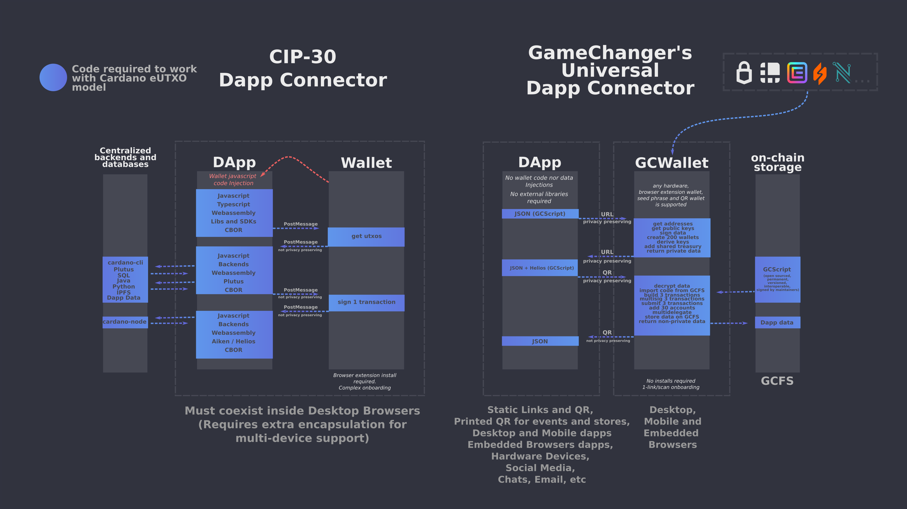
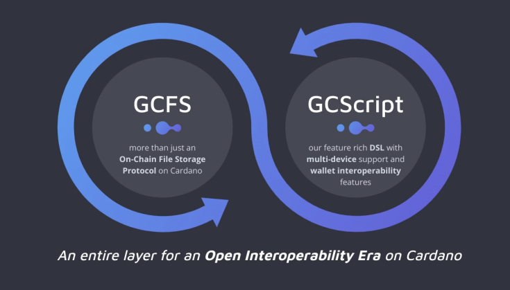

# [Universal Dapp Connector](README.md) / Overview

## The Universal Dapp Connector

*or how to connect **all Cardano wallets**, to **all devices and platforms** with universal building blocks: JSON and URLs*

This documents describes a webpage-based communication bridge allowing URLs to interface with any other Cardano wallet through GameChanger Wallet. This is done packing JSON based DSL scripts, called **GCScript**, into URLs and allowing GameChanger Wallet to unpack them and execute them only under user approval. These scope-limited non-turing complete scripts and their JSON results can be privacy-preserving depending on developer's good practices. 

This communication is done without any injected javascript code into webpages, and even without external libraries or dependencies as basic functionality needed for encoding and decoding the messages towards/from the wallet is nowadays natively present in browsers and many other platforms APIs/libraries. 

This specification concerns any past and future Cardano era as **GCScript** is a very extensible and flexible DSL, prepared to evolve for the future. 

This is intended to cover much more use cases as web3 for Ethereum or [EIP-0012](https://github.com/ergoplatform/eips/pull/23) for Ergo as this 2-year old model has been designed from zero without any other known reference on blockchain space to specially address several issues concerning innovative eUTXO blockchains like Cardano.

## Motivation: why is this necessary?

Cardano is not Ethereum. Since 2021 **GameChanger Wallet** was committed to find natural design patterns that would make sense for an eUTXO model blockchain like Cardano, slow epic work that had no other prior references on blockchain space and had to be solved from zero.

Cardano have not seen yet it's full potential. Desktop defi-only applications are only a glimpse of what we can be doing out there. The problem: The feature-limited design of overall wallet + dapp connector ecosystem we currently have is not allowing us to look further. We push harder and harder to stablish by force of standards, rules and patches that are harming our exponential growth. With our flexible solution, a dapp or a power user can connect all these Cardano wallets to all these audiences with the same JSON code:

Wallets:
- 12,15,24 seed phrases (Mnemonic)
- Personal QR encrypted password protected (Express)
- Gift QR encrypted password protected (Gift)
- Ledger
- Trezor
- Nami
- Eternl
- Flint
- Typhon
- and all other browser extension wallets with single-address mode
- Shared treasuries (or any other multisig and script-based wallet)

Audiences:
- Desktop
- Mobile
- Embedded Browsers
- Social Media, Email, Chat
- Static screens, ads, or printed labels at stores
- more

All these while democratizing access to Cardano with a platform-independent JSON-based scripting language as interoperability layer that handles 100% the off-chain and the on-chain eUTXO code requiring no additional dependencies, libraries, SDKs, completely opposite approach to current mayor adopted ecosystem standards. Because why would I make a web3 wallet that pushes developers to build dapps that run 95% of their code outside user browsers? This early design principle based on an Ethereum account model solution has shaped an un-interoperable, siloed, centralized, backend-excessive, opaque, in-auditable ecosystem and with our model we can help to change this if we truly care to improve.

Suggested article:
- [Is Cardano ecosystem decentralized?](https://forum.cardano.org/t/is-cardano-ecosystem-decentralized/121882)

## Dapp-connector ecosystem comparisson

Differently from CIP-30, we do not inject any executable code inside dapps to stablish connections, and we don't need external dependencies or libraries to encode and decode the messages we use to connect with the wallet.

- Dapp   -> Wallet communication carries the encoded/packed GCScript code 
- Wallet -> Dapp   communication carries the encoded/packed JSON data response from the execution of the code. (developers design these returning payloads - [see Return URL Patterns](https://beta-wallet.gamechanger.finance/doc/api/v2/api.html#returnURLPattern) )

Its important to clarify that GCScript is fully processed and executed on user's browsers, not on our backend. Also when encrypted, it's only decrypted on client side.

Both type of communications can be encapsulated on different transports ( [see Transports](https://beta-wallet.gamechanger.finance/doc/api/v2/api.html#transport) ):
- URL: the basic transport, starting with wallet path.
- QR URL: the basic transport, starting with wallet path, encoded as a QR code.
- Local: Internal in-wallet execution of GCScript, only used for development and on native wallet features

All transports can use these encodings/compression algorithms ([see Encodings](https://beta-wallet.gamechanger.finance/doc/api/v2/api.html#encoding)):
- base64url - for lightweight hardware clients, no compression
- gzip - recommended - base64url encoded gzip compression. Natively supported on modern browsers, and languages like Python, C, Rust, etc without external libraries
- json-url-lzma- external nodejs library that packs JSON into urls

By default all GCScripts in dapps, hardware devices, QR codes, social media links are
- open source, (unless encrypted)
- ready to be cloned and build upon other's work
- auditable, even by end users - simple and self-documented code makes it more auditable than Haskell or any other complex language  
- transparent, dapp connector has a live debugger 
- privacy preserving: dapps DON'T need to know your addresses, eUTXOs, balances, keys to work. This is an amazing overlooked design principle of GCScript
- static links/QR codes: GCScript can be wallet-agnostic, meaning that same link or QR code can be reused across all users, making it suitable for printing, or embedding everywhere.  

The wallet itself uses GCScript dapp connections as a way to open source our code and to let builders clone it.

Last, using Cardano chain itself as permanent immutable storage solution and as an indexed database is that we can put less code and data on centralized backends and databases, and start moving it on-chain for a more interoperable, open source, fault-tolerant and resilient ecosystem

Suggested articles:
- [Helios Timelock Dapp](https://github.com/GameChangerFinance/cardano-gc-helios-dapp)

## Downsides

- "UX": We are so used to desktop browser extension wallets that conveniently pops up when needed that we are willing to accept code injections on all our websites and to limit entire blockchain ecosystems only to desktop scope. Everyone is free to compromise what sees fit.
- "All connections goes through GameChanger Wallet", and it's not fully open source: This project has 2.5 years old now, and we care for our users until the point that we are the only wallet on Cardano that allows you to even connect any other wallet to it, so you are still free of using your hardware wallets and even your browser extension wallets in GameChanger, even for creating multisig wallets. This is why it's called a "meta" or "universal" wallet. Also the wallet has been created by a solo-developer who wants to gradually open source it all, you will discover that is a really huge project if you do your own research. The good news is that this process already started. Thanks to Catalyst Fund11 voters the full dapp connector JSON Schema and Unimatrix Sync, two important parts of the project are currently being released to the community. We want to make it open source as we love this project and we truly believe it's vision has as a lot to offer to Cardano.

Previous: [Universal Dapp Connector](README.md) | Home: [General Documentation](../README.md)