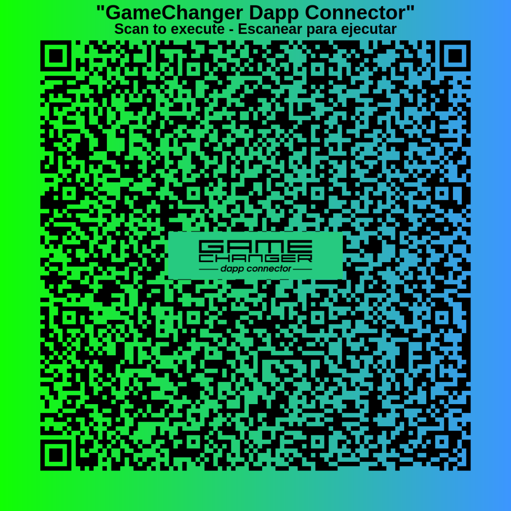

# [Universal Dapp Connector](README.md) / URL Patterns

## Wallet URL patterns, routing and returning data

You already know what the **Universal Dapp Connector** is and why it exists. Now it is time to look at the actual thing that travels between apps, devices and wallets: the URL itself.

This page explains:
- how wallet URLs are shaped
- how they can vary depending on transport and use case
- how to request a DLT or network switch with the **Network Router**
- how to attach a referrer address
- how returning URLs work
- how these same patterns can be generated with the [Official NPM Library and CLI](https://www.npmjs.com/package/@gamechanger-finance/gc)

Later sections will teach how to write these scripts yourself in [GCScript DSL](../gcscript/README.md), how to inspect and edit them in [Playground IDE](https://wallet.gamechanger.finance/playground), and how to use them for actual [transactions](../transactions/README.md), [workspaces](../workspaces/README.md), frontends, backends and hardware flows.

These patterns are useful for:
- dapps
- backend agents
- CLI tools
- QR and NFC workflows
- air-gapped devices
- static websites
- chat messages, emails and documents
- printed labels and physical checkout flows

These can be represented as:
- a plain clickable URL
- a popup launch link
- a QR code embedding the URL
- an NFC tag embedding the URL
- a backend redirect
- a returning URL carrying execution results
- many more..


## The base pattern

With the current single-domain release there is one wallet domain for all supported networks and DLTs:

```txt
https://wallet.gamechanger.finance/
````

A wallet request URL (a "dapp connection", or the result of a "dapp connection") is usually built from:

* a base wallet domain
* an API route
* an encoded payload
* optional query parameters

A common example looks like this:

```txt
https://wallet.gamechanger.finance/api/2/run/1-H4sIAAAAA...AAAA
```

And that same URL may also include router and attribution query parameters:

```txt
https://wallet.gamechanger.finance/api/2/run/1-H4sIAAAAA...AAAA?networkTag=preprod&ref=addr_test1q...
```

> The encoded payload may change length and shape depending on encoding, compression and script size, but the surrounding URL pattern stays the same.

If you are curious about the script living inside that payload, the next documentation sections will show how to write it manually using [GCScript DSL](../gcscript/README.md).

## The Network Router

The **Network Router** is the feature that allows a dapp, agent, backend, QR code, NFC tag, device or plain URL to request that the wallet opens on a specific DLT and network.

It uses these query parameters:

```txt
dltTag=<dlt>
networkTag=<network>
```

Current defaults are:

```txt
dltTag=cardano
networkTag=mainnet
```

That means all of these are valid patterns:

```txt
https://wallet.gamechanger.finance/

https://wallet.gamechanger.finance/?networkTag=mainnet
https://wallet.gamechanger.finance/?dltTag=cardano&networkTag=mainnet
https://wallet.gamechanger.finance/?networkTag=preprod
https://wallet.gamechanger.finance/api/2/run/1-H4sIAAAAA...AAAA?networkTag=preprod
https://wallet.gamechanger.finance/api/2/run/1-H4sIAAAAA...AAAA?dltTag=cardano&networkTag=preprod
```

When the requested DLT or network is different from the current wallet state, the wallet may show a confirmation screen with:

* the origin of the request
* the requested DLT or network
* the option to switch
* the option to stay where the user already is

If the requested values are invalid, an error screen is expected.

### Why this matters now

During the v2 beta stage there were separate wallet subdomains per environment. On the official v2 release there is one single production wallet domain, so routing is now expressed through query parameters instead of subdomain selection.

This makes links more portable:

* one public wallet domain
* many possible target environments, future-ready
* explicit routing when needed 
- atomical routing and connector action request (DSL)
* safer behavior for shared links, QR codes and backend redirects

*If you were using CIP-30 dapp connectors: get ready to think outside the box! You are not targetting desktop-only use cases anymore with UDC, RPCs and real-time bidirectional channels give many assumptions for granted regarding connections. When aiming for real world use-cases beyond desktop requirements differ.*


### Important default behavior

For wallet-facing v2 handlers, the recommended default is to include:

```txt
networkTag=<network>
```

unless explicitly disabled.

This makes generated links and QRs deterministic under the single-domain wallet and avoids relying on the current user wallet state. 

This makes links, QRs and URLs more predictable for dapps and automation, especially under the single-domain design.

This being said, if you are not sure about enforcing network and DLT flavor for example if you just want to share a casual link to the wallet, just don't do it. Don't force network and DLT switches for no good reason.

### When to use it

Use the Network Router when:

* a dapp state currently supports one network
* you must produce highly-deterministic URLs
* the same public link may be opened by users already connected to another network
* a device or printed label cannot assume anything about the current wallet state

Avoid relying on the current user wallet state when the request is network-sensitive.

## The referrer parameter

Wallet URLs may also include a referrer address using:

```txt
ref=<address>
```

Example:

```txt
https://wallet.gamechanger.finance/api/2/run/1-H4sIAAAAA...AAAA?networkTag=mainnet&ref=addr1q...
```

This is a generic referrer feature. It can be used by present or future campaigns, integrations, affiliate systems, attribution flows or reward programs without changing the core wallet URL pattern.

A few practical notes:

* `ref` is optional
* it may coexist with other query parameters
* it should not break preexisting query strings already present on the URL
* the value is expected to be an address for the same target network

### Combining router and referrer

A common pattern is:

```txt
https://wallet.gamechanger.finance/api/2/run/1-H4sIAAAAA...AAAA?networkTag=preprod&ref=addr_test1q...
```

This requests:

* requests the user to switch the wallet into `preprod` network
* tries to apply referrer attribution on user browser session and network 
* execute the encoded request

## URL patterns can vary

The exact URL varies depending on intent.

### 1) Open the wallet home on a network

```txt
https://wallet.gamechanger.finance/?networkTag=preprod
```

### 2) Open a specific wallet request

```txt
https://wallet.gamechanger.finance/api/2/run/1-H4sIAAAAA...AAAA?networkTag=mainnet
```

### 3) Open a request with explicit DLT and network

```txt
https://wallet.gamechanger.finance/api/2/run/1-H4sIAAAAA...AAAA?dltTag=cardano&networkTag=preprod
```

### 4) Open a request with a referrer

```txt
https://wallet.gamechanger.finance/api/2/run/1-H4sIAAAAA...AAAA?networkTag=mainnet&ref=addr1q...
```

### 5) Open the wallet home and request only a network switch

```txt
https://wallet.gamechanger.finance/?dltTag=cardano&networkTag=preprod
```

This is useful when the goal is only to place the wallet on the desired environment before the next manual action.

### 6) Return data to an external site after execution

```txt
https://my-dapp.example/returnURL?result=1-H4sIAAAAA...AAAA
```

In this case the wallet has already processed the DSL script, and results are being exported back to the dapp using a query string. You can customize this behaviour and also pass the response payload using URL sub paths.

## Returning data from the wallet

Capturing a returned URL is optional, but it is one of the most useful integration patterns of the UDC.

A script may define a `returnURLPattern`, and after execution the wallet can redirect the user back to an external URL carrying the encoded result.

The important detail is that these URLs are generated in-wallet by the DSL code itself using the **`returnURLPattern` argument. Is a simple string template**. The script developer decides where `{result}` should be inserted.

### Query-string style pattern

```json
{
    "type":"script",
    "returnURLPattern":"https://my-dapp.example/returnURL?result={result}"
}
```

This produces something like:

```txt
https://my-dapp.example/returnURL?result=1-H4sIAAAAA...AAAA
```

### Subpath style pattern

```json
{
    "type":"script",
    "returnURLPattern":"https://my-dapp.example/returnURL/{result}/view"
}
```

This produces something like:

```txt
https://my-dapp.example/returnURL/1-H4sIAAAAA...AAAA/view
```

So the payload can travel:

* as a query string
* as part of the path
* or as any other URL shape the script developer intentionally defines

Then the external app, frontend or backend can:

* read the packed result from the configured position
* decode and decompress it
* recover the original JSON response data

### Typical return flow

1. A dapp, device or backend generates a wallet URL
2. The user opens it
3. The wallet executes the request
4. The wallet redirects back to the configured return URL
5. The external app extracts the packed result and decodes it

### Frontend-style example

```js
const currentUrl = window.location.href;
const resultRaw = new URL(currentUrl).searchParams.get('result');
// decode resultRaw here
```

### Backend-style example

```js
app.get('/returnURL', async (req, res) => {
    const resultRaw = req.query.result;
    // decode resultRaw here
});
```

> Returning data is not mandatory and user may intercept and reject a return URL by UDC design to preserve  privacy. This encourage the design of systems where user is in full control of the shared data to dapps. 

Also by customizing UDC transport layer you can receive action requests (DSL) and even return resulting data back to dapps or hardware all using QR codes embedding these URLs, for air-gapped connections and real world use cases.

You will see these scripts and return patterns again in upcoming [GCScript DSL](../gcscript/README.md) pages, and you can inspect them live in [Playground IDE](https://wallet.gamechanger.finance/playground).

## QR patterns

A QR code is not a different protocol. It is simply one of these same URL patterns encoded as a QR image.

That means:

* any valid wallet URL pattern is also a valid QR pattern
* router parameters still work
* referrer parameters still work
* returning URL patterns still work
* air-gapped connections can use URL connections and returning URLs encoded back as QR codes too

### Example QR pattern

This repository includes an example QR code generated from a wallet URL:



And the underlying idea is still just a URL like this:

```txt
https://wallet.gamechanger.finance/api/2/run/1-H4sIAAAAA...AAAA?networkTag=mainnet&ref=addr1q...
```

The difference is only the transport:

* plain link for clickable environments
* QR image for camera-based or air-gapped environments


## Generating these URLs programmatically

You do not need to build these patterns by hand.

The recommended tools are:

* [Official NPM Library and CLI](https://www.npmjs.com/package/@gamechanger-finance/gc)
* [Playground IDE](https://wallet.gamechanger.finance/playground)
* [Kitchen Sink playground](https://gclib-kitchen-sink.netlify.app/)

The official library can help generate:

* URLs
* QR codes
* button snippets
* HTML+Js examples
* React examples
* Express backend examples
* more..

The CLI can help from scripts, shells, CI pipelines, backend jobs or device-side tooling.

This is specially useful when:

* NPM library or static URL/QR generation is not available
* Hardware devices and backend code
* the script is large
* compression must be automated
* QR output is needed
* router or referrer parameters must be appended safely
* for prototyping quick boilerplate frontend or backend code

## Multi-network scripts

Some scripts can be written to adapt themselves to the current wallet network and DLT instead of hardcoding parameters.

A common pattern is:

* fetch current network information
* derive a combined key such as `cardano-mainnet`
* select the right parameters for that environment
* continue execution with the selected values

This is especially useful for:

* scripts meant to work on both mainnet and preprod, or others
* reusable public examples
* protocol templates
* open integrations shared by multiple dapps
* keeping maintainance easy while preserving determinism  

We will cover [GCScript DSL](../gcscript/README.md) and **ISL** soon, but for now this code snippet shows how this can be implemented:

```js
{
    "networkInfo": {
        "type": "getNetworkInfo"
    },
    "networkKey": {
        "type": "macro",
        "run": "{ join('-',get('cache.networkInfo.dltTag'),get('cache.networkInfo.networkTag')) }"
    }
}
```

That approach is often better than publishing separate scripts when the business logic is the same and only the parameters vary.

You will learn how to write these scripts properly on the next [GCScript DSL](../gcscript/README.md) pages.

## Common integration patterns

<details>
  <summary>💡 Click to explore common URL patterns and integration techniques...</summary>

### 🔵 Static link on HTML

```html
<a href="https://wallet.gamechanger.finance/api/2/run/1-H4sIAAAAA...AAAA?networkTag=mainnet">
  Launch wallet request
</a>
```

### 🔵 Popup launch on HTML

```html
<a href="https://wallet.gamechanger.finance/api/2/run/1-H4sIAAAAA...AAAA?networkTag=mainnet"
   target="_blank"
   rel="noopener noreferrer"
   onclick="window.open(this.href, 'dapp connection', 'noopener,width=500,height=750'); return false;">
   Launch GC in Popup Mode
</a>
```

### 🔵 Static link on markdown

```md
[Launch wallet request](https://wallet.gamechanger.finance/api/2/run/1-H4sIAAAAA...AAAA?networkTag=preprod)
```

### 🔵 Backend redirect

```js
app.get('/url', async (req, res) => {
    const url = "https://wallet.gamechanger.finance/api/2/run/1-H4sIAAAAA...AAAA?networkTag=preprod";
    res.redirect(url);
});
```

### 🔵 Return URL pattern using query string

```json
{
    "returnURLPattern":"https://my-dapp.example/returnURL?result={result}"
}
```

### 🔵 Return URL pattern using subpath

```json
{
    "returnURLPattern":"https://my-dapp.example/returnURL/{result}/view"
}
```

</details>

## Kitchen Sink playground

For a practical way to try these patterns, render outputs, inspect snippets and preview different launch modes, check:

[Kitchen Sink](https://gclib-kitchen-sink.netlify.app/)

It is a useful place to:

* paste or edit GCScript
* generate URLs and QRs
* compare output formats
* generate HTML, React and Express boilerplates
* verify router and referrer behavior

For embedded or iframe-based previews, keep in mind that wallet may restrict execution in embedded contexts. A preview frame may fail even when the generated method itself is valid.

## Practical rules of thumb

* Add `networkTag` by default on wallet-facing URLs
* Add `dltTag` when the integration is explicitly multi-DLT or you want to be prepared for the future
* Add `ref` only when attribution is intended
* Keep the request payload and the router query parameters conceptually separate
* Use `returnURLPattern` only when a response is actually needed from the wallet
* Prefer multi-network scripts when only parameters vary across environments
* Treat printed, pasted or redirected URLs as long-lived public interfaces
* Remember that QR codes are just these same URL patterns encoded as images

Previous: [Overview](overview.md) | Home: [General Documentation](../README.md)


