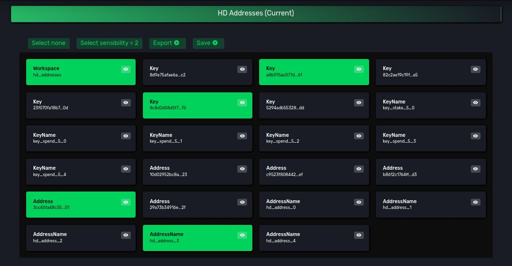
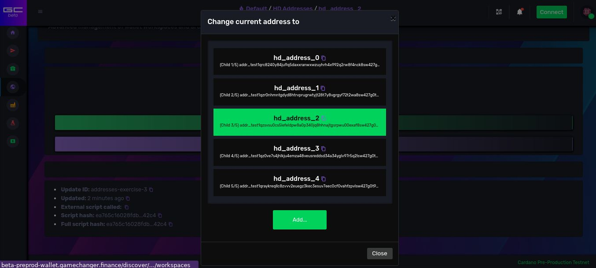
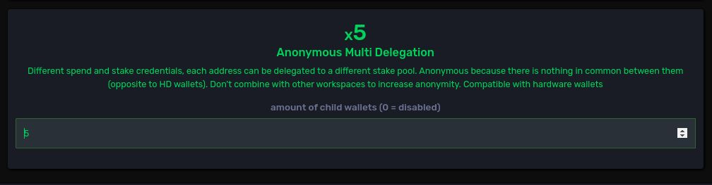
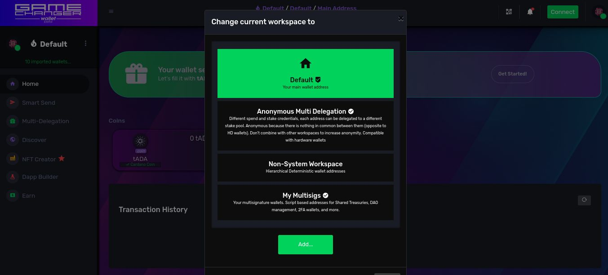

# [Workspaces](README.md) / Personal Account Wallets


On general blockchain cryptography
- a derivation scheme is the design pattern that serves as recipe to derive groups of keys using your wallet's master private key
- Hierarchical Deterministic (HD) wallets create addresses using a derivation scheme that increments sequentially the **addressIndex** to create personal account child keys, for example for account 3
    - "`m/1852h/1815h/3h/0/0`"  
    - "`m/1852h/1815h/3h/0/1`"  
    - "`m/1852h/1815h/3h/0/2`"  
    - "`m/1852h/1815h/3h/0/3`"  
    - and so on..

On Cardano
- HD wallets create addresses in a similar fashion to Bitcoin but here the only key derivation where **addressIndex** gets incremented is the one of the **spend** credential. For example **Base addresses** child keys for account 3 use these paths  
    - **spend**:"`m/1852h/1815h/3h/0/0`" + **stake**:"`m/1852h/1815h/3h/2/0`"    
    - **spend**:"`m/1852h/1815h/3h/0/1`" + **stake**:"`m/1852h/1815h/3h/2/0`"    
    - **spend**:"`m/1852h/1815h/3h/0/2`" + **stake**:"`m/1852h/1815h/3h/2/0`"    
    - **spend**:"`m/1852h/1815h/3h/0/3`" + **stake**:"`m/1852h/1815h/3h/2/0`"    
    - and so on..

HD wallets standard also define automatic address-scanning and special change-output properties not implemented on **GameChanger Wallet** as *Workspaces design principle* is based on single address mode and derivation sequence recoverability, composability  and auditability rather than dynamic and gap-based address balance discovery where some times you can loose track of your "locker IDs", of your own addresses, even if they are still yours, producing typical balance miss-calculations.

**GameChanger Wallet** assumes no derivation standard by default, and it proposes at least 4 official derivation schemes, also supported by Ledger and Trezor hardware wallets, to cover different use cases and anonymity requirements. Thanks to **Workspaces**, it will adapt to user's needs as far as possible, making it not only a general purpose personal wallet, but also a multisig and script based wallet with a common user interface for all use cases. *The universal wallet for Cardano*

## The Cardano HD derivation scheme for Personal Accounts

Let's explore how HD wallet addresses on Cardano are created by replicating their derivation scheme using workspaces.

Wiping your test wallet workspace settings to continue with a clean setup is suggested to avoid mixing views with previous artifacts.

We will create only the first 5 base addresses, using a the **accountIndex** 5. Use the same seed phrase on another Cardano HD wallet software with same account number and you will get the same group of addresses.

```js
{
    "type": "script",
    "title": "HD wallet addresses",
    "description": "Exploring different ways to build addresses",
    "run": {
        "usingWorkspaces": {
            "type": "loadConfig",
            "updateId": "addresses-exercise-3",
            "layers": [
                {
                    "type": "Workspace",
                    "items": [
                        {
                            "namePattern": "hd_addresses",
                            "titlePattern": "HD Addresses",
                            "descriptionPattern": "Hierarchical Deterministic wallet addresses"
                        }
                    ]
                },
                {
                    "type": "Key",
                    "workspaceIds": [
                        "hd_addresses"
                    ],
                    "namePattern": "key_{kind}_{accountIndex}_{addressIndex}",
                    "items": [
                        // one common stake key
                        {
                            "kind": "stake",
                            "accountIndex": 5,
                            "addressIndex": 0
                        },
                        // 5 sequential spend keys
                        {
                            "kind": "spend",
                            "accountIndex": 5,
                            "addressIndex": 0
                        },
                        {
                            "kind": "spend",
                            "accountIndex": 5,
                            "addressIndex": 1
                        },
                        {
                            "kind": "spend",
                            "accountIndex": 5,
                            "addressIndex": 2
                        },
                        {
                            "kind": "spend",
                            "accountIndex": 5,
                            "addressIndex": 3
                        },
                        {
                            "kind": "spend",
                            "accountIndex": 5,
                            "addressIndex": 4
                        }
                    ]
                },
                // let's define the 5 addresses, linking to keys by name reference
                // the pattern? a common shared stake key credential and different sequential spend credentials
                {
                    "type": "Address",
                    "workspaceIds": [
                        "hd_addresses"
                    ],
                    "namePattern": "hd_address_{index}",
                    "items": [
                        {
                            "spendPubKeyName": "key_spend_5_0",
                            "stakePubKeyName": "key_spend_5_0"
                        },
                        {
                            "spendPubKeyName": "key_spend_5_1",
                            "stakePubKeyName": "key_spend_5_0"
                        },
                        {
                            "spendPubKeyName": "key_spend_5_2",
                            "stakePubKeyName": "key_spend_5_0"
                        },
                        {
                            "spendPubKeyName": "key_spend_5_3",
                            "stakePubKeyName": "key_spend_5_0"
                        },
                        {
                            "spendPubKeyName": "key_spend_5_4",
                            "stakePubKeyName": "key_spend_5_0"
                        }
                    ]
                }
            ]
        }
    }
}

```
<a href="https://beta-wallet.gamechanger.finance/api/2/run/1-H4sIAAAAAAAAA7WST4vCMBDFv0rJuYJ_L96WdWFlYfG2h0VKTEYdGtOSpGgp_e47abW26yIWXHoImXm_x5tMC-byFNicWWEwdSxkDp3yhfdFcORKgQu4lAasBUtdCbUQE02at1OqEoN6F0jcbsGAdgTlNnBJsMlQyQ5rMmIKllkCvhIT25QLalDpnEElXL4meos7Umep5A6WkuqNyQBOYARaGExIoXgOhvjvxqBxpS46ONRNzQ-w4s6B8Zn3MmqHqsa9dmnql7_HbWkQDDdij4KrYAFUPaBG61Dcvli5LsMm3gfk5Hm8hFxKn68baB3-ihtDHhUxallGBRciybRbagknf62p-tqZ2Ov9Th2P_VO0OTafhaxNsvnQR7wgKdD5H8ioPzLuj0z6I9POjs7b772nazcq8HYjVZZVtqFf4JO482KrajSLhqStlnVH4TPedxk9xWX8FJfJU1ymj7is6SvLH2V6qZzJBAAA" target="_blank" onclick="window.open(this.href, 'dapp connection', 'width=400,height=600'); return false;" style="text-decoration:none; outline:none;">
 
</a>
<a href="https://beta-preprod-wallet.gamechanger.finance/api/2/run/1-H4sIAAAAAAAAA7WST4vCMBDFv0rJuYJ_L96WdWFlYfG2h0VKTEYdGtOSpGgp_e47abW26yIWXHoImXm_x5tMC-byFNicWWEwdSxkDp3yhfdFcORKgQu4lAasBUtdCbUQE02at1OqEoN6F0jcbsGAdgTlNnBJsMlQyQ5rMmIKllkCvhIT25QLalDpnEElXL4meos7Umep5A6WkuqNyQBOYARaGExIoXgOhvjvxqBxpS46ONRNzQ-w4s6B8Zn3MmqHqsa9dmnql7_HbWkQDDdij4KrYAFUPaBG61Dcvli5LsMm3gfk5Hm8hFxKn68baB3-ihtDHhUxallGBRciybRbagknf62p-tqZ2Ov9Th2P_VO0OTafhaxNsvnQR7wgKdD5H8ioPzLuj0z6I9POjs7b772nazcq8HYjVZZVtqFf4JO482KrajSLhqStlnVH4TPedxk9xWX8FJfJU1ymj7is6SvLH2V6qZzJBAAA" target="_blank" onclick="window.open(this.href, 'dapp connection', 'width=400,height=600'); return false;" style="text-decoration:none; outline:none;">
 
</a>


🔍 *See also:*
[loadConfig](https://beta-wallet.gamechanger.finance/doc/api/v2/loadConfig.html),
[script](https://beta-wallet.gamechanger.finance/doc/api/v2/api.html)


On your wallet, on **Workspaces** page, the new *HD Addresses* workspace will look similarly to this one on my wallet:


<div style="text-align:center">
    
</div>

When you select the *HD Addresses* workspace as current, your *Address Picker* will look similarly to mine: 

<div style="text-align:center">
    
</div>

In my *wallet pov*, these are my generated addresses:
 
| Artifact Name  | Address  |
| :--------- | :--------------- |
| **hd_address_0** |`addr_test1qrc8240y84ju9q5daxxranwxwzuyhrh4x992q2rw8f4nck8`**sw427g0t9c2pgm6vv8mxuvu9cfw802v225q5xuwnt83vq**`v47tzj`|
| **hd_address_1** |`addr_test1qzr0nhmntgdyd8htrvprugrwtyjt28t7y8vgrgyf72t2wa8`**sw427g0t9c2pgm6vv8mxuvu9cfw802v225q5xuwnt83vq**`yed5ls`|
| **hd_address_2** |`addr_test1qzsvsu0cs5lefeldpw8a0p340jq8hhnajtgsrpwu00exaf8`**sw427g0t9c2pgm6vv8mxuvu9cfw802v225q5xuwnt83vq**`yt3sr0`|
| **hd_address_3** |`addr_test1qz0ve7s4jhlkju4emza48veusreddsd34a34yglv97r5q2l`**sw427g0t9c2pgm6vv8mxuvu9cfw802v225q5xuwnt83vq**`5v5l5m`|
| **hd_address_4** |`addr_test1qraykreqllc8zvvv2euegz3kec3esuv7eec0cf0vahfzpvl`**sw427g0t9c2pgm6vv8mxuvu9cfw802v225q5xuwnt83vq**`vwzfdq`|

</br>

Can you spot any similarities between them?

*The sub-string `sw427g0t9c2pgm6vv8mxuvu9cfw802v225q5xuwnt83vq` is common to all my addresses under this specific account number*

</br>

## About HD wallets on Cardano and user anonymity

One of the reasons why the workspace system was invented was to give back to Cardano users what Bitcoin users had in first place: **anonymity or pseudo-anonymity on the public ledger**.

Bitcoin HD standard was designed to derive new, different, receiving addresses in such a way that judging by transaction inputs and outputs (UTXO model) one cannot know what user received the outputs. This is because differently from banks, on blockchains we have a public ledger of all transactions, and all our financial information is exposed, so it is important to retain privacy rights.

Cardano introduced the concept of extended **key roles**, introducing the **stake role** for it's *Proof of Stake* features in addition to the basic **spend role**. These ideas were great and gave us more freedom and many possible use cases out of the box comparing with Bitcoin limitations. 

As seen before, **Cardano HD wallets** share a constant **stake credential** across all their base addresses, this makes them all share a same character sequence. By using a simple block explorer anyone in the world can track all your addresses, and thus your balances and financial information. 

*One of the key goals of the **Bitcoin's HD standard** gets accidentally broken in practice on it's **Cardano** implementation.*

*This is why **Workspaces** are so important to us, because users have for the first time on **Cardano** a wallet that adapts the official standard, even with Ledger and Trezor support, in order to give them back their anonymity on the ledger, and this implies other benefits like multi-delegation properties allowing users to delegate each address to a different stake pool if desired.*

Let's explore our official workspace design for **Anonymous Personal Accounts with Multi-delegation features**. I won't be coding this example this time, I will fork the source code the wallet uses when creating these accounts through the user interface. 

*Remember all wallet actions on **GameChanger Wallet** are completely open, you can always view the underlying gcscript code on the dapp connector interface to audit, modify, learn and build upon it.*

Through sidebar menu go to **Discover -> Accounts**. On *Create Or Extend Account Wallets* panel, let's add 5 addresses on the **Anonymous Multi Delegation** option, which design pattern was designed in a way to also support *Ledger* and *Trezor* hardware wallets. Click on **Apply** button. 

<div style="text-align:center">
    
</div>

On the *dapp connector interface*, if you go to **advanced->code** tabs, you will see this script: 

```js
{
  "title": "Load wallet settings",
  "description": "Load this wallet settings on this device. Settings can be derived child keys, built child addresses and others, all these inside different wallet workspaces. Workspaces are virtual groups of artifacts that allow users to have a specialized wallet experience like multi-delegation, multisig, or transact more anonymously.",
  "type": "script",
  "exportAs": "data",
  "isolateCache": true,
  "run": {
    "configuration": {
      "type": "loadConfig",
      "updateId": "AccountsEditor_2024-04-20T21:54:39.408-03:00",
      "layers": [
        {
          "type": "Workspace",
          "items": [
            {
              "namePattern": "gc_anonpoolsHW",
              "titlePattern": "Anonymous Multi Delegation",
              "descriptionPattern": "Different spend and stake credentials, each address can be delegated to a different stake pool. Anonymous because there is nothing in common between them (opposite to HD wallets). Don't combine with other workspaces to increase anonymity. Compatible with hardware wallets"
            }
          ]
        },
        {
          "type": "Key",
          "items": [
            {
              "accountIndex": 0,
              "addressIndex": 0,
              "namePattern": "gc_spend_0_0",
              "kind": "spend",
              "workspaceIds": [
                "gc_anonpoolsHW"
              ]
            },
            {
              "accountIndex": 0,
              "addressIndex": 0,
              "namePattern": "gc_stake_0_0",
              "kind": "stake",
              "workspaceIds": [
                "gc_anonpoolsHW"
              ]
            },
            {
              "addressIndex": 0,
              "namePattern": "gc_spend_1_0",
              "kind": "spend",
              "accountIndex": 1,
              "workspaceIds": [
                "gc_anonpoolsHW"
              ]
            },
            {
              "addressIndex": 0,
              "namePattern": "gc_stake_1_0",
              "kind": "stake",
              "accountIndex": 1,
              "workspaceIds": [
                "gc_anonpoolsHW"
              ]
            },
            {
              "addressIndex": 0,
              "namePattern": "gc_spend_2_0",
              "kind": "spend",
              "accountIndex": 2,
              "workspaceIds": [
                "gc_anonpoolsHW"
              ]
            },
            {
              "addressIndex": 0,
              "namePattern": "gc_stake_2_0",
              "kind": "stake",
              "accountIndex": 2,
              "workspaceIds": [
                "gc_anonpoolsHW"
              ]
            },
            {
              "addressIndex": 0,
              "namePattern": "gc_spend_3_0",
              "kind": "spend",
              "accountIndex": 3,
              "workspaceIds": [
                "gc_anonpoolsHW"
              ]
            },
            {
              "addressIndex": 0,
              "namePattern": "gc_stake_3_0",
              "kind": "stake",
              "accountIndex": 3,
              "workspaceIds": [
                "gc_anonpoolsHW"
              ]
            },
            {
              "addressIndex": 0,
              "namePattern": "gc_spend_4_0",
              "kind": "spend",
              "accountIndex": 4,
              "workspaceIds": [
                "gc_anonpoolsHW"
              ]
            },
            {
              "addressIndex": 0,
              "namePattern": "gc_stake_4_0",
              "kind": "stake",
              "accountIndex": 4,
              "workspaceIds": [
                "gc_anonpoolsHW"
              ]
            }
          ]
        },
        {
          "type": "Address",
          "items": [
            {
              "namePattern": "gc_anonpoolsHW_0_0",
              "spendPubKeyName": "gc_spend_0_0",
              "stakePubKeyName": "gc_stake_0_0",
              "workspaceIds": [
                "gc_anonpoolsHW"
              ]
            },
            {
              "namePattern": "gc_anonpoolsHW_1_0",
              "spendPubKeyName": "gc_spend_1_0",
              "stakePubKeyName": "gc_stake_1_0",
              "workspaceIds": [
                "gc_anonpoolsHW"
              ]
            },
            {
              "namePattern": "gc_anonpoolsHW_2_0",
              "spendPubKeyName": "gc_spend_2_0",
              "stakePubKeyName": "gc_stake_2_0",
              "workspaceIds": [
                "gc_anonpoolsHW"
              ]
            },
            {
              "namePattern": "gc_anonpoolsHW_3_0",
              "spendPubKeyName": "gc_spend_3_0",
              "stakePubKeyName": "gc_stake_3_0",
              "workspaceIds": [
                "gc_anonpoolsHW"
              ]
            },
            {
              "namePattern": "gc_anonpoolsHW_4_0",
              "spendPubKeyName": "gc_spend_4_0",
              "stakePubKeyName": "gc_stake_4_0",
              "workspaceIds": [
                "gc_anonpoolsHW"
              ]
            }
          ]
        }
      ]
    }
  }
}
```
<a href="https://beta-wallet.gamechanger.finance/api/2/run/1-H4sIAAAAAAAAA7VV3YvaQBD_V4a8tAVPYpJC65uchTv6wUEL91CKrNlRFze7YXeiZw__984mGr0PGikpvujszszvi_UxIkUao3H0xQoJW6E1EngkUmbpo0Ek0edOlaSsOV6ilfLPb4I1TV3iRuU4hO_Hg1wYmCPXndqghHyltIQ17vwA5pXSdKgIKR16jx6EkWBphY5v8BIeix5BGa8kj1GLBTo0dASwtW7tS5GjH8J9-x2EQ9goR5XQsHS2KhnhgqukFiInz0MFhel2C5XnVUAWVmKDIMCXmCuh1W9s9cCHkuGjyRG0WiMUlSZ1JVHjUgRlBk3Fq-UArANywnheA4VlGMJYsyts5fVuyILSrgxyN6ryb55tHU0816QgwRXlrRaE1yJf8U1yFQ4iV7H8j1FuzUItKycaPx6P0zT7cl2fcX9V8iC8lVyf5LmtDPlPUpF1syROsqs4u0riH8lo_D4bpx-HWfzhKk7HccydWuxYi2j8sx3cShpwERbNoREF3gkidCEUy3wWOJbWan9zHyiGSJ3OJ0cB4GtQCaatbk_zdeqYti6zGRyHEAlPgpXPHUqusz-cDmSFjsE55awezt6xo-IsL01_ADmEE6I55oIDEELGVnF-DUePc8t5g9wWhQ1DaYsY4o0FvLVlaT0rEcbfTA8B8e-GMLXmDYWeuTIIW0WrJsVnCQ09yjAF4Y-xULQbwrUtStZjrg99K-HkNiT4MD3a_9oPWks-4-6JGaLx-NZIfIjG8SA6KHIqvLCrVnUWz4Lna2VCUuoS_2zR3sow_rm5NZB_2RjUf7YxlC7deCGl0WuUnsId9baxpjR6jdL_2lhzTLo5Jv1yTLo59rex5ph2c0z75Zh2c-xvY80x6-aY9csx6-Z4ycbzx2jSrL743-HwBNR076o5v2Xf-PbLV6lG9-LC2SNyiS5_BTLqAjLqAjLqB0jSBSTpApL0AyTtApJ2AUn7AZJ1Acm6gGSXAQmf_f4PCclKDAQLAAA" target="_blank" onclick="window.open(this.href, 'dapp connection', 'width=400,height=600'); return false;" style="text-decoration:none; outline:none;">
 
</a>
<a href="https://beta-preprod-wallet.gamechanger.finance/api/2/run/1-H4sIAAAAAAAAA7VV3YvaQBD_V4a8tAVPYpJC65uchTv6wUEL91CKrNlRFze7YXeiZw__984mGr0PGikpvujszszvi_UxIkUao3H0xQoJW6E1EngkUmbpo0Ek0edOlaSsOV6ilfLPb4I1TV3iRuU4hO_Hg1wYmCPXndqghHyltIQ17vwA5pXSdKgIKR16jx6EkWBphY5v8BIeix5BGa8kj1GLBTo0dASwtW7tS5GjH8J9-x2EQ9goR5XQsHS2KhnhgqukFiInz0MFhel2C5XnVUAWVmKDIMCXmCuh1W9s9cCHkuGjyRG0WiMUlSZ1JVHjUgRlBk3Fq-UArANywnheA4VlGMJYsyts5fVuyILSrgxyN6ryb55tHU0816QgwRXlrRaE1yJf8U1yFQ4iV7H8j1FuzUItKycaPx6P0zT7cl2fcX9V8iC8lVyf5LmtDPlPUpF1syROsqs4u0riH8lo_D4bpx-HWfzhKk7HccydWuxYi2j8sx3cShpwERbNoREF3gkidCEUy3wWOJbWan9zHyiGSJ3OJ0cB4GtQCaatbk_zdeqYti6zGRyHEAlPgpXPHUqusz-cDmSFjsE55awezt6xo-IsL01_ADmEE6I55oIDEELGVnF-DUePc8t5g9wWhQ1DaYsY4o0FvLVlaT0rEcbfTA8B8e-GMLXmDYWeuTIIW0WrJsVnCQ09yjAF4Y-xULQbwrUtStZjrg99K-HkNiT4MD3a_9oPWks-4-6JGaLx-NZIfIjG8SA6KHIqvLCrVnUWz4Lna2VCUuoS_2zR3sow_rm5NZB_2RjUf7YxlC7deCGl0WuUnsId9baxpjR6jdL_2lhzTLo5Jv1yTLo59rex5ph2c0z75Zh2c-xvY80x6-aY9csx6-Z4ycbzx2jSrL743-HwBNR076o5v2Xf-PbLV6lG9-LC2SNyiS5_BTLqAjLqAjLqB0jSBSTpApL0AyTtApJ2AUn7AZJ1Acm6gGSXAQmf_f4PCclKDAQLAAA" target="_blank" onclick="window.open(this.href, 'dapp connection', 'width=400,height=600'); return false;" style="text-decoration:none; outline:none;">
 
</a>


🔍 *See also:*
[loadConfig](https://beta-wallet.gamechanger.finance/doc/api/v2/loadConfig.html),
[script](https://beta-wallet.gamechanger.finance/doc/api/v2/api.html)


*Can you identify the design pattern?*

If you run the script, and then select **Anonymous Multi Delegation** workspace as current, on **Address Picker** you will have a group of addresses like mine:

| Artifact Name  | Address  |
| :--------- | :--------------- |
| **gc_anonpoolsHW_0_0** |`addr_test1qqptd68g4yzkrtn38srqvkk78c3stkvw4wvvsqsmaanny7lmzswelsnc0337p4eyyd68cy5mrgv29tqnfqjnzn2fvzlqy429lh`|
| **gc_anonpoolsHW_1_0** |`addr_test1qza0telv9kxmpshkqurv3gccfgx9xae7vc8dq5p73lpgqesur3p8evzcmtfxvw834sluhzysssu03lkr3k7v38pehskqwj8a9q`|
| **gc_anonpoolsHW_2_0** |`addr_test1qz40gpawsf8n29x8xf2gqgmsf3z3f9cvq7lcckk55mvmvhk0wae5tm6l8ekkfmljm43xavxtjusrfu6lna0q7hyjqdgqluux9z`|
| **gc_anonpoolsHW_3_0** |`addr_test1qqlwqt5c2kry94njcz8867kzr67tv9p8zszc5s9sk72krnpdqp3qlapnz0ncn0l3l3w7g8x45jmz67egn42rvpv242xq5krf5g`|
| **gc_anonpoolsHW_4_0** |`addr_test1qp0yq09rxfv70jkd37d598ckcpnaqk27dc3gvslk99cycxz92lphp6gzqlqaxakw4nd8hgjch4mcls4vlj7qm3n55cuslg0nmw`|


</br>

Can you spot now any similarities between them? 

If I'm careful with my transactions, with my on-chain footprint, would you be able to find my *financial persona*? any relationship between them querying the **Cardano** ledger?

</br>

## System Workspaces

For security reasons, users need means to identify and control which artifacts where generated using the official workspaces, and which ones where created by dapps, themselves, or other agents.

**System Artifacts:** are workspaces and named artifacts with names starting with the `gc_` prefix. To create or update them you need a dapp connection call with *system privileges*. Only **GameChanger Wallet** user interface and **Playground IDE** can trigger dapp connections with these permissions.

End users can differentiate system from user-defined, or dapp-defined workspaces by checking the circle with the check mark on **Workspace Picker**. 

<div style="text-align:center">
    
</div>

The **Default** workspace is a special system workspace, the default one, one that is hardcoded on wallet's code.

Previous: [Addresses](addresses.md) | Next: [Multisig Wallets](multisigs.md)