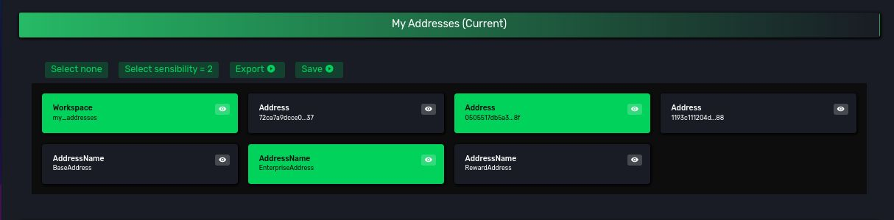
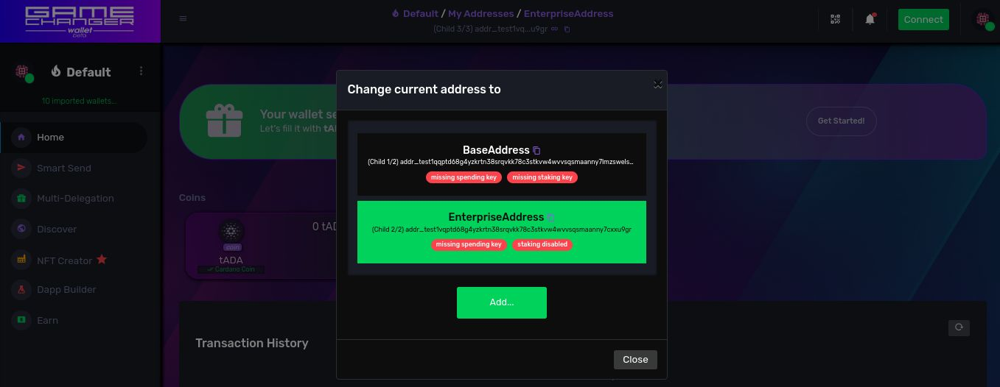
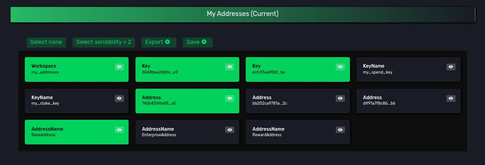
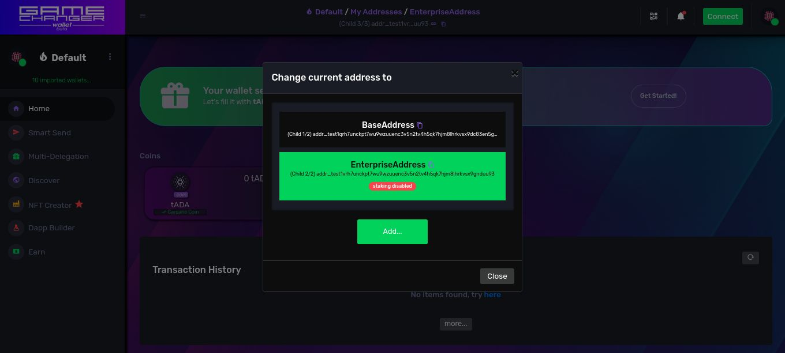
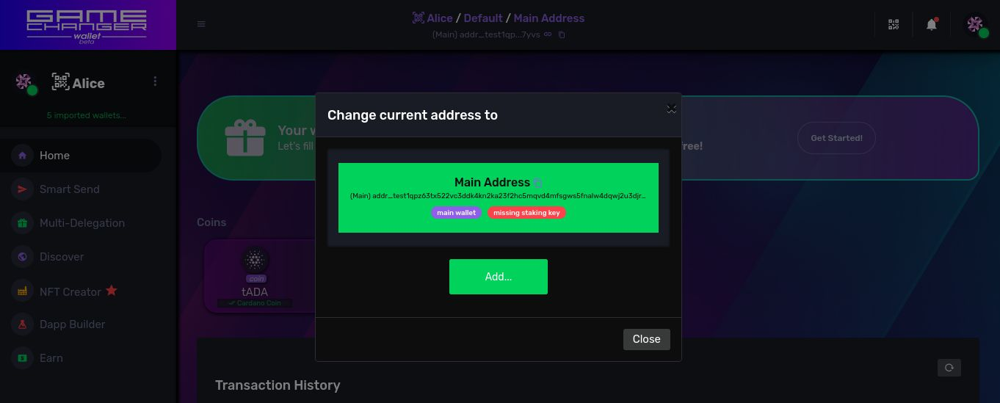
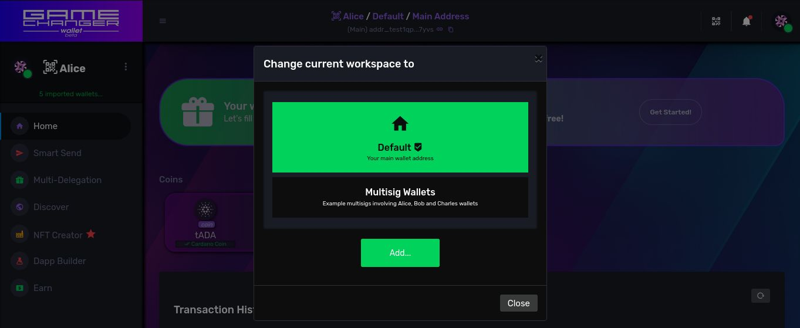

# [Workspaces](README.md) / Addresses

## Introduction

Following the locker and storage room analogy, we said that each locker has
- a unique locker ID (public)
- a unique key (private) that opens it 
    - each key has a unique (public) key ID

On general blockchain cryptography
- a wallet is like a locker
- a wallet address is like the unique locker ID
- a private key is like the unique key that opens the locker
- a public key is like the ID of the unique key that opens the locker
- public keys, and thus the whole key pair, can be referenced by a handy, shorter, unique ID format, a cryptographic hash over the public key: *a key hash*
- a personal account is a numbered section of the storage room where you own all the keys to all it's lockers
- a derivation scheme is the design pattern that serves as recipe to derive groups of keys using your wallet's master private key

On Cardano
- addresses are *usually* generated embedding and encoding key hashes (and script hashes, see multisig chapter)
- each embedded and encoded key hash or script hash is called **spend** or **stake** credential
- if a transaction is signed using the private key matching the key hash of the
    - **spend credential**: a user can spend funds from that address
    - **stake credential**: a user can delegate or withdraw staking rewards from that address
- if an address lacks a 
    - **spend credential**: no user can spend funds from this kind of address
    - **stake credential**: no user can stake funds from this kind of address
- there are several types of addresses, and we will focus on the ones using credentials, the most adopted ones on **Cardano**
    - Shelley-Era addresses
        - **Base**: generated upon a **spend** and a **stake** credential or permission
        - **Enterprise**: generated upon a **spend** credential or permission
        - **Reward**: generated upon a **stake** credential or permission
        - Pointer (we will exclude these ones as they are generated differently)
    - Byron-Era Addresses (legacy format, are half supported on GameChanger Wallet but will be excluded from this chapter)

**GameChanger Wallet** assumes no standard, no address type and no credential type. Thanks to **Workspaces**, it will adapt to user's needs as far as possible, making it not only a general purpose personal wallet, but also a multisig and script based wallet with a common user interface for all use cases. *The universal wallet for Cardano*

## Building addresses

### Static Workspace Design

Let's learn how to build the 3 type of addresses by creating a new workspaces called *My Addresses*.

```js
{
    "type": "script",
    "title": "Building addresses statically ",
    "description": "Exploring different ways to build addresses",
    "args":{
        // a key hash of an specific spend key someone owns
        "spendKeyHash":"02b6e8e8a90561ae713c06065ade3e2305d98eab98c8021bef67327b",
        // a key hash of an specific stake key someone owns
        "stakeKeyHash":"fb141d9fc2787c63e0d72423747c129b1a18a2ac134825314d4960be"
    },
    "run": {
        "usingWorkspaces": {
            "type": "loadConfig",
            "updateId": "addresses-exercise-1",
            "layers": [
                // a layer to define the new workspace
                {
                    "type": "Workspace",
                    "items": [
                        {
                            "namePattern": "my_addresses",
                            "titlePattern": "My Addresses",
                            "descriptionPattern": "My custom addresses!"
                        }
                    ]
                },
                // a layer of type Address to build address artifacts
                {
                    "type": "Address",
                    //tagged under the "my_addresses" workspace
                    "workspaceIds": [
                        "my_addresses"
                    ],
                    // each item is the recipe on how to build an address and it's linked name artifact
                    // namePattern is used to create it's linked name artifact
                    "items": [
                        {
                            // Example Base Address: 1 spend and 1 stake credentials
                            "namePattern": "BaseAddress",
                            "spendPubKeyHashHex": "{get('args.spendKeyHash')}",
                            "stakePubKeyHashHex": "{get('args.stakeKeyHash')}"
                        },
                        {
                            // Example Enterprise Address: 1 spend credential
                            "namePattern": "EnterpriseAddress",
                            "spendPubKeyHashHex": "{get('args.spendKeyHash')}"
                        },
                        {
                            // Example Reward Address: 1 stake credential
                            "namePattern": "RewardAddress",
                            "stakePubKeyHashHex": "{get('args.stakeKeyHash')}"
                        }
                    ]
                }
            ]
        }
    }
}

```
<a href="https://beta-wallet.gamechanger.finance/api/2/run/1-H4sIAAAAAAAAA6WRX0vDMBTFv0rNiwpTmrTrn72pCIoI4osPMuQmuZ1hXVuSlK2MfneTOdcOURDpS8k955eTe7bEdg2SGTFCq8aSCbHKlv7gulWlVNUiACk1GoMmMBasElCWXeCEEj89qq6c_HbTlLX2eqmKAjVWNlhDZwJbB9yjBo7zgl4YMtsS02AlH7C7A_PuICHjCWaYQR5OEwqY0kiESZhMQWKELAqnMs8QeJ6JLGSUY5GkEUu5I7psSxxIBacxlXkhWJqlIokwlCmLWZTGqaAs5xRoBgwEjeKMTSMayzhPQo6knxDdVj5ba9xrXmq9NA0I3MXd76qsQd7UVaEW7uK2kWDxXrrzwwsvcINaKIMX1ClK6FA7_-sBcKC6qbK4-hxWsMInsBa1X-iqextvbFfLMH3sgqvRdNTFkUa0xtarYfUnpJ_3k0OOPcIB1l-J7qUPc3z7_OeU12BwoOzqfGr5voc73DjJdoH27NQ3fjmu-_S8_6rtN8eoVu_w4Y8T3Fbup9HqPzm-U59xDVqOiH_NOXdf338AMrgMq18DAAA" target="_blank" onclick="window.open(this.href, 'dapp connection', 'width=400,height=600'); return false;" style="text-decoration:none; outline:none;">
 
</a>
<a href="https://beta-preprod-wallet.gamechanger.finance/api/2/run/1-H4sIAAAAAAAAA6WRX0vDMBTFv0rNiwpTmrTrn72pCIoI4osPMuQmuZ1hXVuSlK2MfneTOdcOURDpS8k955eTe7bEdg2SGTFCq8aSCbHKlv7gulWlVNUiACk1GoMmMBasElCWXeCEEj89qq6c_HbTlLX2eqmKAjVWNlhDZwJbB9yjBo7zgl4YMtsS02AlH7C7A_PuICHjCWaYQR5OEwqY0kiESZhMQWKELAqnMs8QeJ6JLGSUY5GkEUu5I7psSxxIBacxlXkhWJqlIokwlCmLWZTGqaAs5xRoBgwEjeKMTSMayzhPQo6knxDdVj5ba9xrXmq9NA0I3MXd76qsQd7UVaEW7uK2kWDxXrrzwwsvcINaKIMX1ClK6FA7_-sBcKC6qbK4-hxWsMInsBa1X-iqextvbFfLMH3sgqvRdNTFkUa0xtarYfUnpJ_3k0OOPcIB1l-J7qUPc3z7_OeU12BwoOzqfGr5voc73DjJdoH27NQ3fjmu-_S8_6rtN8eoVu_w4Y8T3Fbup9HqPzm-U59xDVqOiH_NOXdf338AMrgMq18DAAA" target="_blank" onclick="window.open(this.href, 'dapp connection', 'width=400,height=600'); return false;" style="text-decoration:none; outline:none;">
 
</a>


🔍 *See also:*
[loadConfig](https://beta-wallet.gamechanger.finance/doc/api/v2/loadConfig.html),
[script](https://beta-wallet.gamechanger.finance/doc/api/v2/api.html)


On **Workspaces** page the new *My Addresses* workspace will look exactly like this:


<div style="text-align:center">
    
</div>

When selecting the *My Addresses* workspace as current, *Address Picker* will look exactly like this: 

<div style="text-align:center">
    
</div>

Key findings:
- **Reward Addresses** are not listed on *Address Picker* because are considered internal artifacts used for staking operations only
- **BaseAddress** and **EnterpriseAddress** are built using key hashes of key artifacts you do not have on your workspace, and for security reasons *GameChanger Wallet* is notifying you about this with the **missing spending key** and **missing staking key** **red badges**. This means **you are not the owner of the keys required to fully own these addresses**. Only multisig transactions will allow you to spend or stake those funds, otherwise you are watching them in a passive *read-only mode*
- on some address types like **enterprise addresses** a badge also indicates that some operations are disabled due to lack of credentials, like the **staking disabled** badge on **EnterpriseAddress**.
- these 3 addresses where created **statically**: you used constant values for key hashes and this means that every time you run this script you will produce the exact same result, a result that is not customized based on your own keys.

</br>

On my wallet on desktop, on your wallet on mobile, and on a wallet on an *International Space Station* device we will always obtain these 3 addresses on **Cardano Pre-Production Testnet**:

| Artifact Name  | Address  |
| :--------- | :--------------- |
| **BaseAddress** | `addr_test1qqptd68g4yzkrtn38srqvkk78c3stkvw4wvvsqsmaanny7lmzswelsnc0337p4eyyd68cy5mrgv29tqnfqjnzn2fvzlqy429lh`|
| **EnterpriseAddress** | `addr_test1vqptd68g4yzkrtn38srqvkk78c3stkvw4wvvsqsmaanny7cxxu9gr` |
| **RewardAddress** | `stake_test1ura3g8vlcfu8cclq6ujzxaruz2d35x9z4sf5sff3f4ykp0scj3du3` |

</br>

and these exact addresses on **Cardano Mainnet**:

| Artifact Name  | Address  |
| :--------- | :--------------- |
| **BaseAddress** | `addr1qyptd68g4yzkrtn38srqvkk78c3stkvw4wvvsqsmaanny7lmzswelsnc0337p4eyyd68cy5mrgv29tqnfqjnzn2fvzlq8rh9ng`|
| **EnterpriseAddress** | `addr1vyptd68g4yzkrtn38srqvkk78c3stkvw4wvvsqsmaanny7cawge8x` |
| **RewardAddress** | `stake1u8a3g8vlcfu8cclq6ujzxaruz2d35x9z4sf5sff3f4ykp0slcm0cv` |

</br>

Notice that **Cardano** uses an encoding algorithm known as *Bech 32* to encode Shelley-Era addresses and other items, and these allow to add human-readable prefixes to items to mark what these are

| Address Type      | Mainnet Prefix  | Testnet Prefix |
| :---------       | :------------- | :------------ |
| **Base & Enterprise** |  `addr1`      | `addr_test1` |
| **Reward**            |  `stake1`      | `stake_test1` |

</br>


### Dynamic Workspace Design

Let's now adapt the static workspace design to became dynamic: to adapt automatically to the wallet that is running it, to it's own *point of view (pov)*.

For this matter, lets replace these statically-generated address artifacts into addresses built using key artifacts you can own.

Please wipe your workspaces to continue with a clean testing wallet setup.


```js
{
    "type": "script",
    "title": "Building addresses dynamically ",
    "description": "Exploring different ways to build addresses",
    "run": {
        "usingWorkspaces": {
            "type": "loadConfig",
            "updateId": "addresses-exercise-2",
            "layers": [
                {
                    "type": "Workspace",
                    "items": [
                        {
                            "namePattern": "my_addresses",
                            "titlePattern": "My Addresses",
                            "descriptionPattern": "My custom addresses!"
                        }
                    ]
                },
                //let's derive 2 random child keys from your master private key
                {
                    "type": "Key",
                    "workspaceIds": [
                        "my_addresses"
                    ],
                    "items": [
                        {
                            "namePattern": "my_spend_key",
                            "pathPattern": "m/1852h/1815h/3h/0/123"
                        },
                        {
                            "namePattern": "my_stake_key",
                            "pathPattern": "m/1852h/1815h/5h/2/456"
                        }
                    ]
                },
                //let's define these addresses using the key hashes of the previous keys, by artifact name reference!
                {
                    "type": "Address",
                    "workspaceIds": [
                        "my_addresses"
                    ],
                    "items": [
                        {
                            // Example Base Address: 1 spend and 1 stake credentials linked to your keys by name
                            "namePattern": "BaseAddress",
                            "spendPubKeyName": "my_spend_key",
                            "stakePubKeyName": "my_stake_key"
                        },
                        {
                            // Example Enterprise Address: 1 spend credential linked to your key by name
                            "namePattern": "EnterpriseAddress",
                            "spendPubKeyName": "my_spend_key"
                        },
                        {
                            // Example Reward Address: 1 stake credential linked to your key by name
                            "namePattern": "RewardAddress",
                            "stakePubKeyName": "my_stake_key"
                        }
                    ]
                }
            ]
        }
    }
}

```
<a href="https://beta-wallet.gamechanger.finance/api/2/run/1-H4sIAAAAAAAAA6VQXWvCMBT9K1melc66jrG3OXyQsSF72cMQic3VBtMkJCk1SP_7bqtrK4W5MVJCuefjnpMj9cEAfaQutcJ4OqJeeFkPZoWQXKgdYZxbcA4c4UGxXKRMykCQyeEkElohf34wUttawMV2CxaUJyULjnhNNrVXZ4RaW6DmSAuHgg9t986wFAEcnfNIzfizVluxQ3ZhOPOw4DhvTcZwAJsKB-MYGZIFsKj_bA1aV0SFh_wEYgFYMu_B1pnzsO6Haqp36GsgTz20V_eCkxbO67xrd0OrVTVqc7xAQHH5nWbB6yCXm1c_JnQGFF_vGxvDfNYDo8lDEmd4T5IsmmbRbTSJp7RePnTxbA-_cMEvju6S-8sS53f4R5EZc9C5NJ2WxQYf5w1pw6JN3AGh7TCsOFf4Y6z4w5ahyTuUzPKewZUUKzxV9QUlyC2CRAMAAA" target="_blank" onclick="window.open(this.href, 'dapp connection', 'width=400,height=600'); return false;" style="text-decoration:none; outline:none;">
 
</a>
<a href="https://beta-preprod-wallet.gamechanger.finance/api/2/run/1-H4sIAAAAAAAAA6VQXWvCMBT9K1melc66jrG3OXyQsSF72cMQic3VBtMkJCk1SP_7bqtrK4W5MVJCuefjnpMj9cEAfaQutcJ4OqJeeFkPZoWQXKgdYZxbcA4c4UGxXKRMykCQyeEkElohf34wUttawMV2CxaUJyULjnhNNrVXZ4RaW6DmSAuHgg9t986wFAEcnfNIzfizVluxQ3ZhOPOw4DhvTcZwAJsKB-MYGZIFsKj_bA1aV0SFh_wEYgFYMu_B1pnzsO6Haqp36GsgTz20V_eCkxbO67xrd0OrVTVqc7xAQHH5nWbB6yCXm1c_JnQGFF_vGxvDfNYDo8lDEmd4T5IsmmbRbTSJp7RePnTxbA-_cMEvju6S-8sS53f4R5EZc9C5NJ2WxQYf5w1pw6JN3AGh7TCsOFf4Y6z4w5ahyTuUzPKewZUUKzxV9QUlyC2CRAMAAA" target="_blank" onclick="window.open(this.href, 'dapp connection', 'width=400,height=600'); return false;" style="text-decoration:none; outline:none;">
 
</a>


🔍 *See also:*
[loadConfig](https://beta-wallet.gamechanger.finance/doc/api/v2/loadConfig.html),
[script](https://beta-wallet.gamechanger.finance/doc/api/v2/api.html)


On your wallet, on **Workspaces** page, the new *My Addresses* workspace will look similarly to this one on my wallet:


<div style="text-align:center">
    
</div>

When you select the *My Addresses* workspace as current, your *Address Picker* will look similarly to mine: 

<div style="text-align:center">
    
</div>

Key findings:
- **BaseAddress** and **EnterpriseAddress** were built this time using your own public keys, using key hashes of key artifacts you do have on your workspace, so now the **missing spending key** and **missing staking key** **red badges** are gone. This means **you are the owner of the keys required to fully own these addresses**. Multisig is not needed to for making transactions locally, on your owned addresses.
- these 3 addresses where created **dynamically**: you used name artifacts for referencing key hashes automatically underneath script execution context and this means that every time you run this script on any other wallet, with different private keys, you will produce different address and key results, results that are customized based on end user wallet *pov*.
- play with the *artifact selection tool* to audit the artifact dependency tree. Check how
    - `BaseAddress` name artifact connects to
        - `74db436f6ef8...a5` address artifact, which connects to
            - `6048bee2686c...e9` spend key artifact
            - `ecfcf3aa90bf...be` stake key artifact

*One same gcscript source code for all users. Static, wallet-agnostic source code dapp connection with dynamic, wallet-specific execution results based on user pov. No wallet-specific private nor secret data leaked hardcoded on code nor workspace parameters, safe for web transport or for serialization for backup and disaster-recovery purposes...*

**This is the GameChanger Wallet way**, novel design principles made for modern web3 wallet management and dapp connections.


## The Main Address

We define as **Main Address** the base address that is generated out of
- **Main Spend Key** key-hash as credential
- **Main Stake Key** key-hash as credential

On gcscript:

```js
{
    "type": "script",
    "title": "My Main Address",
    "description": "Generating an alias of your wallet's Main Address",
    "run": {
        "usingWorkspaces": {
            "type": "loadConfig",
            "updateId": "addresses-exercise-3",
            "layers": [
                {
                    "type": "Workspace",
                    "items": [
                        {
                            "namePattern": "my_addresses",
                            "titlePattern": "My Addresses",
                            "descriptionPattern": "My custom addresses!"
                        }
                    ]
                },
                {
                    "type": "Key",
                    "workspaceIds": [
                        "my_addresses"
                    ],
                    "items": [
                        {
                            "namePattern": "my_main_spend_key",
                            "pathPattern": "m/1852h/1815h/0h/0/0"
                        },
                        {
                            "namePattern": "my_main_stake_key",
                            "pathPattern": "m/1852h/1815h/0h/2/0"
                        }
                    ]
                },
                {
                    "type": "Address",
                    "workspaceIds": [
                        "my_addresses"
                    ],
                    "items": [
                        {
                            "namePattern": "MyMainAddress",
                            "spendPubKeyName": "my_main_spend_key",
                            "stakePubKeyName": "my_main_stake_key"
                        }
                    ]
                }
            ]
        }
    }
}

```
<a href="https://beta-wallet.gamechanger.finance/api/2/run/1-H4sIAAAAAAAAA52SQUvDQBCF_8q6Fy8taSsF8VY8SJFKbx6klDE7bZYmu2F3Ql1K_ruziU1SsSJCyGHem2_f2-QkKZQoH6RPnS5JjiRpyuNgFcQKtBELpRx6z4rC1qStYf0JDTogbfYCjIBcgxd2J4KtnDhCniPd-u8EV_HmSVaet16tO_gSUvRx9JUit6AerdnpPburUgHhUvEcWgT6MX6gS7XH8R07cgjoeP-tA3RUVjVh0YoGClwDEbqYvAjbjncu3KvcezFQB6UvPGnlyRaiA93IelOPuhzPGHj5eE6zVDHI5cmbXxMWfHNbX6JR20PDKoGygSOZ3s9nGb-n8yyZ8JNMZDz_CojggH8DzSJoWKX_fP-tswrxP-g5Ta119c6X9MLGK4WbzD-7ujYcdFPX9SezpkBcxgIAAA" target="_blank" onclick="window.open(this.href, 'dapp connection', 'width=400,height=600'); return false;" style="text-decoration:none; outline:none;">
 
</a>
<a href="https://beta-preprod-wallet.gamechanger.finance/api/2/run/1-H4sIAAAAAAAAA52SQUvDQBCF_8q6Fy8taSsF8VY8SJFKbx6klDE7bZYmu2F3Ql1K_ruziU1SsSJCyGHem2_f2-QkKZQoH6RPnS5JjiRpyuNgFcQKtBELpRx6z4rC1qStYf0JDTogbfYCjIBcgxd2J4KtnDhCniPd-u8EV_HmSVaet16tO_gSUvRx9JUit6AerdnpPburUgHhUvEcWgT6MX6gS7XH8R07cgjoeP-tA3RUVjVh0YoGClwDEbqYvAjbjncu3KvcezFQB6UvPGnlyRaiA93IelOPuhzPGHj5eE6zVDHI5cmbXxMWfHNbX6JR20PDKoGygSOZ3s9nGb-n8yyZ8JNMZDz_CojggH8DzSJoWKX_fP-tswrxP-g5Ta119c6X9MLGK4WbzD-7ujYcdFPX9SezpkBcxgIAAA" target="_blank" onclick="window.open(this.href, 'dapp connection', 'width=400,height=600'); return false;" style="text-decoration:none; outline:none;">
 
</a>

🔍 *See also:*
[loadConfig](https://beta-wallet.gamechanger.finance/doc/api/v2/loadConfig.html),
[script](https://beta-wallet.gamechanger.finance/doc/api/v2/api.html)


## The Default Address

**GameChanger Wallet** introduced on **Cardano** new non-custodial wallet types, two of them were created for fast and easy onboarding and testing purposes:
- **Burner Wallets** : a seed phrase based wallet type, which is encrypted by a device-managed password, and stored on your browser local storage. This wallet type is inspired by the [Burner Wallet Collective](https://burnerwallet.co) and allow a very fast user experience for short-term tasks and developer environment.
- **Gift Wallets** : a seed phrase based wallet type, which is encrypted by password and encoded as QR codes you can scan to later import providing the right password. It leverages on same encryption algorithm most wallet software use on **Cardano** to allow users to produce wallets, even at scale, for events, classrooms, for testing and onboarding purposes.

These 2 special types are not advised as long-term personal wallets as they are disposable, short-term wallets, marked as so by an ethical feature that triggers in-wallet suggestions to take a better course of action to users. 

**Default Address**: is the address the user interface imports out-of-the-box for each wallet. On short-term types it is slightly different to **Main Address** to encourage users to avoid using these types as long-term personal wallets. It is generated this way:
- on short-term wallet types like **Gift** and **Burner** wallets:
    - **Main Spend Key** key-hash as credential
    - **GameChanger Managed Stake Key** key-hash as credential
- on long-term personal wallet types like **Mnemonic**, **Express**, **Browser Extension** and **Hardware** wallet types:
    - **Main Spend Key** key-hash as credential
    - **Main Stake Key** key-hash as credential

In both scenarios users can still access their **Main Address**, **Main Spend Key** and **Main Stake Key**, only on short-term wallet types this default address uses a different stake credential to incentivize users to move into a personal wallet type. Only affected features are the stake-related ones, but users have always full spending control of the funds.

Here we can see one on a **Gift Wallet**:

<div style="text-align:center">
    
</div>

Notice how the red *missing stake key* badge matches the lack of this specific staking key on these wallet types.

## The Default Workspace

The **Default** workspace is a special one that you cannot remove, that will be always present on your **Workspace Picker** as first choice, and that only contains your **Default Address**.

Here we can see one on a **Gift Wallet**:
<div style="text-align:center">
    
</div>

On next chapter we will learn security tips and how to differentiate across these workspace types.


Previous: [Keys](keys.md) | Next: [Personal Account Wallets](accounts.md)