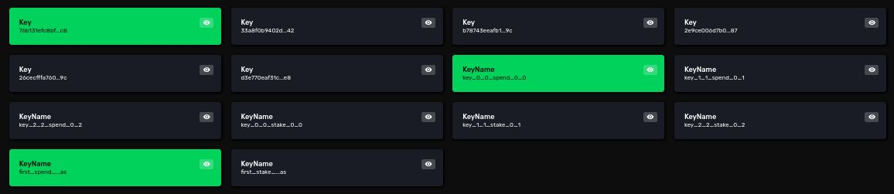
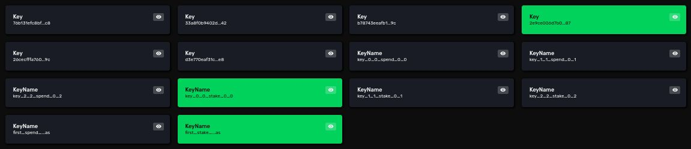
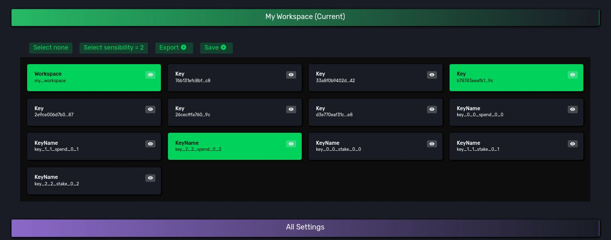
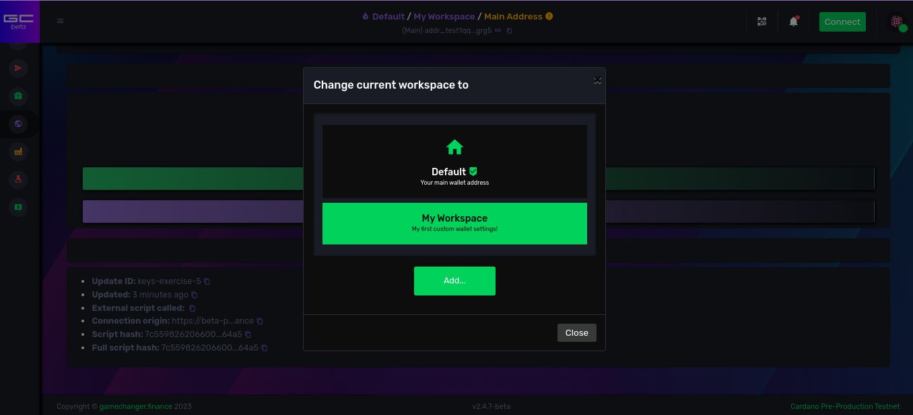

# [Workspaces](README.md) / Keys

## Introduction

Following the locker and storage room analogy, we said that each locker has
- a unique (private) key that opens it 
- each key has a unique (public) key ID
- each locker unique ID is directly linked with the key ID

On blockchain cryptography
- private keys (a secret a user owns) allows to rule over a wallet like unique keys opens each locker
- a public (shareable) key generated from the private key is like the unique ID of a locker key
- a private key and it's public key counterpart is called a key pair
- child key pairs can be derived, or generated upon a master private key
- this master key can be generated using the popular seed phrases we all know about
- private keys are used to sign messages and transactions
- public keys, and thus the whole key pair, can be referenced by a handy, shorter, unique ID format, a cryptographic hash over the public key: *a key hash*
- a wallet address is simply a unique ID generated upon a key hash (stick to this concept for now)
- on standards like Bitcoin's [BIP_0044](https://en.bitcoin.it/wiki/BIP_0044) you can imagine child key derivation as an almost-infinite checkerboard with 2 axis. You use 2 index numbers to derive a unique specific key, a unique cell of the board
    - an account index
    - an address index

On **Cardano**
- we extended the Bitcoin [BIP_0044](https://en.bitcoin.it/wiki/BIP_0044) standard to specialize more each key based on new roles. 
    - Think of roles as the specific permission you are granted with by signing using a private key
- we introduced the [HD (Hierarchy for Deterministic) Wallets for Cardano](https://cips.cardano.org/cip/CIP-1852/) standard, this is **the recipe on how to derive, or generate, child keys**
    - it is a chain of numbers, or indexes, instructing wallet software on how to generate each child key. 
    - sections of the chain are
        - **purpose**: `1852`, a constant number to make it clear we are using the Cardano standard
        - **coin_type**:`1815`, a constant number to make it clear we are using the Cardano standard, reserved for future use
        - **account**: or **account index**, a customizable index, an axis of your checkerboard
        - **role**: or the **kind** of permission someone is granted with by owning the key
            - External chain: we call it **Spend** kind. Usually used to give you permission to spend funds from an address
            - Internal chain: we call it **Internal Spend** kind. Usually used to give you permission to spend funds from an internal-only address - supported but not used on GameChanger Wallet 
            - Staking key   : we call it **Stake** kind.  Usually used to give you permission to delegate stake and withdraw rewards from an address
            - DRep and Constitutional Committee keys are out of scope for now.
        - **index**: or **address index**, a customizable index, another axis of your checkerboard
    - it uses the *BIP32-Ed25519* derivation style: a masked string that follows the pattern `m / purpose' / coin_type' / account' / role / index`. We opt to use `h` instead of `'` for the *hardening* indicator
    - On *GameChanger Wallet* you can use either the *BIP32-Ed25519* masked string style or you can use JSON properties for **kind**,  **accountIndex** and **addressIndex** values.
    - For example, here are three different key derivation paths expressed on both supported formats:
        - "`m/1852h/1815h/0h/0/0`" 
            - **kind**: `spend`
            - **accountIndex**: `0`
            - **addressIndex**: `0`
        - "`m/1852h/1815h/5h/0/123`"
            - **kind**: `spend`
            - **accountIndex**: `5`
            - **addressIndex**: `123`
        - "`m/1852h/1815h/0h/2/0`"
            - **kind**: `stake`
            - **accountIndex**: `0`
            - **addressIndex**: `0`

Let's jump into practice now. 

Go to the pre-production testnet wallet.

From sidebar menu navigate through *discover -> advanced -> workspaces* to access **Workspaces** page.

Preferably use the **Reset all Workspaces** red button to start with a clean wallet setup.

## Deriving keys

### JSON style derivation path

On **Dapp Builder** (*Playground IDE*) let's derive the first 3 consecutive **spend** and **stake** keys from your master key (from your seed phrase, or the private key stored on your hardware wallet). 6 different keys in total derived using JSON style derivation path.

```js
{
    "type": "script",
    "title": "Key derivation",
    "description": "Exploring different ways to derive keys",
    "run": {
        "usingWorkspaces": {
            // this function derives and loads into a user wallet the artifacts instructed through the `layers` argument
            "type": "loadConfig",
            // this is an arbitrary string that when changes across `loadConfig` calls, it triggers some wallet actions
            "updateId": "keys-exercise-1",
            // groups of artifacts recipes by category
            "layers": [
                {
                    // category "Key" groups recipes for child key derivation
                    "type": "Key",
                    // list of individual artifact recipes
                    "items": [
                        // first 3 spend keys, we decide to only change addressIndex
                        {
                            "kind": "spend",
                            "accountIndex": 0,
                            "addressIndex": 0
                        },
                        {
                            "kind": "spend",
                            "accountIndex": 0,
                            "addressIndex": 1
                        },
                        {
                            "kind": "spend",
                            "accountIndex": 0,
                            "addressIndex": 2
                        },
                        // first 3 stake keys, we decide to only change addressIndex
                        {
                            "kind": "stake",
                            "accountIndex": 0,
                            "addressIndex": 0
                        },
                        {
                            "kind": "stake",
                            "accountIndex": 0,
                            "addressIndex": 1
                        },
                        {
                            "kind": "stake",
                            "accountIndex": 0,
                            "addressIndex": 2
                        }                       
                    ]
                }
            ]
        }
    }
}

```
If we audit artifacts on **Workspaces** page on the wallet you will see a setup like this:

<div style="text-align:center">
    
</div>

Play with the select tool to analyse the relationships between them. There is none. 6 different **yellow-marked** and unrelated key artifacts.


### *BIP32-Ed25519* style derivation path

Now lets overwrite wallet setup with same child keys but derived using the masked string style. 

```js
{
    "type": "script",
    "title": "Key derivation",
    "description": "Exploring different ways to derive keys",
    "run": {
        "usingWorkspaces": {
            "type": "loadConfig",
            "updateId": "keys-exercise-2",
            "layers": [
                {
                    "type": "Key",
                    "items": [
                        // first 3 spend keys, we decide to only change addressIndex
                        {
                            "pathPattern": "m/1852h/1815h/0h/0/0"
                        },
                        {
                            "pathPattern": "m/1852h/1815h/0h/0/1"
                        },
                        {
                            "pathPattern": "m/1852h/1815h/0h/0/2"

                        },
                        // first 3 stake keys, we decide to only change addressIndex
                        {
                            "pathPattern": "m/1852h/1815h/0h/2/0"
                        },
                        {
                            "pathPattern": "m/1852h/1815h/0h/2/1"
                        },
                        {
                            "pathPattern": "m/1852h/1815h/0h/2/2"
                        }                       
                    ]
                }
            ]
        }
    }
}

```

If we audit artifacts on **Workspaces** page we will see the same 6 keys generated and no more. This proves how each artifact is unique and while you can replace or update it's recipe, the resulting object will not change, otherwise new key artifacts would have appear on the list.

This is because we produced same keys, and thus same *key hashes*.

### Templated design

"Is there a way to automate the sequence?"

Yes. While GCScript is an isomorphic and verbose language without fancy runtime iterators (quite on purpose), it has string templating features on some of the functions. URL compression algorithm benefits a lot from this technique to reduce payload sizes.

Let's automate the last exercise. Because we need 2 different counts, one for the spend keys, and one for the stake keys, we will split the layer into 2 layers of the same category. Each item has an index in the list where it belongs and by using the `index` templating variable wrapped between `{` and `}`, it will get replaced in-place making our `addressIndex` to increment matching the previous design pattern.

*Please do not confuse **string templates** with **ISL code**, both share the same begin `{` and end `}` tokens but are not the same. For now.*

```js
{
    "type": "script",
    "title": "Key derivation",
    "description": "Exploring different ways to derive keys",
    "run": {
        "usingWorkspaces": {
            "type": "loadConfig",
            "updateId": "keys-exercise-3",
            "layers": [
                {
                    "type": "Key",
                    "items": [
                        // first 3 spend keys, addressIndex will be the index of each item on the list, starting from zero
                        {
                            "pathPattern": "m/1852h/1815h/0h/0/{index}"
                        },
                        {
                            "pathPattern": "m/1852h/1815h/0h/0/{index}"
                        },
                        {
                            "pathPattern": "m/1852h/1815h/0h/0/{index}"
                        }           
                    ]
                },
                {
                    "type": "Key",
                    "items": [
                        // first 3 stake keys, addressIndex will be the index of each item on the list, starting from zero
                        {
                            "pathPattern": "m/1852h/1815h/0h/2/{index}"
                        },
                        {
                            "pathPattern": "m/1852h/1815h/0h/2/{index}"
                        },
                        {
                            "pathPattern": "m/1852h/1815h/0h/2/{index}"
                        }                       
                    ]
                }
            ]
        }
    }
}

```
Once again we can verify on **Workspaces** page the same 6 keys were re-generated and no more. Templating worked as expected, artifacts collided but same *key hashes* were produced.

### Human-friendly artifact names

Now lets attach a name, a user-friendly label or ID to each of these artifacts. We will use string templating for this as well.

Keep in mind that these names or *aliases*
- are also artifacts
- names are unique across all workspaces of a user wallet
- are linked to only one other artifact
- linked artifact is updatable
- names are listed on *Transaction Review*, and other user interfaces
- names are IDs that can be used on GCScript to query for and reuse the linked artifacts

Let's add a third layer to create 2 extra aliases for the first **spend** and **stake** keys, using individual item properties to override layer's default name pattern parameter.

```js
{
    "type": "script",
    "title": "Key derivation",
    "description": "Exploring different ways to derive keys",
    "run": {
        "usingWorkspaces": {
            "type": "loadConfig",
            "updateId": "keys-exercise-4",
            "layers": [
                {
                    "type": "Key",
                    // we create names for each key using default parameters for child items to inherit the string template
                    "namePattern": "key_{index}_{key}_{kind}_{accountIndex}_{addressIndex}",
                    "items": [
                        {
                            "pathPattern": "m/1852h/1815h/0h/0/{index}"
                        },
                        {
                            "pathPattern": "m/1852h/1815h/0h/0/{index}"
                        },
                        {
                            "pathPattern": "m/1852h/1815h/0h/0/{index}"
                        }           
                    ]
                },
                {
                    "type": "Key",
                    // we create names for each key using default parameters for child items to inherit the string template
                    "namePattern": "key_{index}_{key}_{kind}_{accountIndex}_{addressIndex}",
                    "items": [
                        {
                            "pathPattern": "m/1852h/1815h/0h/2/{index}"
                        },
                        {
                            "pathPattern": "m/1852h/1815h/0h/2/{index}"
                        },
                        {
                            "pathPattern": "m/1852h/1815h/0h/2/{index}"
                        }                       
                    ]
                },
                {
                    "type": "Key",
                    // this default parameter will be overridden individually by each child item 
                    "namePattern": "key_{index}_{key}_{kind}_{accountIndex}_{addressIndex}",
                    "items": [
                        {
                            // this name patter overrides the layer's default name parameter
                            "namePattern": "first_{kind}_key_alias",
                            "pathPattern": "m/1852h/1815h/0h/0/0"
                        },
                        {
                            // this name patter overrides the layer's default name parameter
                            "namePattern": "first_{kind}_key_alias",
                            "pathPattern": "m/1852h/1815h/0h/2/0"
                        }           
                    ]
                }
            ]
        }
    }
}

```


We can now verify on **Workspaces** page the same 6 keys were re-generated and no more, but 8 *name artifacts* were created this time. The 6 names of the 1st and 2nd layer plus the 2 extra names of the last layer.

If we explore the relationships with the selection tool we can clearly see how 2 name artifacts points to the same spend key artifact

<div style="text-align:center">
    
</div>

and the same with a stake key artifact

<div style="text-align:center">
    
</div>

Most distinguishable change now is that all key artifacts are no longer *yellow-marked*.

**Orphan artifacts:** are artifacts that have no associated name artifacts, hidden from end user reach, but existing on wallet storage for user safety and recovery purposes. When an artifact has at least one or more names associated are *white-marked* and this is the suggested way of creating artifacts.

## The Workspace Artifact

Every wallet item produced with the dapp connector is an artifact, so *Workspaces* are also artifacts! 

This is a novel Web 3 wallet design you will only find on GameChanger Wallet.

**Workspace artifacts:** are like tags, IDs, used to group other artifacts and may hold some metadata.

Until now on **Workspaces** page we have seen how all artifacts were listed on a tab called *All settings*. 

Now we will tag all artifacts but the 2 extra aliases under a workspace called *My Workspace*.


```js
{
    "type": "script",
    "title": "Key derivation",
    "description": "Exploring different ways to derive keys",
    "run": {
        "usingWorkspaces": {
            "type": "loadConfig",
            "updateId": "keys-exercise-5",
            "layers": [
                // a new layer, one to define a new workspace
                {
                    "type": "Workspace",
                    "items": [
                        {
                            "namePattern": "my_workspace",
                            "titlePattern": "My Workspace",
                            "descriptionPattern": "My first custom wallet settings!"
                        }
                    ]
                },
                {
                    "type": "Key",
                    // we tag these items under the new workspace
                    "workspaceIds": [
                        "my_workspace"
                    ],
                    "namePattern": "key_{index}_{key}_{kind}_{accountIndex}_{addressIndex}",
                    "items": [
                        {
                            "pathPattern": "m/1852h/1815h/0h/0/{index}"
                        },
                        {
                            "pathPattern": "m/1852h/1815h/0h/0/{index}"
                        },
                        {
                            "pathPattern": "m/1852h/1815h/0h/0/{index}"
                        }           
                    ]
                },
                {
                    "type": "Key",
                    // we tag these items under the new workspace
                    "workspaceIds": [
                        "my_workspace"
                    ],
                    "namePattern": "key_{index}_{key}_{kind}_{accountIndex}_{addressIndex}",
                    "items": [
                        {
                            "pathPattern": "m/1852h/1815h/0h/2/{index}"
                        },
                        {
                            "pathPattern": "m/1852h/1815h/0h/2/{index}"
                        },
                        {
                            "pathPattern": "m/1852h/1815h/0h/2/{index}"
                        }                       
                    ]
                },
                {
                    "type": "Key",
                    // we won't tag these items under the new workspace                  
                    "namePattern": "key_{index}_{key}_{kind}_{accountIndex}_{addressIndex}",
                    "items": [
                        {
                            "namePattern": "first_{kind}_key_alias",
                            "pathPattern": "m/1852h/1815h/0h/0/0"
                        },
                        {
                            "namePattern": "first_{kind}_key_alias",
                            "pathPattern": "m/1852h/1815h/0h/2/0"
                        }           
                    ]
                }
            ]
        }
    }
}

```
</br>

On **Workspaces** page we can see now that 
- the 6 keys
- the 6 name artifacts
- 1 workspace artifact 

are listed on a new tab, called *My Workspace*. It excludes the other 2, non-tagged, name artifacts. Notice how now if you play with the select tool, all artifacts *belong*, or link to the workspace artifact.

<div style="text-align:center">
    
</div>

</br>

At the top center of the screen, on the wallet toolbar, you are presented with 3 indicators, each opens a picker dialog
 - the **Wallet Picker**
 - the **Workspace Picker** (only shown when at least 1 workspace is present on current wallet)
 - the **Address Picker**

You have now created a workspace that is going to be listed on the **Workspace Picker**, the menu where you select the current workspace that setup your wallet.

<div style="text-align:center">
    
</div>


Current address indicator, the **Address Picker**, is shown yellow marked because this workspace does not have an address yet, and well, **GameChanger Wallet** is a single address wallet, it requires you to select an address inside your current workspace to know properly what keys to use when signing transactions and to render the graphical interface

## Main Key Pair Derivation

These first key pairs are very important for single address wallets, and while on GameChanger Wallet you can set as current any address, these keys still play an important role, you will later learn how these two are used to create your wallet's **Main Address**. 

The following script serves as a derivation path definition on it's own.

```js

{
    "type": "script",
    "title": "Main Key Derivation",
    "description": "Main Spend and Stake Keys derivation paths",
    "run": {
        "usingWorkspaces": {
            "type": "loadConfig",
            "updateId": "keys-exercise-6",
            "layers": [
                {
                    "type": "Key",            
                    "items": [
                        {
                            "namePattern": "main_spend_key",
                            "pathPattern": "m/1852h/1815h/0h/0/0"
                        },
                        {
                            "namePattern": "main_stake_key",
                            "pathPattern": "m/1852h/1815h/0h/2/0"
                        }           
                    ]
                }
            ]
        }
    }
}

```

## Key queries on GCScript

Both `loadConfig` and `saveConfig` functions does not return results, by design, for security reasons.

To reuse on scripts the generated artifacts, say, the hashes of the derived keys for example we
 - ask permission to the user to select the intended workspace with the `setCurrentWorkspace` function
 - and we use query functions, like `getPublicKeys` to search, filter, format and order the results 

Also you can always query for your wallet's **Main Spend** and **Main Stake** keys using the functions
- `getSpendingPublicKey`
- `getStakingPublicKey`

 Let's run some queries on the previous `my_workspace` and explore the results.


```js
{
    "type": "script",
    "title": "Key queries",
    "description": "Explore the different ways to query keys and obtain all results under the same format",
    "exportAs": "data",
    "run": {
        // this will return your Main Spending Key, no matter if it's not present on current workspace
        "mainSpendKey": {
            "type": "getSpendingPublicKey"
        },
        // this will return your Main Staking Key, no matter if it's not present on current workspace
        "mainStakeKey": {
            "type": "getStakingPublicKey"
        },
        // here we ask the user permission to change by code wallet's current workspace, same we do manually using Workspace Picker
        "setWorkspace": {
            "type": "setCurrentWorkspace",
            "workspaceId": "my_workspace"
        },
        // once on the right workspace, we run some queries of artifacts tagged under 'my_workspace'
        "keysInWorkspace": {
            "type": "script",
            "run": {
                "allKeys": {
                    // without arguments we search for all the key artifacts
                    "type": "getPublicKeys"
                },
                "spendKeys": {
                    "type": "getPublicKeys",
                    // we alter the resulting JSON key-value map with keys named using a templated pattern, in this case the *BIP32-Ed25519* derivation path by using the 'path' variable
                    "keyPattern": "{path}",
                    //filter will narrow the results with the matching properties 
                    "filter": {
                        // here we only want all the keys which kind equals 'spend'
                        "kind": "spend"
                    }
                },
                "onlyAddressIndex1": {
                    "type": "getPublicKeys",
                    // we alter the resulting JSON key-value map with keys named using a templated pattern, in this case the name of the artifact if it has one, using the 'artifactName' variable
                    "keyPattern": "{artifactName}",
                    "filter": {
                        // here we filter for all keys which addressIndex equals '1'
                        "addressIndex": 1
                    }
                },
                "onlyAccountIndex5": {
                    "type": "getPublicKeys",
                    "keyPattern": "{artifactName}",
                    "filter": {
                        // here we filter by all the keys which *BIP32-Ed25519* derivation path starts with  "m/1852h/1815h/5h/", and we have none of these
                        "pathPrefix": "m/1852h/1815h/5h/"
                    }
                }
            }
        }
    }
}

```
</br>

And your results will be similar to these (but never the same as you have a different master private key than mine).

- **pubKeyHex**: is the hexadecimal representation of the public key
- **pubKeyHashHex**: is a hash of the public key
- **derivationKind**: is the role or kind of the key

```js

{
  "exports": {
    "data": {
      "mainSpendKey": {
        "pubKeyHex": "dbe92e8dbd943644f9bfe733e71c272ce3e80d9554b5ba0b2ffd305adb3d897e",
        "pubKeyHashHex": "02b6e8e8a90561ae713c06065ade3e2305d98eab98c8021bef67327b",
        "derivationKind": "spend"
      },
      "mainStakeKey": {
        "pubKeyHex": "fed3d97da0eca5151953a0030c5f8a927ef6eca7529bec8969afdcd8eab4fca4",
        "pubKeyHashHex": "fb141d9fc2787c63e0d72423747c129b1a18a2ac134825314d4960be",
        "derivationKind": "stake"
      },
      "setWorkspace": "my_workspace",
      "keysInWorkspace": {
        "allKeys": {
          "spend-0-0": {
            "pubKeyHex": "dbe92e8dbd943644f9bfe733e71c272ce3e80d9554b5ba0b2ffd305adb3d897e",
            "pubKeyHashHex": "02b6e8e8a90561ae713c06065ade3e2305d98eab98c8021bef67327b",
            "derivationKind": "spend"
          },
          "spend-0-1": {
            "pubKeyHex": "a0bae0d9e38c5adc72ae180cbc1680a6a7f3f6d6164a69cd0103fae00f749e00",
            "pubKeyHashHex": "d1ce53f09d3f705ba1386856d3e0cc2581a081d40f7f9b99699e17fd",
            "derivationKind": "spend"
          },
          "spend-0-2": {
            "pubKeyHex": "81826cb2c4728ad5875bb0d76fad3885bf01d5144d84067fcfade74b0ead3f99",
            "pubKeyHashHex": "52addabafdc2d46ad9e649a78f3d2471d7270259e526306c52653f79",
            "derivationKind": "spend"
          },
          "stake-0-0": {
            "pubKeyHex": "fed3d97da0eca5151953a0030c5f8a927ef6eca7529bec8969afdcd8eab4fca4",
            "pubKeyHashHex": "fb141d9fc2787c63e0d72423747c129b1a18a2ac134825314d4960be",
            "derivationKind": "stake"
          },
          "stake-0-1": {
            "pubKeyHex": "24551846dcfe06f628d5b33a1e04103a7185ba80a498a9e6cd64f6164862a2f6",
            "pubKeyHashHex": "b7bdc0e33f223291f671d4186618430e3a1c085d3290e6c4170e3e70",
            "derivationKind": "stake"
          },
          "stake-0-2": {
            "pubKeyHex": "13d4db833ac798590bbdd17b72857f0f70cdb6920d0375b9f70248ab617f0704",
            "pubKeyHashHex": "c9ac52c87f1e9d31a05aeac51ba75ec5fbfe320ede9c1c3823b342e7",
            "derivationKind": "stake"
          }
        },
        "spendKeys": {
          "m/1852h/1815h/0h/0/0": {
            "pubKeyHex": "dbe92e8dbd943644f9bfe733e71c272ce3e80d9554b5ba0b2ffd305adb3d897e",
            "pubKeyHashHex": "02b6e8e8a90561ae713c06065ade3e2305d98eab98c8021bef67327b",
            "derivationKind": "spend"
          },
          "m/1852h/1815h/0h/0/1": {
            "pubKeyHex": "a0bae0d9e38c5adc72ae180cbc1680a6a7f3f6d6164a69cd0103fae00f749e00",
            "pubKeyHashHex": "d1ce53f09d3f705ba1386856d3e0cc2581a081d40f7f9b99699e17fd",
            "derivationKind": "spend"
          },
          "m/1852h/1815h/0h/0/2": {
            "pubKeyHex": "81826cb2c4728ad5875bb0d76fad3885bf01d5144d84067fcfade74b0ead3f99",
            "pubKeyHashHex": "52addabafdc2d46ad9e649a78f3d2471d7270259e526306c52653f79",
            "derivationKind": "spend"
          }
        },
        "onlyAddressIndex1": {
          "key_1_1_spend_0_1": {
            "pubKeyHex": "a0bae0d9e38c5adc72ae180cbc1680a6a7f3f6d6164a69cd0103fae00f749e00",
            "pubKeyHashHex": "d1ce53f09d3f705ba1386856d3e0cc2581a081d40f7f9b99699e17fd",
            "derivationKind": "spend"
          },
          "key_1_1_stake_0_1": {
            "pubKeyHex": "24551846dcfe06f628d5b33a1e04103a7185ba80a498a9e6cd64f6164862a2f6",
            "pubKeyHashHex": "b7bdc0e33f223291f671d4186618430e3a1c085d3290e6c4170e3e70",
            "derivationKind": "stake"
          }
        },
        "onlyAccountIndex5": {}
      }
    }
  }
}

```

Now you can build scripts, and dapps, that can derive keys on user's wallets and then access *with user permission* this data in order to reuse it, for example for minting NFTs or creating multisig transactions.

---

Let's now explore on next chapter how *keys* and *addresses* are related on **Cardano**,

...as artifacts!

Previous: [Quick Start](quick-start.md) | Next: [Addresses](addresses.md)