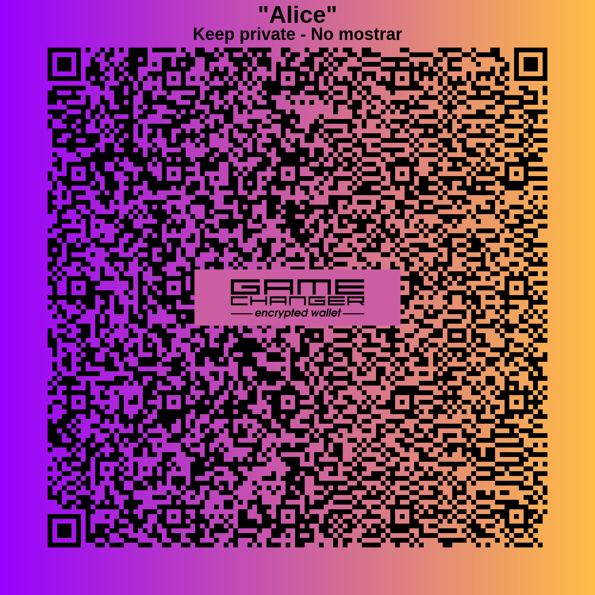
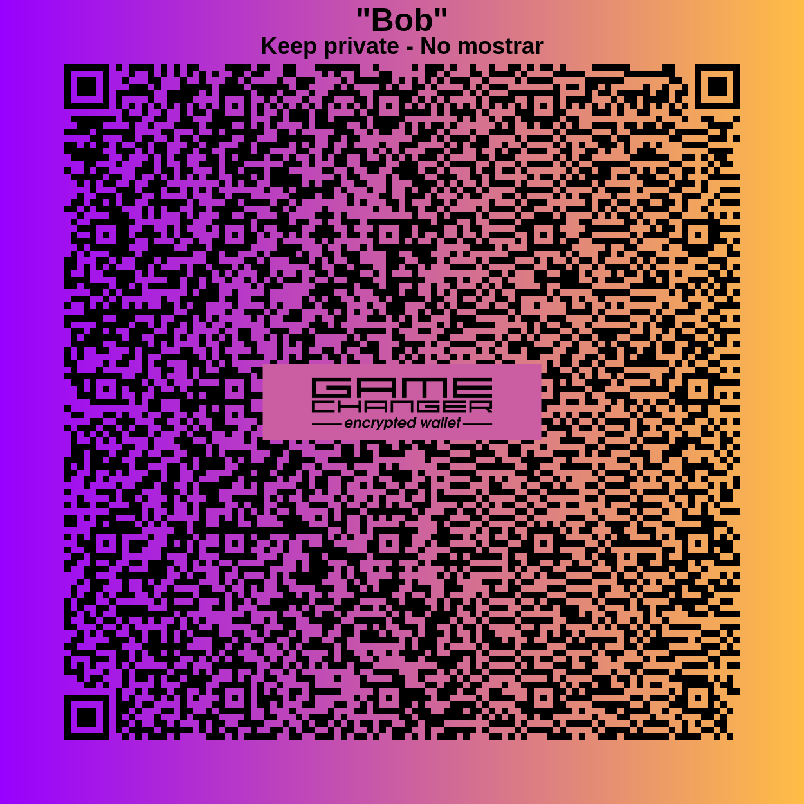
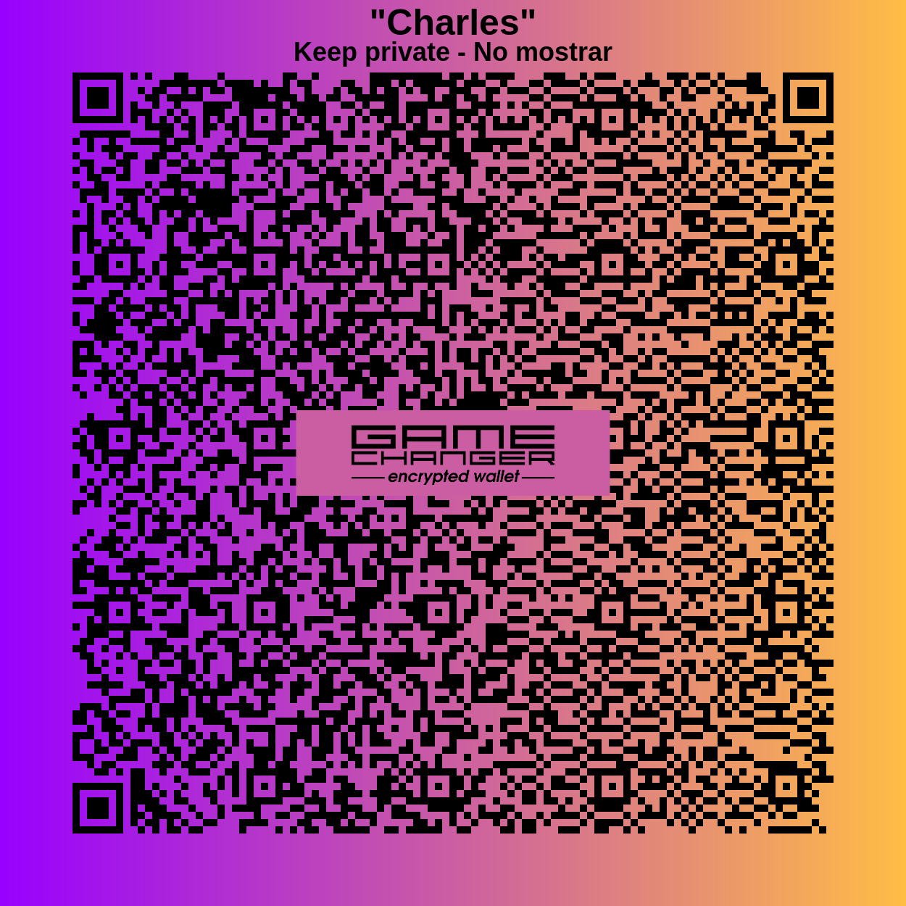
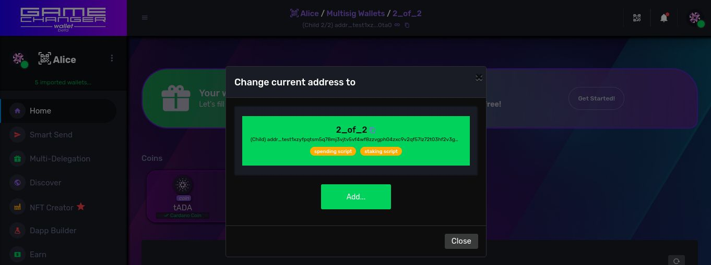
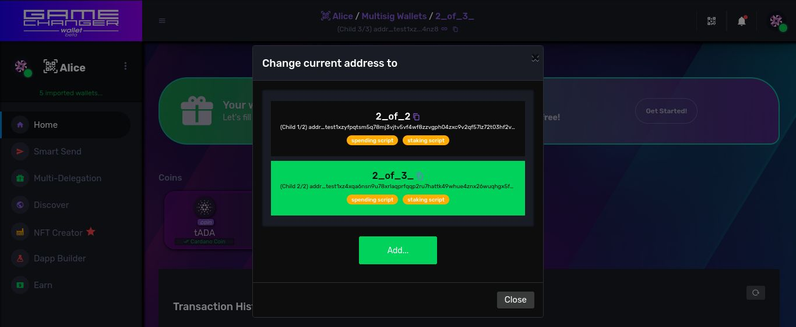

# [Workspaces](README.md) / Multisig Wallets

## Introduction

We have seen how each credential on Cardano Shelley-Era most used addresses points to specific user keys by encoding their key hashes inside. 

As seen on previous chapters **Native Scripts** and **Plutus Scripts** are the 2 protocol-native programmable code languages that can be executed on-chain and that are used as validators, as transaction witnesses based on a customizable logic, **smart contracts** if you wish to call them that way.

Here, on **Cardano**, you can use hashes to reference *on-chain scripts* instead of key-hashes to reference user keys on address credentials. This allow **spend** and **stake** permissions based on code logic instead of plain user signatures.

## Preparations: 3 Gift Wallets

For all the examples on this chapter let's automate the creation of your own set of **Gift Wallets** for each testing persona using the `walletGenerator` API function, which generates them at scale if you wish, or individually like on the following script.

<details>
  <summary>More about wallet types...</summary>

**Gift Wallets**: are a seed phrase based wallet type, which is encrypted by password and encoded as QR codes you can scan to later import providing the right password. It leverages on same encryption algorithm most wallet software use on **Cardano** to allow users to produce wallets, even at scale, for events, classrooms, for testing and onboarding purposes. Same produced wallet works for **Pre-Production Testnet** and **Mainnet** networks. 

**Express Wallets** are similar QR wallets, but are meant for personal, private use with a faster and less error-prone import procedure than plain old seed phrases. Are considered an intermediary step between the insecure plain text seed phrase wallets (**Mnemonic wallets**) and a secure hardware wallet (**Trezor or Ledger wallets**). All these types are supported on **GameChanger Wallet** in addition to **Browser Extension wallets** as well.

</details>

</br>

```js
{
    "type": "script",
    "title": "Creating Alice, Bob and Charles",
    "description": "Generates 3 unique QR password-encrypted Gift Wallets for testing multisig with your own set of keys. QR codes will be downloaded as PNG files. Import them into GC Wallet and store script results.",
    "exportAs": "MyAlterEgos",
    "run": {
        "Alice": {
            "type": "walletGenerator",
            "amount": 1,
            "defaultNamePattern": "Alice",
            "defaultPasswordPattern": "ImAlice1234",
            "defaultDescriptionPattern": "Use to sign as Alice",
            "defaultKeyPattern": "wallet",
            "defaultHintPattern": "your password is '{password}'",
            "qr": true,
            "download": true,
            "extra":true
        },
        "Bob": {
            "type": "walletGenerator",
            "amount": 1,
            "defaultNamePattern": "Bob",
            "defaultPasswordPattern": "ImBob1234",
            "defaultDescriptionPattern": "Use to sign as Bob",
            "defaultKeyPattern": "wallet",
            "defaultHintPattern": "your password is '{password}'",
            "qr": true,
            "download": true,
            "extra":true
        },
        "Charles": {
            "type": "walletGenerator",
            "amount": 1,
            "defaultNamePattern": "Charles",
            "defaultPasswordPattern": "ImCharles1234",
            "defaultDescriptionPattern": "Use to sign as Charles",
            "defaultKeyPattern": "wallet",
            "defaultHintPattern": "your password is '{password}'",
            "qr": true,
            "download": true,
            "extra":true
        }
    }
}
```

🔍 *See also:*
[walletGenerator](https://beta-wallet.gamechanger.finance/doc/api/v2/walletGenerator.html),
[script](https://beta-wallet.gamechanger.finance/doc/api/v2/api.html)


**Note:** use `"secrets":true` and run in *system* mode to also obtain the random-generated seed phrases and private keys on function output. Remember you can also create **Gift Wallets** (onboarding) or **Express Wallets** (personal) QR wallets from seed phrases through **GameChanger Wallet** user interface.

These were my results, the ones I will use along the chapter. I recommend you to create and store your own set of wallets and results to avoid testing interference across the multisig exercises. 

<details>
  <summary>My results...</summary>

```js
{
  "exports": {
    "MyAlterEgos": {
      "Alice": {
        "wallet": {
          "index": 0,
          "key": "wallet",
          "address": "addr_test1qpz63tx522vc3ddk4kn2ka23f2hc5mqvd4mfsgws5fnalw4dqwj2u3djrag0mene2cm9elu5mdqmcz9zc2rzgq7c5g6qvx7yvs",
          "name": "Alice",
          "spendKeyHex": "8d9e6ca3ae6d72e13bdedf2f7e88c4b69c7121cf798ffd419a31939ed03f3042",
          "stakeKeyHex": "cad8a28a285394850f089ed6a06d2ff6c28ed5eea07d682a17c47f6b9674e827",
          "spendKeyHashHex": "45a8acd4529988b5b6ada6ab75514aaf8a6c0c6d769821d0a267dfba",
          "stakeKeyHashHex": "896f31da01424a4c6037b21fc4d498170f43f237abd1dcf57e08e07e",
          "defaultCredentials": {
            "stakeKeyHashHex": "ad03a4ae45b21f50fde67956365cff94db41bc08a2c2862403d8a234"
          }
        }
      },
      "Bob": {
        "wallet": {
          "index": 0,
          "key": "wallet",
          "address": "addr_test1qppv96wge7d33dqxmmnjm5ea0s27eyexwzmv2e70dmy8jgddqwj2u3djrag0mene2cm9elu5mdqmcz9zc2rzgq7c5g6qp7hkyz",
          "name": "Bob",
          "spendKeyHex": "86df58cd59cfd00c83fcef56c476c66961b3b759260dac2ab59d682fa248fb49",
          "stakeKeyHex": "f6912b0f7243075ace4d823b7195e44bc720dab971e5c678db219a3f20722331",
          "spendKeyHashHex": "42c2e9c8cf9b18b406dee72dd33d7c15ec932670b6c567cf6ec87921",
          "stakeKeyHashHex": "fab802bd709e1eea862ce8055a35b76c07bfdd3c5d8b8d136528cdf0",
          "defaultCredentials": {
            "stakeKeyHashHex": "ad03a4ae45b21f50fde67956365cff94db41bc08a2c2862403d8a234"
          }
        }
      },
      "Charles": {
        "wallet": {
          "index": 0,
          "key": "wallet",
          "address": "addr_test1qrteq06jp4v974wl0m4mpvesmpaz2tsam0vmgh8033g8lyddqwj2u3djrag0mene2cm9elu5mdqmcz9zc2rzgq7c5g6q7vxlwf",
          "name": "Charles",
          "spendKeyHex": "14699ec845c593a14641cc3bbd89652b347ded2cad144a8fc8868b1933ea0fcf",
          "stakeKeyHex": "c9643734d444b20ac96cf03123960f179307a0ca8ce1ff7ede7b02981a329579",
          "spendKeyHashHex": "d7903f520d585f55df7eebb0b330d87a252e1ddbd9b45cef8c507f91",
          "stakeKeyHashHex": "c613a698b348a999a5c8cdb9b99aabf7365194e8a9891285044c5eaf",
          "defaultCredentials": {
            "stakeKeyHashHex": "ad03a4ae45b21f50fde67956365cff94db41bc08a2c2862403d8a234"
          }
        }
      }
    }
  }
}
```

</details>

</br>

We will use their **Main Spend and Main Stake keys** *key-hashes* to later build our *native scripts*. These hashes can be obtained on your results under the **spendKeyHashHex** and **stakeKeyHashHex** properties.

|      | Alice | Bob  | Charles |
|:---: | :---: | :--: | :-----: |
| encrypted private key |  |  |  |
| main spend key hash | `45a8acd4529988b5b6ada6ab75514aaf8a6c0c6d769821d0a267dfba` |  `42c2e9c8cf9b18b406dee72dd33d7c15ec932670b6c567cf6ec87921` |  `d7903f520d585f55df7eebb0b330d87a252e1ddbd9b45cef8c507f91` | 
| main stake key hash | `896f31da01424a4c6037b21fc4d498170f43f237abd1dcf57e08e07e` |  `fab802bd709e1eea862ce8055a35b76c07bfdd3c5d8b8d136528cdf0` |  `c613a698b348a999a5c8cdb9b99aabf7365194e8a9891285044c5eaf` | 

</br>


## Multi-signature Addresses

On this chapter we will continue exploring the importance and usefulness of **Native Scripts**, or *dumb contracts*, by using them to code the logic required for special types of addresses that require a combination of more than one user key signature in transactions to grant **spend** or **stake** permissions: the usually called **multisig addresses**.

We will explore most common use cases among the infinite logic combinations that can be done.

When designing multisig workspaces, a smart pattern a developer can follow is to embed the party credentials on the code making it static, agnostic from any specific wallet pov. As a result, **the same code can be executed on Alice, Bob and Charles devices pairing them all with the same multisig address** 

When encoding the gcscript as a URL or QR code, you can make your multisig users life easier: **a single shareable URL to load the exact same multisig on any device**

### Example: 2 of 2 signatures

It's native script grants **spend** and **stake** permissions on transactions consuming funds or managing stake on the multisig address only if: `Alice and Bob signs`

The shareable workspace loader code:
```js

{
    "type": "script",
    "title": "Multisig 2 of 2 Workspace",
    "description": "Alice and Bob must sign",
    "args":{
        "Alice":{
            "spendKeyHashHex": "45a8acd4529988b5b6ada6ab75514aaf8a6c0c6d769821d0a267dfba",
            "stakeKeyHashHex": "896f31da01424a4c6037b21fc4d498170f43f237abd1dcf57e08e07e"
        },
        "Bob":{
            "spendKeyHashHex": "42c2e9c8cf9b18b406dee72dd33d7c15ec932670b6c567cf6ec87921",
            "stakeKeyHashHex": "fab802bd709e1eea862ce8055a35b76c07bfdd3c5d8b8d136528cdf0"
        }
    },
    "run": {
        "walletSetup": {
            "type": "loadConfig",
            "updateId": "multisigs_update_1",
            "layers": [
                {
                    "type": "Workspace",
                    "items": [
                        {
                            "namePattern": "multisigs",
                            "titlePattern": "Multisig Wallets",
                            "descriptionPattern": "Example multisigs involving Alice, Bob and Charles wallets"
                        }
                    ]
                },
                {
                    //this layer will build Native Scripts artifacts
                    "type": "NativeScript",
                    "workspaceIds": [
                        "multisigs"
                    ],
                    // we use the "key" string template variable to replace by the key of the key-value map of items provided
                    "namePattern": "2_of_2_{key}_script",
                    "items": {
                        // for this item where the key variable equals "spend" , 
                        // the artifact name will be "2_of_2_spend_script"
                        "spend": {
                            //"all" is a native script that enforces that all sub-native script items on list be met
                            "all": {
                                "alice": {
                                    //"pubKeyHashHex" is a native script that enforces an specific key signature referenced by key hash
                                    "pubKeyHashHex": "{get('args.Alice.spendKeyHashHex')}"
                                },
                                "bob": {
                                    "pubKeyHashHex": "{get('args.Bob.spendKeyHashHex')}"
                                }
                            }
                        },
                        // for this item where the key variable equals "stake" , 
                        // the artifact name will be "2_of_2_stake_script"
                        "stake": {
                            "all": {
                                "alice": {
                                    "pubKeyHashHex": "{get('args.Alice.stakeKeyHashHex')}"
                                },
                                "bob": {
                                    "pubKeyHashHex": "{get('args.Bob.stakeKeyHashHex')}"
                                }
                            }
                        }
                    }
                },
                {
                    "type": "Address",
                    "workspaceIds": [
                        "multisigs"
                    ],
                    "items": [
                        {
                            "namePattern": "2_of_2",
                            //for spend credential we use the native script hash of native script named "2_of_2_spend_script"
                            "spendNativeScriptName": "2_of_2_spend_script",
                            //for stake credential we use the native script hash of native script named "2_of_2_stake_script"
                            "stakeNativeScriptName": "2_of_2_stake_script"
                        }
                    ]
                }
            ]
        }
    }
}

```

🔍 *See also:*
[loadConfig](https://beta-wallet.gamechanger.finance/doc/api/v2/loadConfig.html),
[script](https://beta-wallet.gamechanger.finance/doc/api/v2/api.html)

After selecting `Multisig Wallets` as current workspace, this is how your **Address Picker** will look like:

<div style="text-align:center">
    
</div>


**Note**: using similar script logic for spend and for stake credentials is a common practice among **Cardano** multisig wallet software, but actually you are free to use different credential types on **GameChanger Wallet**.


### Example: 2 of 3 signatures

It's native script grants **spend** and **stake** permissions on transactions consuming funds or managing stake on the multisig address only if: `At least 2 of Alice, Bob and Charles signs`

The shareable workspace loader code:
```js

{
    "type": "script",
    "title": "Multisig 2 of 3 Workspace",
    "description": "At least 2 of Alice, Bob and Charles must sign",
    "args":{
        "Alice":{
            "spendKeyHashHex": "45a8acd4529988b5b6ada6ab75514aaf8a6c0c6d769821d0a267dfba",
            "stakeKeyHashHex": "896f31da01424a4c6037b21fc4d498170f43f237abd1dcf57e08e07e"
        },
        "Bob":{
            "spendKeyHashHex": "42c2e9c8cf9b18b406dee72dd33d7c15ec932670b6c567cf6ec87921",
            "stakeKeyHashHex": "fab802bd709e1eea862ce8055a35b76c07bfdd3c5d8b8d136528cdf0"
        },
        "Charles":{
            "spendKeyHashHex": "d7903f520d585f55df7eebb0b330d87a252e1ddbd9b45cef8c507f91",
            "stakeKeyHashHex": "c613a698b348a999a5c8cdb9b99aabf7365194e8a9891285044c5eaf"
        }
    },
    "run": {
        "walletSetup": {
            "type": "loadConfig",
            "updateId": "multisigs_update_2",
            "layers": [
                {
                    "type": "Workspace",
                    "items": [
                        {
                            "namePattern": "multisigs",
                            "titlePattern": "Multisig Wallets",
                            "descriptionPattern": "Example multisigs involving Alice, Bob and Charles wallets"
                        }
                    ]
                },
                {
                    "type": "NativeScript",
                    "workspaceIds": [
                        "multisigs"
                    ],
                    "namePattern": "2_of_3_{key}_script",
                    "items": {
                        "spend": {
                            //"atLeast" and "ofThese" builds a native script that enforces that "atLeast" N number of sub-native script items on "ofThese" list must be met
                            "atLeast":2,
                            "ofThese": {
                                "alice": {
                                    "pubKeyHashHex": "{get('args.Alice.spendKeyHashHex')}"
                                },
                                "bob": {
                                    "pubKeyHashHex": "{get('args.Bob.spendKeyHashHex')}"
                                },
                                "charles": {
                                    "pubKeyHashHex": "{get('args.Charles.spendKeyHashHex')}"
                                }
                            }
                        },
                        "stake": {
                            "atLeast":2,
                            "ofThese": {
                                "alice": {
                                    "pubKeyHashHex": "{get('args.Alice.stakeKeyHashHex')}"
                                },
                                "bob": {
                                    "pubKeyHashHex": "{get('args.Bob.stakeKeyHashHex')}"
                                },
                                "charles": {
                                    "pubKeyHashHex": "{get('args.Charles.stakeKeyHashHex')}"
                                }
                            }
                        }
                    }
                },
                {
                    "type": "Address",
                    "workspaceIds": [
                        "multisigs"
                    ],
                    "items": [
                        {
                            "namePattern": "2_of_3",
                            "spendNativeScriptName": "2_of_3_spend_script",
                            "stakeNativeScriptName": "2_of_3_stake_script"
                        }
                    ]
                }
            ]
        }
    }
}

```

🔍 *See also:*
[loadConfig](https://beta-wallet.gamechanger.finance/doc/api/v2/loadConfig.html),
[script](https://beta-wallet.gamechanger.finance/doc/api/v2/api.html)


After selecting `Multisig Wallets` as current workspace, this is how your **Address Picker** will look like:

<div style="text-align:center">
    
</div>

**Note**: using similar script logic for spend and for stake credentials is a common practice among **Cardano** multisig wallet software, but actually you are free to use different credential types on **GameChanger Wallet**.


## Seamless Transactions 

**GameChanger Wallet** design has numerous advantages, since 2021 it has never been trivial the fact that transactions are built by the wallet itself and otherwise, while also supported, is not advised.

The **Transaction Builder API** functions are fully integrated with **Workspace API**, allowing wallet user interface (end users) and dapps (developers) to benefit from a seamless transition between building transactions from: 
- main addresses (Burner,Gift,Mnemonic,Hardware and Browser Extension wallets)
- personal account addresses (HD, anonymous, custom)
- multisig addresses like shared treasuries, DAOs, 2FA, etc.. (script based addresses)
- foreign addresses (third party credentials)

This is done by a couple of novel features such as **Automatic Artifact Provision** where transaction building recipes missing some pieces of information are healed using artifacts from the *local workspace storage*. Also the concept of **Automatic Optional Signers** plays a key role on calculating the worst transaction fee required in order to support the case where all the involved signatures referenced by **native scripts** are required. These and other underlying features ensures transaction validity and wallet-agnostic building arguments that are ready for any wallet context.

Here's an example of a seamless and wallet-agnostic transaction design that works also for multisig wallets:

```js
{
    "type": "script",
    "run": {
        // building an off-chain transaction..
        "build":{
            "type": "buildTx",
            "tx": {
                "outputs": [
                    //an output of 1 coin to some address
                    {
                        "address":"addr_test1vrv2myc3je5q7fxfnajjgj4qnynhdp82rsylnj2lm8yawtswwgyaw",
                        "assets": [
                            { 
                                "policyId": "ada", 
                                "assetName": "ada", 
                                "quantity": "1000000"
                            }
                        ]
                    },
                ],
                // Add these lines if you also want seamless support for multisig wallets 
                "options": {
                    "autoProvision": {
                        "workspaceNativeScript": true
                    },
                    "autoOptionalSigners": {
                        "nativeScript": true,
                    },
                }
            },
        },
        // signing the transaction with user's private keys
        "sign":{
            "type": "signTxs",
            "detailedPermissions": false,
            "txs": [
                "{get('cache.build.txHex')}"
            ]
        },
        // submitting the transaction to a Cardano Node, for going on-chain
        "submit":{
            "type": "submitTxs",
            "txs": "{get('cache.sign')}"
        }
    }
}

```


🔍 *See also:*
[buildTx](https://beta-wallet.gamechanger.finance/doc/api/v2/buildTx.html),
[signTxs](https://beta-wallet.gamechanger.finance/doc/api/v2/signTxs.html),
[submitTxs](https://beta-wallet.gamechanger.finance/doc/api/v2/submitTxs.html),
[script](https://beta-wallet.gamechanger.finance/doc/api/v2/api.html)

"But wait, what that has to do with me?"

- **For end users** it means that for the first time you have a wallet software that abstracts **Cardano** complexities and brings you a unified and seamless user interface where no matter what kind of wallet you have, making transactions and interacting with dapps , whether you are a single user or a shared treasury member, your wallet experience looks the same.
- **For developers** it means for the first time on **Cardano** you only need to code your dapps or web integrations once, and with the same universal code you reach all mobile and desktop audiences possible, even **Multisigs**, **Browser Extension** and **Hardware** wallets.


</br>

Previous: [Personal Account Wallets](accounts.md) | Home: [General Documentation](../README.md)