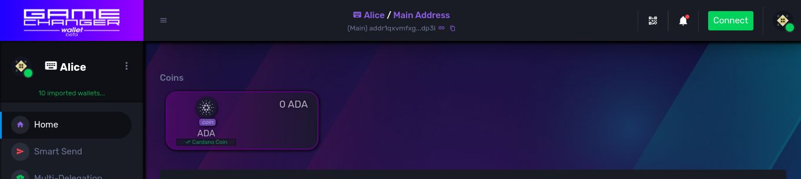
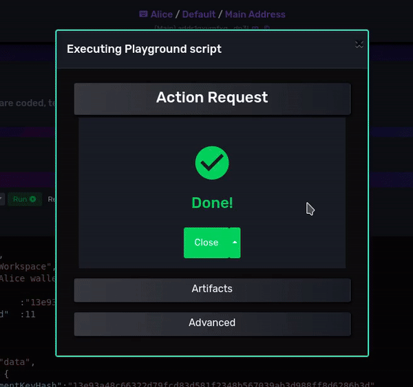
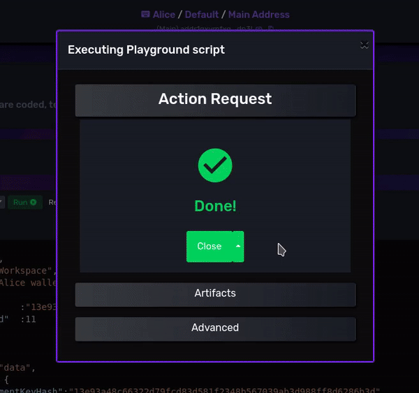
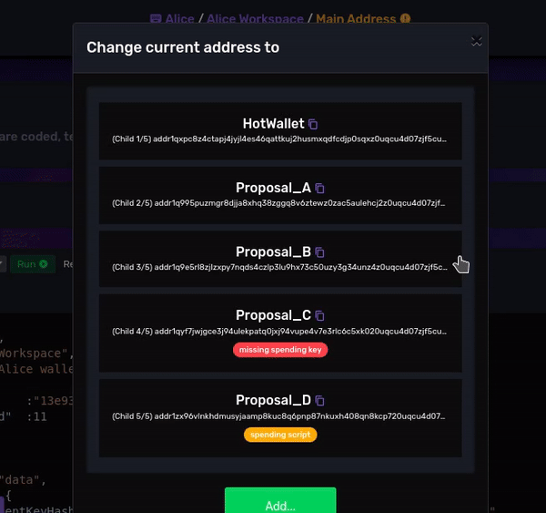
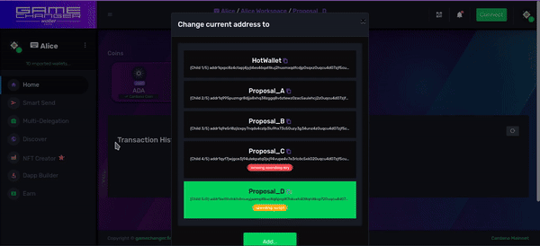

# [Workspaces](README.md) / Quick Start

## Introduction

Let's explore what can be done with *Workspaces* to solve a real use case where standards are not enough, to design a practical wallet setup for *Alice, the Catalyst Proposer* (based on a true story).

Alice is trying to contribute to **Cardano** and community voted to fund her 4 proposals on **Project Catalyst**. 

She now needs 4 different addresses to receive and manage these funds separately. Also she needs a hot wallet, a separate address for daily expenses. She only want to use 1 hardware wallet or 1 seed phrase to manage all these addresses for simplicity (and security) sake. Also she wants to contribute to a good cause by delegating all her addresses to [WHITE](https://white.topopool.com/) or [PEACE](https://pooltool.io/pool/bd24b3372791f401cc029455c44ea77f3c8750ce3b804a354af0ff16/delegators) stake pools.  

Alice's 5 addresses:
- **Hot Wallet**: she is the owner. For daily expenses and other tasks.
- **Proposal A**: she is the only proposer. She is the owner.
- **Proposal B**: she is the only proposer. She is the owner.
- **Proposal C**: she will work for Bob. Bob is the owner, she wants to keep an eye on the funds, trigger payment requests and also delegate to the same stake pool.
- **Proposal D**: she co-propose it with her friend Bob. She also need approval from Bob to move the funds.

She tried to use single address wallets software but
- to avoid mixing balances she is forced to create several accounts, and many of these don't allow that and force her to use different seed phrases or hardware wallets
- if she create several accounts, one for proposal, she must delegate them separately to the stake pool of choice (and this is more expensive)
- this wallet is not properly prepared for multisig wallets, so D is out of the equation

She was planning to use a hierarchical deterministic Cardano wallet software with a sequence of addresses but 
- it mixes balances from receiving addresses
- to avoid mixing balances she is forced to create several accounts
- if she create several accounts, one for proposal, she must delegate them separately to the stake pool of choice (and this is more expensive)
- this wallet is not properly prepared for multisig wallets, so D is out of the equation

She then thought on using a multisig wallet software
- she is forced to deal with key management herself for A, B, and is unable to deal with C. 
- she must solve delegation outside this wallet to reuse the staking credential, to share same delegation across them all

Finally she found out about GameChanger Wallet Workspaces and she wanted to give it a try. Here is the GCScript she used to setup her own wallet:


## Alice Workspace GCScript code (JSON):

```js

{
    "type": "script",
    "title": "Alice Workspace",
    "description": "Alice wallet settings to manage her 4 Catalyst projects",
    "args":{
        "Bob"           :"13e93a48c66322d79fcd83d581f2348b567039ab3d988ff8d6286b3d",
        "CatalystFund"  :11
    },
    "run": {
        "Bob": {
            "type": "data",
            "value": {
                "paymentKeyHash":"13e93a48c66322d79fcd83d581f2348b567039ab3d988ff8d6286b3d"
            }
        },
        "walletSetup": {
            "type": "loadConfig",
            "updateId": "alice_update_1",
            "layers": [
                {
                    "type": "Workspace",
                    "items": [
                        {
                            "namePattern": "alice",
                            "titlePattern": "Alice Workspace",
                            "descriptionPattern": "Alice wallet settings to manage her 4 Catalyst projects"
                        }
                    ]
                },
                {
                    "type": "Key",
                    "workspaceIds": [
                        "alice"
                    ],
                    "items": [
                        {
                            "namePattern": "spend-hot",
                            "kind": "spend",
                            "accountIndex": "{get('args.CatalystFund')}",
                            "addressIndex": 0
                        },
                        {
                            "namePattern": "spend-A",
                            "kind": "spend",
                            "accountIndex": "{get('args.CatalystFund')}",
                            "addressIndex": 1
                        },
                                                {
                            "namePattern": "spend-B",
                            "kind": "spend",
                            "accountIndex": "{get('args.CatalystFund')}",
                            "addressIndex": 2
                        },
                                                {
                            "namePattern": "spend-D",
                            "kind": "spend",
                            "accountIndex": "{get('args.CatalystFund')}",
                            "addressIndex": 3
                        },
                        {
                            "namePattern": "stake-all",
                            "kind": "stake",
                            "accountIndex": "{get('args.CatalystFund')}",
                            "addressIndex": 0
                        }
                    ]
                },
                {
                    "type": "NativeScript",
                    "workspaceIds": [
                        "alice"
                    ],
                    "namePattern": "shared_spend_script",
                    "items": {
                        "spend": {
                            "all": {
                                "alice": {
                                    "pubKeyName": "spend-D"
                                },
                                "bob": {
                                    "pubKeyHashHex": "{get('args.Bob')}"
                                }
                            }
                        }
                    }
                },
                {
                    "type": "Address",
                    "workspaceIds": [
                        "alice"
                    ],
                    "items": [
                        {
                            "namePattern": "HotWallet",
                            "spendPubKeyName": "spend-hot",
                            "stakePubKeyName": "stake-all"
                        },
                        {
                            "namePattern": "Proposal_A",
                            "spendPubKeyName": "spend-A",
                            "stakePubKeyName": "stake-all"
                        },
                        {
                            "namePattern": "Proposal_B",
                            "spendPubKeyName": "spend-B",
                            "stakePubKeyName": "stake-all"
                        },
                        {
                            "namePattern": "Proposal_C",
                            "spendPubKeyHashHex": "{get('args.Bob')}",
                            "stakePubKeyName": "stake-all"
                        },
                        {
                            "namePattern": "Proposal_D",
                            "spendNativeScriptName": "shared_spend_script",
                            "stakePubKeyName": "stake-all"
                        }
                    ]
                }
            ]
        }
    }
}

```
### Running the script

Alice was working on Cardano Mainnet, so let's go step by step on replicating her setup.

Go to [GameChanger Wallet for Cardano Mainnet](https://beta-wallet.gamechanger.finance/). You can try it on Pre-Production Testnet but addresses will change. 

This is Alice seed phrase:

```
hunt sleep wheel toddler around town man accuse labor elbow adapt bottom snake warm whip
```

Create a *mnemonic wallet* with the seed phrase, it will look like this:

<div style="text-align:center">
    
</div>

Now go to *Dapp Builder*, ( [Playground IDE for Cardano Mainnet](https://beta-wallet.gamechanger.finance/playground) ), paste the gcscript on the code editor and click on run.

After running it, the *workspace* will be added to your wallet. On the *dapp connector* interface you can find the generated *artifacts*. Play with the select tool to explore the relationships between them. 

<div style="text-align:center">
    
</div>


Now close the *dapp connector UI* and on the *Workspace Picker* lets change between the *Default* workspace (the one that comes out-of-the-box), into *Alice Workspace*, to make *GameChanger Wallet* load the 5 addresses, adapting the whole user interface exclusively for Alice. Then on the *Address Picker* you can visualize all the available addresses on the current workspace.

<div style="text-align:center">
    
</div>

Alice addresses are:

| Artifact Name  | Address  |
| :--------- | :--------------- |
| **HotWallet** | *addr1qxpc8z4ctapj4jyjl4es46qattkuj2husmxqdfcdjp0sqxz0uqcu4d07zjf5cuqdqpy54vpmaw6lp7nl82l2pz5w2reqsm3el0* |
| **Proposal_A** | *addr1q995puzmgr8djja8xhq38zggq8v6ztewz0zac5aulehcj2z0uqcu4d07zjf5cuqdqpy54vpmaw6lp7nl82l2pz5w2reqw7nqtm* |
| **Proposal_B** | *addr1q9e5rl8zjlzxpy7nqds4czlp3lu9hx73c50uzy3g34unz4z0uqcu4d07zjf5cuqdqpy54vpmaw6lp7nl82l2pz5w2req4my3xv* |
| **Proposal_C** | *addr1qyf7jwjgce3j94ulekpatq0jxj94vupe4v7e3rlc6c5xk020uqcu4d07zjf5cuqdqpy54vpmaw6lp7nl82l2pz5w2req555rjs* |
| **Proposal_D** | *addr1zx96vlnkhdmusyjaamp8kuc8q6pnp87nkuxh408qn8kcp720uqcu4d07zjf5cuqdqpy54vpmaw6lp7nl82l2pz5w2reqrqpljd* |

</br>

*GameChanger Wallet is a flexible and customizable single address wallet*. 

You can now set on the *Address Picker* the current address to any of the 5 Alice addresses.

<div style="text-align:center">
    
</div>

 For example you can now delegate to *WHITE*, *PEACE* or any other stake pool from your *HotWallet* address and all the other ones will automatically delegate their stake to the same pool (due to the shared stake credential across all addresses). Or you can send funds between the addresses, as they all appear now on the address book in *Smart Send*, where you can make transactions through the user interface. 

<div style="text-align:center">
    
</div>

You can rest assure that every time you move funds from one address to another, all the other balances remain unmodified, as change outputs work in single address mode, and go back to the address that builds the transactions, the *current selected wallet* from the *Address Picker*

Important considerations
- you need yours and Bob's signatures to spend assets from Proposal_D address, you will learn soon how multisig works
- you do not own Proposal_C address, only Bob can spend those funds. You can use multisig also in this case.
- you can go back to the *Default* workspace to return your wallet to the initial setup
- on discover -> advanced-> workspaces page you can reset all your workspaces leaving the wallet to the initial state. 
- `loadConfig` function loads the workspace on browser storage, re-run the gcscript to recover the same setup later on desktop or mobile 
- `saveConfig` function receives the same `layers` argument and beside loading the workspace on browser storage, it will create a transaction stream to store your workspaces on-chain with GCFS
- as you can see on the code, `loadConfig` and `saveConfig` does not handle nor store private keys, seed phrases or other secret sensitive information, they deal with the recipes on how to reconstruct workspaces. 
- users, dapps or other agents can run `loadConfig` and `saveConfig` like any other gcscript function, making workspaces available for third party applications as well.
- if you run this gcscript on a different wallet (different seed phrase,private keys) you will end up having another working workspace but with totally different addresses. This is because *Alice Workspace* derives keys and generates addresses dynamically, not statically. Only Proposal_C address spend credential is statically defined. 


</br>

<details>
  <summary>Notes regarding standards.</summary>

Standards limit your possibilities, they exist for a reason. But sometimes reasons exists because strict, non-universal and overly-opinionated standards limit possibilities in first place. 

Toolmakers are nobody to tell you what to do or what not to do. Specially on web3 space.

*GameChanger Wallet* gives you freedom of choice through *Workspaces* for you to follow the standard you agree with, or to find your own solution. 

But "*With great power comes great responsibility*":

Learn. Innovate. Think outside the box. But test your solutions across different wallet types. Prepare yourself for ecosystem realities. Sometimes hardware wallets memory constraints, or they interpretation of standards, can limit your plans. Extension wallets offer you very few options here. Some APIs may not calculate staking rewards properly on special scenarios. Check GameChanger official workspaces for *Personal Accounts* and *Multisig Wallets* to learn derivation scheme patterns and workspace designs supporting a grand majority of wallet types.   

</details>

</br>

Have you noticed that if Alice change the `args.CatalystFund` argument value to the next fund number, she will generate different addresses and keys? This is done by customizing the key derivation scheme, we will explore this on the next chapter. 


Previous: [Overview](overview.md) | Next: [Keys](keys.md)