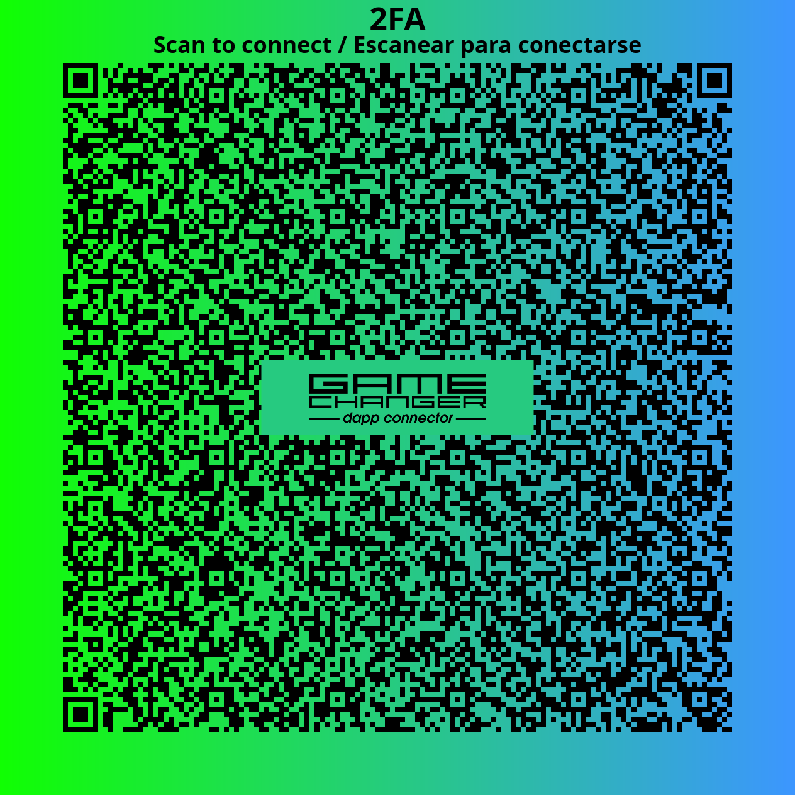

# Cardano Example Dapp

## **2FA**

Create a workspace with a Shared Treasury address based on 2 addresses. A second address on the workspace is your main address as Signer


## Try it online: 

-  Visit [HTML5 Dapp](https://gamechangerfinance.github.io/gamechanger.wallet/examples/2FA.html)
-  Run [Standalone URL dapp connection](https://beta-wallet.gamechanger.finance/api/2/run/1-H4sIAAAAAAAAA5VU227aQBD9lZVfkkgUUVpA5A2lqoIqRUhUykOFosE7vhR7195dYxzkf--sb5gQ2uYJ78zsmTNnznJ0TJGgc-9oV4WJcQaOCU1kA-PvCzpxrBOhFBR7UAgGGbBcqp1OwEWWhyagwDoAhZz9pAKdqYIB5wq1ZlvQFJaCjdsQ6iFbMI2uFLwrowITYA821KyQmWIxhKKrAs3WoS9QETE8JFKZha6ZfsNYUlChyRQRPTqx5HYIIQU6JSWyKkqVixrLnprJORigu3uIMnu0zT6ncw8gTue76WQy8_f4ZQKx4WkSzOfBPB2bQ_A6mrkBHPxpluc-n_6e7keeO_oqJhj44_m4OOw1_exRqzSND6knklmR5WJWpO5rlubKsiI6S-HJHpcYXFUNYvk6Rx9Nw9fW3dLx9sYFN8DhaZKbu7vSguUQRWjWpEDSA4wk8AcpvNAn1CyhWXHJzzSLoEBFevzq7jy3W6BsaDCukwJiXIExaAV2xh60XukF31rmlHqu2NHajQmFr5mPtEYiw9mWzMI4cWH1NWYkc1ufEWK7fafclIOO4w8sqFXnlyW3JCtWm-ukdYKCf9KJFFpaD-1CwdswHcF1ZSbMUnA8OPejgQOt9nXAtn8DaGCH7wDa8P8A9id6AhPucd0-wyujXWzh5bjDonzpnm8z-7GZij5I-epFFBojz34l2ZbkeyKkC02sKalRV_QIOni0XCsv9sxn_ThMoIhRmKbuxvqwJIR6_H93PhPvY53tXfLReeeyp2b7zD_ske4PphJmdV2qZs7V30a6eDVk5xOzCq-_9gbFbrXKnbZaAV8rtbm2lCy1ISH-AIiTaVnXBQAA)

## Source code:

- dapp connection code: [GCScript DSL](2FA.gcscript)
- frontend (using @gamechanger-finance/gc): [HTML5 dapp](2FA.html)
- frontend (without official library): [Native HTML5 dapp](2FA_nolib.html)

Dapp code was autogenerated by [Playground IDE in GameChanger Wallet ](https://beta-wallet.gamechanger.finance/playground)

## GCScript code (dapp connection):
```json
{
  "type": "script",
  "title": "2FA",
  "description": "Create a workspace with a Shared Treasury address based on 2 addresses. A second address on the workspace is your main address as Signer",
  "exportAs": "2FADemo",
  "return": {
    "mode": "none"
  },
  "run": {
    "2FAAddress": {
      "type": "data",
      "value": "addr1q9faamq9k6557gve35amtdqph99h9q2txhz07chaxg6uwwgd6j6v0fc04n5ehg292yxvs292vesrqqmxqfnp7yuwn7yqczuqwr"
    },
    "2FAInfo": {
      "type": "macro",
      "run": "{getAddressInfo(get('cache.2FAAddress'))}"
    },
    "walletSetup": {
      "type": "loadConfig",
      "updateId": "2FADemo",
      "layers": [
        {
          "type": "Workspace",
          "items": [
            {
              "namePattern": "2fa",
              "titlePattern": "2FA",
              "descriptionPattern": "Wallet settings generated by a demo script to create a 2FA address"
            }
          ]
        },
        {
          "type": "Key",
          "workspaceIds": [
            "2fa"
          ],
          "items": [
            {
              "namePattern": "spend-sponsor",
              "kind": "spend",
              "accountIndex": 0,
              "addressIndex": 0
            },
            {
              "namePattern": "stake-sponsor",
              "kind": "stake",
              "accountIndex": 0,
              "addressIndex": 0
            }
          ]
        },
        {
          "type": "NativeScript",
          "workspaceIds": [
            "2fa"
          ],
          "namePattern": "2fa_{key}_script",
          "items": {
            "spend": {
              "all": {
                "myself": {
                  "pubKeyName": "spend-sponsor"
                },
                "2fa": {
                  "pubKeyHashHex": "{get('cache.2FAInfo.paymentKeyHash')}"
                }
              }
            },
            "stake": {
              "all": {
                "myself": {
                  "pubKeyName": "stake-sponsor"
                },
                "2fa": {
                  "pubKeyHashHex": "{get('cache.2FAInfo.stakingKeyHash')}"
                }
              }
            }
          }
        },
        {
          "type": "Address",
          "workspaceIds": [
            "2fa"
          ],
          "items": [
            {
              "namePattern": "Signer",
              "spendPubKeyName": "spend-sponsor",
              "stakePubKeyName": "stake-sponsor"
            },
            {
              "namePattern": "2FA Address",
              "spendNativeScriptName": "2fa_spend_script",
              "stakeNativeScriptName": "2fa_stake_script"
            }
          ]
        }
      ]
    }
  }
}
```

## Run standalone QR dapp connection: 

You can use [Playground IDE in GameChanger Wallet ](https://beta-wallet.gamechanger.finance/playground) in `QR URL Transport` mode to capture results

[](https://gamechangerfinance.github.io/gamechanger.wallet/examples/2FA.png)

## Resources
- [How to connect?](https://www.npmjs.com/package/@gamechanger-finance/gc)
- [Github Docs and examples](https://github.com/GameChangerFinance/gamechanger.wallet/)
- [GCScript documentation](https://beta-wallet.gamechanger.finance/doc/api/v2/api.html)
- [Playground IDE in GameChanger Wallet ](https://beta-wallet.gamechanger.finance/playground)
- [Youtube Tutorials](https://www.youtube.com/@gamechanger.finance)
- [Discord Support](https://discord.gg/vpbfyRaDKG)
- [Twitter News](https://twitter.com/GameChangerOk)
- [Website](https://gamechanger.finance)

## License
MIT 
    
